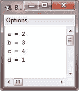
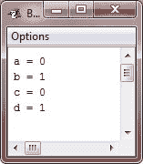

# Java 递增递减运算符

> 原文：<https://codescracker.com/java/java-increment-decrement.htm>

运算符(++)和运算符(-)是 Java 的递增和递减运算符。增量(++)和减量运算符(-)仅用于将值增加和减少 1。

递增运算符将其操作数增加 1，而递减运算符只是将其操作数减少 1。例如，语句:

```
x = x + 1;
```

可以通过使用递增运算符重写，例如++:

```
x++;
```

同样，声明:

```
x = x - 1;
```

相当于:

```
x--;
```

这些运算符的独特之处在于，它们可以以后缀(在操作数之后)和前缀(在操作数之前)的形式出现。

## 前缀递增和递减运算符

在前缀形式中，在值被接收用于表达式之前，操作数递增或递减。

## 后缀递增和递减运算符

在后缀形式中，获取前一个值用于表达式，然后修改操作数。

### 例子

在这里的例子中，前缀和后缀形式没有区别。然而，当增量和/或减量操作符是一个更大的表达式的一部分时，这两种形式之间就会出现一个微妙的、无论多么强大的差别。这里有一个例子:

```
x = 42;
y = ++x;
```

这里，y 如您所料被设置为 43，因为增量发生在 x 被赋给 y 之前。相当于这两种说法:

```
x = x + 1;
y = x;
```

然而，当我们这样写的时候，

```
x = 42;
y = x++;
```

这里 x 的值是在执行 increment 操作符之前获得的，所以 y 的值是 42。很自然，在这两种情况下，x 都被设置为 43。这里，直线 y = x++；相当于这两种说法:

```
y = x;
x = x + 1;
```

## Java 递增和递减运算符示例

这个 Java 程序演示了增量运算符:

```
/* Java Program Example - Java Increment Decrement Operator
 * This program demonstrates the increment (++) operator 
 */

public class JavaProgram
{   
    public static void main(String args[])
    {

        int a = 1;
        int b = 2;
        int c;
        int d;
        c = ++b;
        d = a++;
        c++;
        System.out.println("a = " +a);
        System.out.println("b = " +b);
        System.out.println("c = " +c);
        System.out.println("d = " +d);

    }
}
```

当编译并执行上述 Java 程序时，它将产生以下输出:



现在，这个 Java 程序演示了减量运算符:

```
/* Java Program Example - Java Increment Decrement Operator
 * This program demonstrates the decrement (--) operator 
 */

public class JavaProgram
{   
    public static void main(String args[])
    {

        int a = 1;
        int b = 2;
        int c;
        int d;
        c = --b;
        d = a--;
        c--;
        System.out.println("a = " +a);
        System.out.println("b = " +b);
        System.out.println("c = " +c);
        System.out.println("d = " +d);

    }
}
```

当编译并执行上述 Java 程序时，它将产生以下输出:



### 更多示例

这里还有一些关于 Java 中递增递减运算符的例子，你可以去看看:

*   [打印斐波那契数列](/java/program/java-program-print-fibonacci-series.htm)
*   [检查回文与否](/java/program/java-program-check-palindrome.htm)
*   [找到阿姆斯特朗号](/java/program/java-program-find-armstrong-number.htm)
*   [生成阿姆斯特朗数字](/java/program/java-program-generate-armstrong-number.htm)
*   [计算 nCr nPr](/java/program/java-program-find-ncr-npr.htm)
*   [打印帕斯卡三角形](/java/program/java-program-print-pascal-triangle.htm)

[Java 在线测试](/exam/showtest.php?subid=1)

* * *

* * *