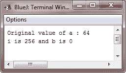
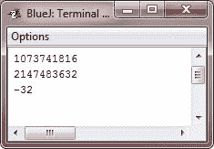

# Java 左移运算符

> 原文：<https://codescracker.com/java/java-left-shift.htm>

左移运算符<

```
*value << num*
```

这里，num 指定了 value 中的值左移的位数，即<

当您移动字节和短值时，Java 的自动类型提升会产生意想不到的结果。

如你所知，当一个表达式被求值时，byte 和 short 值被提升为 int。

而且，这样表达式的结果也是一个 int。这意味着字节或短整型值左移的结果将只是一个 int，并且左移的位不会丢失，直到它们移过位位置 31。

此外，负字节或短值在提升为 int 时将进行符号扩展。因此，高位将用 1 填充。由于这些原因，对字节或 short 执行左移意味着必须消除 int 结果的高位字节。

例如，如果将一个字节值左移，该值将首先提升为 int，然后再进行移位。这意味着当您想要的是移位字节值的结果时，您必须丢弃结果的前三个字节。最简单的方法是将结果转换回一个字节。

## Java 左移运算符示例

这个程序演示了左移运算符的概念:

```
/* Java Program Example - Java Left Shift
 * Left shifting a byte value. 
 */

public class JavaProgram
{   
    public static void main(String args[])
    {

        byte a = 64, b;
        int i;

        i = a << 2;
        b = (byte) (a << 2);

        System.out.println("Original value of a : " +a);
        System.out.println("i is " + i + " and b is " + b);

    }
}
```

当编译并执行上述 Java 程序时，它将产生以下输出:



因为为了计算，a 被提升为 int，并且将值 64 (0100 0000)左移两次会导致 I 包含值 256 (1 0000 0000)。然而，b 中的值包含 0，因为移位后，低位字节现在为零。它仅有 1 位被移出。

由于每一次左移都会使原始值翻倍，程序员经常利用这一事实作为乘以 2 的有效选项。但是你需要小心。也就是说，如果将 1 位移动到高位(31 位或 63 位)，该值将变为负值。这个程序说明了这一点:

```
/* Java Program Example - Java Left Shift
 * Left shifting is a quick way to multiply by 2\. 
 */

public class JavaProgram
{   
    public static void main(String args[])
    {

        int i;
        int num = 0xFFFFFFE;

        for(i=0; i<4; i++)
        {
            num = num << 1;
            System.out.println(num);
        }

    }
}
```

当编译并执行上述 Java 程序时，它将产生以下输出:



起始值是经过仔细选择的，因为左移 4 位后，它将产生值-32。如您所见，当第 31 位移位 1 位时，数字被解释为负数。

[Java 在线测试](/exam/showtest.php?subid=1)

* * *

* * *