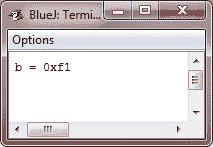

# Java 右移

> 原文：<https://codescracker.com/java/java-right-shift.htm>

右移位运算符 **> >** ，将一个值中的所有位向右移位指定的次数。下面是在 Java 中使用右移运算符的一般形式 :

```
*value >> num*
```

这里， *num* 指定将 *value* 中的值右移的位数，即> >将 指定值中的所有位向右移动由 *num* 指定的位数。

以下代码片段将值 32 向右移动两个位置，导致 **a** 被设置为 **8** :

```
int a = 32;
a = a >> 2;      // a now contains 8
```

当一个值有“移位”的位时，这些位就丢失了。例如，下一个代码片段将值 35 向右移动两个位置，这导致两个低位丢失，再次导致 **a** 被设置为 8:

```
int a = 35;
a = a >> 2;     // now a contains 8
```

观察二进制中的相同操作可以更清楚地看到这是如何发生的:

```
00100011   35
>>2
00001000   8
```

每当您将一个值向右移动时，它会将该值除以 2，并丢弃任何余数。在某些情况下，您可以利用这一点进行高性能的整数 2 分频。

当您右移时，右移所暴露的顶部(最左边)位会被顶部位的先前内容填充。这被称为*符号扩展*，用来在你向右移动负数时保持它们的符号。例如， -8 > > 1 是-4，用二进制表示就是:

```
11111000   -8
>>1
11111100   -4
```

有趣的是，如果您将-1 右移，结果始终保持为-1，因为符号扩展会在高阶位不断引入更多的 1。

有时，当您将值向右移动时，并不需要符号扩展值。例如，下面的程序将一个**字节**值转换成它的十六进制字符串表示。请注意，移位后的值通过与 **0x0f** 进行“与”运算来屏蔽，以丢弃 任何符号扩展位，以便该值可以用作十六进制字符数组的索引。

## Java 右移运算符示例

下面是一个示例程序，帮助您理解 Java 中右移运算符的概念:

```
/* Java Program Example - Java Right Shift
 * Masking sign extension. */

public class JavaProgram
{   
    public static void main(String args[])
    {

        char hex[] = {
            '0', '1', '2', '3', '4', '5', '6', '7',
            '8', '9', 'a', 'b', 'c', 'd', 'e', 'f'
        };

        byte b = (byte) 0xf1;

        System.out.println("b = 0x" + hex[(b >> 4) & 0x0f] + hex[b & 0x0f]);

    }
}
```

当编译并执行上述 Java 程序时，它将产生以下输出:



[Java 在线测试](/exam/showtest.php?subid=1)

* * *

* * *