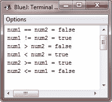

# Java 关系运算符

> 原文：<https://codescracker.com/java/java-relational-operators.htm>

*关系运算符*决定一个操作数与另一个操作数的关系。

具体来说，它们决定平等和有序。这里，下表列出了 Java 中可用的关系运算符:

| 操作员 | 名字 | 意义 |
| == | 等于 | 该运算符用于检查两个操作数的值是否相等。如果是，则条件变为真，否则为假 |
| ！= | 不等于 | 该运算符用于检查两个操作数的值是否相等。如果值不相等，则条件为真，否则为假 |
| > | 大于 | 该运算符用于检查左操作数的值是否大于右操作数的值。如果是，则条件变为真，否则为假 |
| < | 不到 | 该运算符用于检查左操作数的值是否小于右操作数的值。如果是，则条件变为真，否则为假 |
| >= | 大于或等于 | 该运算符用于检查左操作数的值是否大于或等于右操作数的值。如果是，则条件变为真，否则为假 |
| <= | 小于或等于 | 该运算符用于检查左操作数的值是否小于或等于右操作数的值。如果是，那么条件变为真，否则为假 |

这些操作的结果是一个**布尔**值。关系运算符最常用于由 控制 **if** 语句和各种循环语句的表达式中。

Java 中的任何类型，包括整数、字符、浮点数和布尔值，都可以使用等式测试(==)和不等式测试(！=).注意，在 Java 中，等式用两个等号表示，而不是一次。

**记住**——一个等号就是赋值操作符。

使用排序运算符只能比较数值类型。也就是说，只有整数、浮点和字符操作数可以进行比较，以确定哪一个大于或小于另一个。

如上所述，关系运算符产生的结果是一个**布尔**值。例如，下面的代码片段是 完全有效的:

```
int a = 4;
int b = 1;
boolean c = a < b;
```

在这种情况下， **a < b** 的结果(也就是**假**)被存储在 **c** 中。

如果你是来自 C/C++ 背景，请不要以下。在 C/C++ 中，这些类型的语句非常常见:

```
int done;
// ...
if(!done)...  // Valid in C/C++
if(done)...   // but not in Java.
```

在 Java 中，这些语句必须写成这样:

```
if(done == 0)...   // This is a Java-style.
if(done != 0)...
```

原因是 Java 不像 C/C++ 那样定义真与假。在 C/C++ 中，true 是任何非零值，false 是零。在 Java 中， **true** 和 **false** 是与零或非零无关的非数值。因此，为了测试零或非零， 您必须显式地使用一个或多个关系运算符。

## 关系运算符示例

下面的示例程序演示了关系运算符:

```
/* Java Program Example - Java Relational Operators */

public class JavaProgram
{   
    public static void main(String args[])
    {

        int num1 = 100, num2 = 200;

        System.out.println("num1 == num2 = " + (num1 == num2) );
        System.out.println("num1 != num2 = " + (num1 != num2) );
        System.out.println("num1 > num2 = " + (num1 > num2) );
        System.out.println("num1 < num2 = " + (num1 < num2) );
        System.out.println("num2 >= num1 = " + (num2 >= num1) );
        System.out.println("num2 <= num1 = " + (num2 <= num1) );

    }
}
```

当编译并执行上述 Java 程序时，它将产生以下输出:



[Java 在线测试](/exam/showtest.php?subid=1)

* * *

* * *