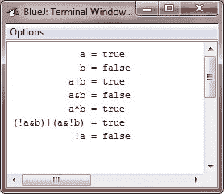

# Java 布尔逻辑运算符

> 原文：<https://codescracker.com/java/java-boolean-logical-operators.htm>

布尔逻辑运算符只对**布尔**操作数进行运算。所有的二进制逻辑运算符将两个**布尔**值 组合成一个合成的**布尔**值。

## 布尔逻辑运算符列表

这里，下表列出了 Java 中可用的布尔运算符:

| 操作员 | 名字 |
| & | 逻辑与 |
| &#124; | 逻辑或 |
| ^ | 逻辑异或(异或) |
| &#124;&#124; | 短路或 |
| && | 短路和 |
| ！ | 逻辑一元非 |
| &= | 和分配 |
| &#124;= | 或分配 |
| = | 异或赋值 |
| == | 等于 |
| ！= | 不等于 |
| ？： | 三元 if-then-else |

布尔逻辑运算符 **&、|** 和 **^** 对**布尔**值的操作方式与它们对整数的位 的操作方式相同。**逻辑一元非！**)运算符反转布尔状态:**！真==假**和**！false == true** 。

### Java 布尔逻辑运算效果

下表显示了每个逻辑操作的效果:

| A | B | A &#124; B | A & B | ^湾 | ！A |
| 错误的 | 错误的 | 错误的 | 错误的 | 错误的 | 真实的 |
| 真实的 | 错误的 | 真实的 | 错误的 | 真实的 | 错误的 |
| 错误的 | 真实的 | 真实的 | 错误的 | 真实的 | 真实的 |
| 真实的 | 真实的 | 真实的 | 真实的 | 错误的 | 错误的 |

## 布尔逻辑运算符示例

这是一个布尔逻辑运算符的示例程序。以下程序几乎与之前 (在[位运算符](/java/java-bitwise-operators.htm)章节中)所示的**位逻辑**示例相同，但它操作的是**布尔**逻辑值，而不是二进制位:

```
/* Java Program Example - Java Boolean Logical Operators
*  Demonstrate the boolean logical operators. */

public class JavaProgram
{   
    public static void main(String args[])
    {

        boolean a = true;
        boolean b = false;

        boolean c = a | b;
        boolean d = a & b;
        boolean e = a ^ b;
        boolean f = (!a & b) | (a & !b);
        boolean g = !a;

        System.out.println("            a = " + a);
        System.out.println("            b = " + b);
        System.out.println("          a|b = " + c);
        System.out.println("          a&b = " + d);
        System.out.println("          a^b = " + e);
        System.out.println("(!a&b)|(a&!b) = " + f);
        System.out.println("           !a = " + g);

    }
}
```

当编译并执行上述 Java 程序时，它将产生以下输出:



### 更多示例

这里列出了一些基于布尔逻辑操作符的例子，你可以试试。最常用的等于(==)运算符。

*   [检查偶数或奇数](/java/program/java-program-check-even-odd.htm)
*   [检查是否灌注](/java/program/java-program-check-prime.htm)
*   [检查是否为字母](/java/program/java-program-check-alphabet.htm)
*   [读取文件](/java/program/java-program-read-file.htm)
*   [读取&显示文件](/java/program/java-program-read-and-display-file.htm)
*   [复制文件](/java/program/java-program-copy-file.htm)
*   [合并两个文件](/java/program/java-program-merge-two-files.htm)

这里，不要和上面的一些例子混淆，比如读文件，写文件等等。你将一个一个地学会所有的。

[Java 在线测试](/exam/showtest.php?subid=1)

* * *

* * *