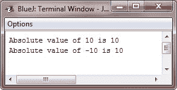

# Java 三元运算符

> 原文：<https://codescracker.com/java/java-ternary-operator.htm>

Java 包括一个特殊的*三元*(三向)运算符，可以替换某些类型的 if-then-else 语句。这个 符就是**？**。起初这看起来有些令人困惑，但是**？**一旦掌握就能非常有效地使用。

下面是使用三元运算符(？)在 Java 中:

```
*expression1 ? expression2 : expression 3*
```

这里，*表达式 1* 可以是计算结果为**布尔值**的任何表达式。如果*表达式 1* 为**真**， ，则*表达式 2* 被求值；否则，*表达式 3* 被求值。**的结果？**运算是对表达式 求值的运算。两个表达式即*表达式 2* 和*表达式 3* 都需要返回相同(或兼容)的类型，不能是 **void** 。

这里有一个例子说明**？**被录用:

```
ratio = denom == 0 ? 0 : num / denom;
```

Java 在对上面的赋值表达式求值时，首先看问号左边的*处的表达式。 如果 **denom** 等于零，那么问号*和冒号之间的表达式*被求值并作为整个 **的值？**表情。如果 **denom** 不等于零，那么*冒号后的表达式*被求值并用于整个**的值 ？**表情。**产生的结果？**操作员然后被分配到**比率**。*

## Java 三元运算符(？)示例

下面是一个示例程序，演示了**？**操作员。它使用**？**获取一个变量的绝对值。

```
/* Java Program Example - Java Ternary Operator (?)
 * This program demonstrates the ? Operator */

public class JavaProgram
{   
    public static void main(String args[])
    {

        int i, k;

        i = 10;
        k = i < 0 ? -i : i;     // get absolute value of i

        System.out.println("Absolute value of " + i + " is " + k);

        i = -10;
        k = i < 0 ? -i : i;     // get absolute value of i

        System.out.println("Absolute value of " + i + " is " + k);

    }
}
```

当编译并执行上述 Java 程序时，它将产生以下输出:



[Java 在线测试](/exam/showtest.php?subid=1)

* * *

* * *