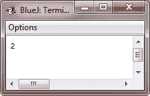

# Java 运算符优先级

> 原文：<https://codescracker.com/java/java-operator-precedence.htm>

下面的表格显示了 Java 操作符的优先级顺序，从最高到最低。同一行中的运算符优先级相同。

在二元运算中，求值顺序是从左到右(除了赋值，从右到左求值)。尽管它们在技术上是分隔符[]、()和。(点运算符)也可以像运算符一样工作。在那出戏里，他们有最高优先权。另外，请注意箭头操作符(->)。它是由 JDK 8 添加的，用于 lambda 表达式中。

## Java 运算符优先级表

| 最高的 |  |  |  |  |  |  |
| ++(后缀) | -(后缀) |  |  |  |  |  |
| ++(前缀) | -(前缀) | ~ | ！ | +(一元) | -(一元) | (*类型转换*) |
| * | / | % |  |  |  |  |
| + | - |  |  |  |  |  |
| >> | >>> | << |  |  |  |  |
| > | >= | < | <= | instanceof |  |  |
| == | ！= |  |  |  |  |  |
| & |  |  |  |  |  |  |
| ^ |  |  |  |  |  |  |
| &#124; |  |  |  |  |  |  |
| && |  |  |  |  |  |  |
| &#124;&#124; |  |  |  |  |  |  |
| ？： |  |  |  |  |  |  |
| -> |  |  |  |  |  |  |
| = | op= |  |  |  |  |  |
| 最低的 |  |  |  |  |  |  |

## Java 运算符优先级示例

让我们考虑下面这个简单的 Java 程序，演示 Java 的运算符优先级:

```
/* Java Program Example - Java Operators Precedence
 * This simple program illustrates 
 * operator precedence
 */

public class JavaProgram
{ 
   public static void main(String args[])
   {

      int a;

      a = 2 + 3 - 4 * 5 / 6;

      System.out.print(a);

   }
}
```

当上述 Java 程序被编译和运行时，它将产生以下输出:



正如您将看到的，这将产生输出为 **2** ，根据上表，上述程序的计算采取以下步骤:

1.  首先， **4 * 5** 将执行，结果出现在 **20**
2.  接下来， **4 * 5 / 6** 即 **20 / 6** 将执行，导致 **3**
3.  接下来， **2 + 3 - 3** 将执行，结果在 **2**

[Java 在线测试](/exam/showtest.php?subid=1)

* * *

* * *