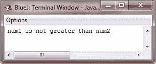

# Java 决策

> 原文：<https://codescracker.com/java/java-decision-making.htm>

你可以根据自己的需要检查一些表达式来计算一些代码块。Java 提供了决策语句来执行这项任务。

## Java 决策语句

Java 支持以下两种决策语句:

*   [if 语句](/java/java-if-statement.htm)
*   [开关语句](/java/java-switch-statement.htm)

这些语句允许你根据只有在运行时才知道的条件来控制程序的执行流程。

### if 语句

**if** 语句由布尔表达式组成，后跟一个或多个语句。关于 [if 语句](/java/java-if-statement.htm)，你将在单独的章节中学习。

### switch 语句

**switch** 语句允许根据值列表测试变量的相等性。每个值被称为一个案例，每个案例中被 打开的变量被检查。您将在单独的章节中了解 [开关语句](/java/java-switch-statement.htm)。

## Java 决策程序

下面是一个示例程序，有助于理解决策语句在 Java 中是如何工作的:

```
/* Java Decision Making - Example Program */

public class JavaProgram
{   
    public static void main(String args[])
    {
        int num1=50, num2=60;
        if(num1>num2)
        {
            System.out.println("num1 is greater than num2");
        }
        else
        {
            System.out.println("num1 is not greater than num2");
        }
    }
}
```

下面是上面的 Java 程序产生的输出:



[Java 在线测试](/exam/showtest.php?subid=1)

* * *

* * *