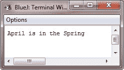

# Java if if-else if-else-if 语句

> 原文：<https://codescracker.com/java/java-if-statement.htm>

在 Java 中，if 语句是条件分支语句。它可以用于通过两个不同的路径路由程序执行。以下是 Java 语言中 if 语句的一般形式:

```
if(*condition*)
   *statement1*;

else
   *statement2*;
```

在这里，每个语句可以是一个用花括号括起来的单个或复合语句(一个块)。条件是任何返回布尔值的表达式。else 子句是可选的。

## Java if 语句工作

if 语句的工作方式如下:
如果条件为真，则执行语句 1。否则，执行语句 2(如果存在的话)。在任何情况下，两条语句都不会被执行。 例如，考虑以下情况:

```
int a, b;
//...
if(a < b)
   a = 0;
else
   b = 0;
```

这里，如果 a 小于 b，那么 a 被设置为零。否则，b 被设置为零。在任何情况下，它们都不会被设置为零。

通常，用于控制 if 语句的表达式会涉及到关系运算符。不过，这在技术上不是必需的。可以使用单个布尔变量来控制 if，如下面的代码片段所示:

```
boolean dataAvailable;
//...
if(dataAvailable)
   ProcessData();

else
   waitForMoreData();
```

记住，只有一个语句可以直接出现在 if 或 else 之后。如果要包含更多语句，将使用创建一个块，如下面的代码片段所示:

```
int bytesAvailable;
//...
if(bytesAvailable > 0)
{
   ProcessData();
   bytesAvailable -= n;
}
else
   waitForMoreData();
```

这里，如果 bytesAvailable 大于零，if 块中的两条语句都将执行。

一些程序员发现在使用 if 语句时使用花括号是有利的，即使每个子句中只有一个语句。这样便于以后添加另一个语句，也不用担心忘记大括号。

## Java 嵌套 ifs

嵌套 if 是一个 if 语句，它是另一个 if 或 else 的目标。

嵌套 if 在编程中非常常见。当您嵌套 ifs 时，重要的是要记住，else 语句总是引用最近的 if 语句，该语句与 else 在同一个块中，并且还没有与 else 关联。下面是一个例子:

```
if(i == 10)
{
   if(j < 20)
      a = b;
   if(k > 100)
      c = d;      // this if is
   else                // associated with this else
      a = c;
}
else
   a = d;          // this else refers to if(i == 10)
```

不要和花括号混淆。当然，如果有不止一个代码块，那么就要加上花括号。否则不要。下面是使用花括号的上述程序的改进版本:

```
if(i == 10)
{
   if(j < 20)
   {
      a = b;
   }

   if(k > 100)
   {
      c = d;    
   }
   else
   {
      a = c;
   }
}
else
{
   a = d;
}
```

作为注释指示符，最终的 else 不与 if(j <20) as it is not in the same block (even though it is the nearest if without an else). Instead, the final else is associated with if(i==10). The inner else refers to the if(k> 100)相关联，因为它是同一块内最近的 if。

## Java if-else-if 阶梯

基于一系列嵌套 if 的通用编程结构是 if-else-if 梯形。下面是 Java 中 if-else-if 梯形的一般形式:

```
if(*condition*)
   *statement*;

else if(*condition*)
   *statement*;

else if(*condition*)
   *statement*
.
.
.
else
   *statement*;
```

if 语句自上而下执行。一旦控制 if 的条件之一为真，就执行与该 if 相关的语句，并绕过阶梯的其余部分。

如果没有一个条件为真，那么将执行最后一个 else 语句。最终的 else 充当默认条件；也就是说，如果所有其他条件测试都失败，则执行最后的 else 语句。如果没有最终的 else，并且所有其他条件都为假，则不会发生任何操作。

### Java if-else-if 示例

下面是一个程序，它使用 if-else-if 阶梯来确定某个特定月份处于哪个季节:

```
/* Java Program Example - Java if Statement
 * This program demonstrates the if-else-if statements 
 */

public class JavaProgram
{   
    public static void main(String args[])
    {

        int month = 4;      // April
        String season;

        if(month == 12 || month == 1 || month == 2)
        {
            season = "Winter";
        }
        else if(month == 3 || month == 4 || month == 5)
        {
            season = "Spring";
        }
        else if(month == 6 || month == 7 || month == 8)
        {
            season = "Summer";
        }
        else if(month == 9 || month == 10 || month == 11)
        {
            season = "Autumn";
        }
        else
        {
            season = "Bogus Month";
        }

        System.out.println("April is in the " + season);

    }
}
```

当编译并执行上述 Java 程序时，它将产生以下输出:



从上面的程序中，你会发现，无论你给 month 取什么值，在这个阶梯中有且只有一个赋值语句会被执行。

### 更多示例

以下是一些使用 if 语句的示例程序列表:

*   [检查偶数或奇数](/java/program/java-program-check-even-odd.htm)
*   [检查是否灌注](/java/program/java-program-check-prime.htm)
*   [检查是否为字母](/java/program/java-program-check-alphabet.htm)
*   [检查是否为元音](/java/program/java-program-check-vowel.htm)
*   [是否勾选闰年](/java/program/java-program-check-leap-year.htm)
*   [检查是否为字谜](/java/program/java-program-check-anagram.htm)

[Java 在线测试](/exam/showtest.php?subid=1)

* * *

* * *