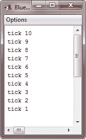
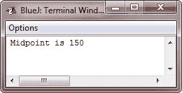

# Java`while`循环

> 原文：<https://codescracker.com/java/java-while-loop.htm>

**while** 循环是 Java 最基本的循环语句。当它的控制表达式为 true 时，它重复一个语句或块。以下是 Java 中`while`循环的一般形式:

```
while(condition)
{
   // body of the loop
}
```

*条件*可以是任何布尔表达式。只要条件表达式为真，就会执行循环体。 当*条件*变为假时，控制传递到紧接着循环的下一行代码。如果只重复一个语句，花括号是不必要的。

## Java`while`循环示例

下面是一个 **while** 循环，从 10 开始倒数，精确地打印 10 行“tick”:

```
/* Java Program Example - Java while Loop
 * Demonstrate the while Loop */

public class JavaProgram
{   
    public static void main(String args[])
    {

        int n = 10;

        while(n>0)
        {
            System.out.println("tick " + n);
            n--;
        }

    }
}
```

当编译并执行上述 Java 程序时，它将产生以下输出:



由于 **while** 循环在循环的顶部计算其条件表达式，如果条件一开始就是假的，那么循环体甚至不会执行 一次。例如，在下面的代码片段中，从不执行对 **println()** 的调用:

```
int a = 10, b = 20;
while(a > b)
{
   System.out.println("This will not be displayed.");
}
```

**while** 循环的主体可以为空。这是因为一个*空语句*(曾经只由 一个分号组成)在 Java 中是语法有效的。例如，考虑以下程序:

```
/* Java Program Example - Java while Loop
 * The target of a loop can be empty */

public class JavaProgram
{   
    public static void main(String args[])
    {

        int i, j;

        i = 100;
        j = 200;

        // find midpoint between i and j
        while(++i < --j);    // there is no body in this loop

        System.out.println("Midpoint is " + i);

    }
}
```

当编译并执行上述 Java 程序时，它将产生以下输出:



### 解释的示例

**i** 的值递增， **j** 的值递减。然后将这些值相互比较。如果 **i** 的新值仍然小于 **j** 的新值，则循环重复。 如果 **i** 等于或大于 **j** ，循环停止。从循环中退出后， **i** 将保持在 **i** 和 **j** 的原始值 的中间值。(当然，该程序仅在开始时 **i** 小于 **j** 时有效。) 可以看到，不需要循环体，所有的动作都发生在条件表达式本身之内。在专业编写的 Java 代码中，当控制表达式可以自己处理所有细节时，短循环经常被编码成没有主体。

### 更多示例

以下是更多的例子，你可能会喜欢:

*   [十进制到二进制的转换](/java/program/java-program-convert-decimal-to-binary.htm)
*   [十进制到八进制的转换](/java/program/java-program-convert-decimal-to-octal.htm)
*   [十进制到十六进制的转换](/java/program/java-program-convert-decimal-to-hexadecimal.htm)
*   [二进制到十进制的转换](/java/program/java-program-convert-binary-to-decimal.htm)
*   [二进制到八进制的转换](/java/program/java-program-convert-binary-to-octal.htm)
*   [二进制到十六进制的转换](/java/program/java-program-convert-binary-to-hexadecimal.htm)
*   [八进制到十进制的转换](/java/program/java-program-convert-octal-to-decimal.htm)
*   [八进制到二进制的转换](/java/program/java-program-convert-octal-to-binary.htm)
*   [八进制到十六进制的转换](/java/program/java-program-convert-octal-to-hexadecimal.htm)
*   [十六进制到十进制的转换](/java/program/java-program-convert-hexadecimal-to-decimal.htm)
*   [十六进制到二进制的转换](/java/program/java-program-convert-hexadecimal-to-binary.htm)
*   [十六进制到八进制的转换](/java/program/java-program-convert-hexadecimal-to-octal.htm)

[Java 在线测试](/exam/showtest.php?subid=1)

* * *

* * *