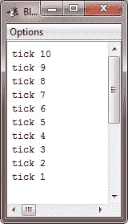
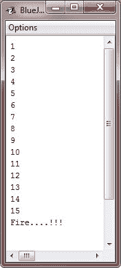

# Java`for`循环

> 原文：<https://codescracker.com/java/java-for-loop.htm>

从 JDK 5 开始，有两种形式的`for`循环。第一种是自 Java 最初版本以来一直使用的传统形式。第二种是更新的“[for-each](/java/java-for-each-loop.htm)” (你将在其他章节详细了解这个循环)形式。

我们将逐一讨论这两种类型的`for`循环，即本章中的一种循环和下一章中的新循环。

## Java`for`循环语法

以下是传统 for 语句的一般形式:

```
for(initialization; condition; iteration)
{
   // body of the loop
}
```

如果只重复一个语句，那么就不需要花括号。但是您可以使用花括号(因为这样可以更容易地在后面添加其他语句)。

## 用于循环工作的 Java

这里解释一下`for`循环的工作:
当循环开始时，那么首先执行循环的初始化部分(只执行一次)。一般来说，这是一个设置 循环控制变量的值的表达式，该变量充当控制循环的计数器。
理解这一点很重要，正如已经说过的，初始化表达式首先执行，但只执行一次。接下来，对条件进行评估。 This(条件表达式)必须是布尔表达式。它通常根据目标值测试循环控制变量。如果表达式 为真，则执行循环体。如果为假，则循环终止。接下来，执行循环的迭代部分 。这通常是一个增加或减少控制循环的变量的表达式。然后循环迭代，首先 计算条件表达式，然后执行循环体，然后每次都执行迭代表达式。重复这个过程，直到控制表达式变为假。

## Java`for`循环示例

下面是使用`for`循环的“tick”程序的一个版本:

```
/* Java Program Example - Java for Loop
 * This program demonstrate the for loop 
 */

public class JavaProgram
{   
    public static void main(String args[])
    {

        int i;

        for(i=10; i>0; i--)
        {
            System.out.println("tick " + i);
        }

    }
}
```

当编译并执行上述 Java 程序时，它将产生以下输出:



让我们再看一个例子，也演示了循环的**:**

```
/* Java Program Example - Java for Loops
 * This program demonstrates for loop
 */

public class JavaProgram
{ 
   public static void main(String args[])
   {

      int i;

      for(i=1; i<=15; i++)
      {
          System.out.println(i + " ");
      }
      System.out.println("Fire....!!!");  

   }
}
```

示例运行如下所示:



### 更多示例

下面是一些使用**作为**循环的示例程序列表:

*   [检查是否灌注](/java/program/java-program-check-prime.htm)
*   [打印帕斯卡三角形](/java/program/java-program-print-pascal-triangle.htm)
*   [一维数组程序](/java/program/java-program-one-dimensional-array.htm)
*   [线性搜索](/java/program/java-program-linear-search.htm)
*   [二分搜索](/java/program/java-program-binary-search.htm)
*   [检查是否为字谜](/java/program/java-program-check-anagram.htm)
*   [生成随机数](/java/program/java-program-generate-random-numbers.htm)
*   [写入文件](/java/program/java-program-write-to-file.htm)

[Java 在线测试](/exam/showtest.php?subid=1)

* * *

* * *