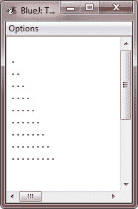
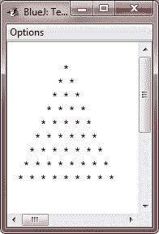

# Java 嵌套循环

> 原文：<https://codescracker.com/java/java-nested-loops.htm>

像所有其他编程语言一样，Java 允许嵌套循环(即循环中的循环)。

嵌套循环意味着循环中的循环。换句话说，嵌套循环意味着，循环中的循环，循环中的循环，等等。

## Java 嵌套循环示例

下面是一个为循环嵌套 Java **的示例程序:**

```
/* Java Program Example - Java Nested Loops */

public class JavaProgram
{   
    public static void main(String args[])
    {

        int i, j;

        for(i=0; i<10; i++)
        {
            for(j=0; j<i; j++)
            {
                System.out.print(".");
            }
            System.out.println();
        }

    }
}
```

当编译并执行上述 Java 程序时，它将产生以下输出:



让我们再看一个演示嵌套循环的例子:

```
/* Java Program Example - Java nested loops */

public class JavaProgram
{ 
   public static void main(String args[])
   {

      int i, j, k, space=10;

      for(i=0; i<10; i++)
      {
          for(k=0; k<space; k++)
          {
              System.out.print(" ");
          }

          for(j=0; j<i; j++)
          {
              System.out.print("* ");
          }
          System.out.println();

          space--;
      }

   }
}
```

上面的 Java 程序的运行示例如下所示:



### 更多示例

以下是一些使用嵌套循环的示例程序列表:

*   [图案打印程序](/java/program/java-program-print-star-pyramid-patterns.htm)
*   [打印菱形图案](/java/program/java-program-print-diamond-pattern.htm)
*   [打印弗洛伊德三角形](/java/program/java-program-print-floyd-triangle.htm)
*   [打印帕斯卡三角形](/java/program/java-program-print-pascal-triangle.htm)
*   [二维数组程序](/java/program/java-program-two-dimensional-array.htm)
*   [相加两个矩阵](/java/program/java-program-add-two-matrices.htm)
*   [相减两个矩阵](/java/program/java-program-subtract-matrices.htm)
*   [转置矩阵](/java/program/java-program-transpose-matrix.htm)
*   [将两个矩阵相乘](/java/program/java-program-multiply-two-matrices.htm)
*   [三维阵列程序](/java/program/java-program-three-dimensional-array.htm)
*   [检查是否为变位词](/java/program/java-program-check-anagram.htm)

[Java 在线测试](/exam/showtest.php?subid=1)

* * *

* * *