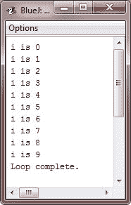
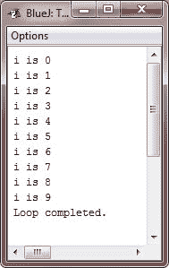
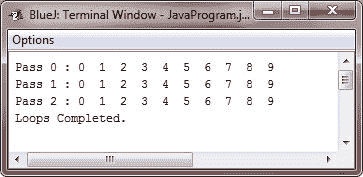
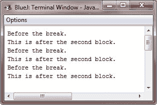
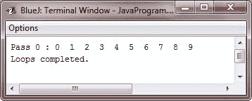

# Java`break`语句

> 原文：<https://codescracker.com/java/java-break-statement.htm>

在 Java 中， **break** 语句有以下三种用途:

1.  它在 **switch** 语句中终止一个语句序列。
2.  它可用于退出循环。
3.  可以作为 goto 的“文明”形式。

因为我们已经讨论了第一种用法，所以这里我们只讨论最后两种用法。

## 使用 break 退出循环

通过使用关键字 **break** ，可以绕过条件表达式和循环体 中的任何剩余代码，强制快速终止循环。一旦在循环中遇到 **break** 语句，循环将被终止，程序控制将在循环后的下一条语句 处重新开始。下面是一个简单的例子，演示了 break 退出循环:

### 示例-使用 break 退出`for`循环

下面是一个示例程序，展示了如何在 Java 中使用`break`语句从循环的[中退出:](/java/java-for-loop.htm)

```
/* Java Program Example - Java break Statement */
// Using break to exit a loop

public class JavaProgram
{   
    public static void main(String args[])
    {

        for(int i=0; i<100; i++)
        {
            if(i == 10)
                break;
            System.out.println("i is " + i);
        }

        System.out.println("Loop complete.");

    }
}
```

当编译并执行上述 Java 程序时，它将产生以下输出:



如你所见，循环的**被设计为从 0 运行到 99，当 **i** 变为 10 时， **break** 语句导致它提前终止。**

**break** 语句可以用于任何 Java 的循环，包括有意的无限循环。例如，下面是使用 **while** 循环编码的 前置程序。

### 示例-使用 break 退出`while`循环

下面是一个示例程序，展示了如何在 Java 中使用`break`语句从一个 [`while`循环](/java/java-while-loop.htm)中退出:

```
/* Java Program Example - Java break Statement
*  Use break to exit a while loop */

public class JavaProgram
{   
    public static void main(String args[])
    {

        int i = 0;

        while(i<100)
        {
            if(i == 10)
                break;
            System.out.println("i is " + i);
            i++;
        }

        System.out.println("Loop completed.");

    }
}
```

当编译并执行上述程序时，它将产生与上面相同的输出:



每当在一组嵌套循环中使用时， **break** 语句将只从最里面的循环中跳出。例如:

### 示例-使用 break 退出嵌套循环

下面是一个示例程序，展示了如何在 Java 中使用`break`语句从[嵌套循环](/java/java-nested-loops.htm)中退出:

```
/* Java Program Example - Java break Statement
*  Use break in nested loops */

public class JavaProgram
{   
    public static void main(String args[])
    {

        for(int i=0; i<3; i++)
        {
            System.out.print("Pass " + i + " : ");
            for(int j=0; j<100; j++)
            {
                if(j == 10)    // terminate loop
                    break;     // if j is 10

                System.out.print(j + "  ");
            }
            System.out.println();
        }

        System.out.println("Loops Completed.");

    }
}
```

当编译并执行上述 Java 程序时，它将产生以下输出:



如您所见，内部循环中的 **break** 语句只导致该循环的终止。外环不受影响。

以下是关于**休息**需要记住的另外两点:

*   您也可以在一个循环中使用多个 **break** 语句。但是，要小心。太多的 **break** 语句有 破坏你的代码的倾向。
*   终止**开关**语句的 **break** 语句只影响那个**开关**语句，而不影响任何封闭循环。

## 使用 break 作为 Goto 的一种形式

除了与**开关**和循环一起使用之外，**中断**语句也可以单独使用，以提供 goto 语句的“文明的” 形式。

Java 没有 goto 语句，因为它提供了一种以任意和非结构化的方式进行分支的方法，这通常会使充满 goto 的代码难以理解和维护。它还禁止某些编译器优化。

在某些地方，goto 是流控制的一个重要且合法的构造。例如，当您从深度嵌套的循环集中退出时，goto 会很有用。为了处理这种情况，Java 定义了一种扩展形式的 **break** 语句。通过使用这种 形式的**中断**，你可以，例如，中断一个或多个代码块。这些块不必是循环的一部分或者是 T4 开关。它们可以是任何块。此外，您可以精确地指定执行将在哪里恢复，因为这种形式的 **break** 使用标签。正如您将看到的，中断**给了您 goto 的好处，而没有它的问题。**

### 标记的 break 语法

下面是带标签的 **break** 语句的一般形式:

```
break *label*;
```

最常见的是，*标签*是标识代码块的标签的名称。它可以是一个独立的代码块，但也可以是另一个语句的目标块。当这种类型的**中断**执行时，控制被转移出命名块。 被标记的块必须包含 **break** 语句，但不一定要立即包含块。例如， 这意味着，您可以使用一个带标签的 **break** 从一组嵌套块中退出。但是您不能使用 **break** 将 控制转移出没有包含 **break** 语句的块。

要命名任何块，请在它的开头放置一个标签。标签是任何合法的 Java 标识符，后跟一个冒号。

一旦你标记了任何一个块，你可以使用这个标签作为一个 **break** 语句的目标。这样做将导致在标记块的*端*恢复执行。例如，这个程序显示了三个 嵌套块，每个块都有自己的标签。**中断**导致执行向前跳转，越过标记为 **秒**的块的结尾，跳过两个 **println()** 。

```
/* Java Program Example - Java break Statement
*  Use break as a civilized form of goto */

public class JavaProgram
{   
    public static void main(String args[])
    {

        boolean t = true;

        first: {
            second: {
                third: {
                    System.out.println("Before the break.");
                    if(t) break second;     // break out of second block
                    System.out.println("This won't execute.");
                }
                System.out.println("This won't execute.");
            }
            System.out.println("This is after the second block.");
        }

    }
}
```

当编译并执行上述 Java 程序时，它将产生以下输出:



带标签的 **break** 语句最常见的用途之一是从嵌套循环中退出。

例如，在这个程序中，外部循环只执行一次:

```
/* Java Program Example - Java break Statement
*  Using break to exit from nested loops */

public class JavaProgram
{   
    public static void main(String args[])
    {

        outer: for(int i=0; i<3; i++) {
            System.out.print("Pass " + i + " : ");
            for(int j=0; j<100; j++) {
                if(j == 10)
                    break outer;     // exit both loops
                System.out.print(j + "  ");
            }
            System.out.println("This will not print.");
        }
        System.out.println("\nLoops completed.");

    }
}
```

当编译并执行上述 Java 程序时，它将产生以下输出:



正如您在这里看到的，当内部循环断开到外部循环时，两个循环都已终止。注意，这个例子将语句的**标记为目标代码块。**

永远记住，你不能中断到任何没有为封闭块定义的标签。

### 更多示例

这里列举了一些使用 **break** 语句的例子，你可以去找。

*   [检查是否灌注](/java/program/java-program-check-prime.htm)
*   [检查是否为变位词](/java/program/java-program-check-anagram.htm)
*   [制作简单的计算器](/java/program/java-program-make-calculator.htm)
*   [线性搜索](/java/program/java-program-linear-search.htm)
*   [二分搜索](/java/program/java-program-binary-search.htm)

[Java 在线测试](/exam/showtest.php?subid=1)

* * *

* * *