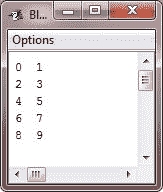
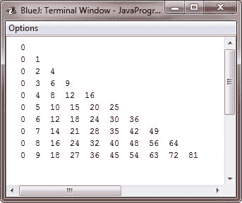

# Java`continue`语句

> 原文：<https://codescracker.com/java/java-continue-statement.htm>

在某些情况下，强制循环的早期迭代是有用的，例如，您可能希望继续运行循环，但对于这个特定的迭代，停止处理循环体中的剩余代码。实际上，这是一个 goto，只是将循环体传递到循环的末尾。 **continue** 语句执行这样的操作。

在 **while** 和 **do-while** 循环中， **continue** 语句导致控制直接转移到控制循环的条件 表达式。在循环的**中，控制首先转到 **for** 语句和 的迭代部分，然后转到条件表达式。并且对于所有三个循环( **for，while** ，以及 **do-while** ，任何中间代码都被绕过。**

## Java`continue`语句示例

下面是一个示例程序，它使用 *continue* 语句在每行上打印两个数字:

```
/* Java Program Example - Java continue Statement
 * This program demonstrates the continue keyword
 */

public class JavaProgram
{   
    public static void main(String args[])
    {

        for(int i=0; i<10; i++)
        {
            System.out.print(i + "  ");
            if(i%2 == 0) continue;
            System.out.println();
        }

    }
}
```

当编译并执行上述 Java 程序时，它将产生以下输出:



与 **break** 语句一样， **continue** 可以定义一个标签来报告继续哪个封闭循环。下面是一个示例 程序，它使用 **continue** 关键字打印从 0 到 9 的三角乘法表:

```
/* Java Program Example - Java continue Statement
 * Using continue with a label 
 */

public class JavaProgram
{   
    public static void main(String args[])
    {

        outer: for(int i=0; i<10; i++) {
            for(int j=0; j<10; j++) {
                if(j > i) {
                    System.out.println();
                    continue outer;
                }
                System.out.print("  " + (i * j));
            }
        }
        System.out.println();

    }
}
```

当编译并执行上述 Java 程序时，它将产生以下输出:



上例中的 **continue** 语句终止循环计数 **j** ，然后继续下一次循环计数 I。

[Java 在线测试](/exam/showtest.php?subid=1)

* * *

* * *