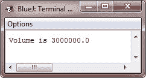
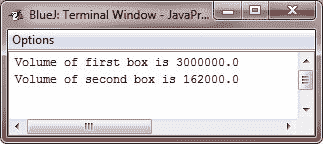

# Java 类

> 原文：<https://codescracker.com/java/java-classes.htm>

关于类，要理解的最重要的事情是它定义了一个新的数据类型。一旦定义好，这个新类型就可以用来创建该类型的对象。因此，类是对象的模板，而对象是类的实例。因为对象是类的实例，所以你会经常看到两个词，对象和实例互换使用。

当你在 Java 中定义一个类时，你声明了它的确切形式和性质。通过指定它包含的数据和处理该数据的代码，可以做到这一点。虽然非常简单的类可能只包含代码或数据，但大多数现实世界中的类两者都有。正如您将看到的，类代码定义了其数据的接口。

## Java 类关键字

使用 **class** 关键字声明一个类。

到目前为止，已经使用的类实际上是对其完整形式的非常有限的说明。类可以(并且通常会)变得更加复杂。

一个**类**定义的简化形式如下所示:

```
class *classname*
{
   *type instance-variable1;
   type instance-variable2;

   //...

   type instance-variableN;

   type methodname1(parameter-list)
   {
      // body of the method
   }
   type methodname2(parameter-list)
   {
      // body of the method
   }

   //...

   type methodnameN(parameter-list)
   {
      // body of the method
   }
}*
```

在**类**中定义的数据或变量被称为*实例变量*。

代码是在*方法*中获得的。在一个类中定义的方法和变量统称为该类的*成员* 。

在大多数类中，通过为该类定义的方法来操作和访问实例变量。因此，一般来说，是方法决定了如何使用类数据。

### Java 实例变量

在一个类中定义的变量被称为实例变量，因为该类的所有实例(即该类的所有对象)都包含这些变量的副本。因此，一个对象的数据是唯一的，并且独立于另一个对象的数据。

所有方法都有和我们一直使用的 **main()** 相同的一般形式。尽管如此，大多数方法不会被指定为**静态** 或**公共**。

注意，类的公共形式并没有指定一个 **main()** 方法。Java 类不需要有一个 **main()** 方法。如果这个类是你程序的起点，你只需要定义一个。此外，一些种类的 Java 应用程序，比如 applets，根本不需要 T4 main()方法。

## 简单的 Java 类

现在让我们从一个简单的例子开始我们对一个类的学习。这里有一个名为 **Box** 的类，它定义了这三个实例变量:

*   宽度
*   高度
*   深度

目前，**框**还没有任何方法(但很快会添加一些)。

```
class Box
{
   double width;
   double height;
   double depth;
}
```

如上所述，一个类定义了一个新的数据类型，在这种情况下称为 **Box** 。您将使用这个名称来声明类型为 **Box** 的对象。

重要的是要记住，类声明只创建一个模板，它不创建一个实际的对象。因此，前面的代码不会导致任何类型为 **Box** 的对象出现。

要实际创建一个 **Box** 对象，您将使用如下所示的语句:

```
Box mybox = new Box();   // creates a Box object called mybox
```

上述语句执行后， **mybox** 将成为 **Box** 的一个实例。因此，它将具有“物理”现实。目前， 不用担心上述声明的细节。

如前所述，每次创建一个类的实例时，您都在创建一个对象，该对象包含由该类定义的每个实例变量的副本。因此，每个**框**对象也将包含其自身的实例变量**宽度、**高度、 和**深度**的副本。您将使用点运算符(。)来访问这些变量。

点运算符(。)将对象的名称与实例变量的名称链接起来。例如，要给 **mybox** 的**宽度**变量赋值 100，可以使用下面的语句:

```
mybox.width = 100;
```

上面的语句告诉编译器将包含在 **mybox** 对象中的**宽度**的副本赋值为 100。

通常，使用点运算符来访问对象中的实例变量和方法。还有一点:尽管通常被称为点运算符，但 Java 的正式规范将。作为分离器。然而，随着术语“点运算符”的广泛使用。

## Java 类示例

下面是一个使用**盒**类的完整程序:

```
/* Java Program Example - Java Classes
*  Call this file BoxDemo.java */

class Box
{
    double width;
    double height;
    double depth;
}

/* class that declares an object of type Box */
class BoxDemo
{
    public static void main(String args[])
    {
        Box mybox = new Box();
        double vol;

        /* assign the values to the mybox's instance variables */
        mybox.width = 100;
        mybox.height = 200;
        mybox.depth = 150;

        /* now compute the volume of the box */
        vol = mybox.width * mybox.height * mybox.depth;

        System.out.println("Volume is " + vol);
    }
}
```

你应该调用包含这个程序的文件**BoxDemo.java**，因为 **main()** 方法在名为 **BoxDemo** ， 的类中，而不是名为 **Box** 的类中。

当你编译这个程序的时候，你会发现这两个**。已经创建了类**文件，一个用于**盒子**，一个用于 **盒子演示**类。Java 编译器自动将每个类放到自己的**中。类**文件。没有必要让 **Box** 和 **BoxDemo** 实际存在于同一个源文件中。你可以把每个类放在自己的文件中，分别命名为**Box.java**和**BoxDemo.java**、 。

要运行上述程序，必须执行 **BoxDemo.class** 。执行此操作时，您将看到以下输出:



如前所述，每个对象都有自己的实例变量副本。这意味着如果你有两个**盒子**对象，每个都有它自己的 副本，以及**高度、**宽度和**深度**。

理解对一个对象的实例变量的改变对另一个对象的实例变量没有影响是很重要的。例如，下面的程序声明了两个**框**对象:

```
/* Java Program Example - Java Classes
*  This program declares two Box objects */

class Box
{
    double width;
    double height;
    double depth;
}

class BoxDemo
{
    public static void main(String args[])
    {

        Box mybox1 = new Box();
        Box mybox2 = new Box();
        double vol;

        /* assign the values to the mybox1's instance variables */
        mybox1.width = 100;
        mybox1.height = 200;
        mybox1.depth = 150;

        /* assign different values to the mybox2's instance variables */
        mybox2.width = 30;
        mybox2.height = 60;
        mybox2.depth = 90;

        /* compute the volume of the first box */
        vol = mybox1.width * mybox1.height * mybox1.depth;

        /* print the volume of the first box */
        System.out.println("Volume of first box is " + vol);

        /* compute the volume of the second box */
        vol = mybox2.width * mybox2.height * mybox2.depth;

        /* print the volume of the second box */
        System.out.println("Volume of second box is " + vol);

    }
}
```

当编译并执行上述 Java 程序时，它将产生以下输出:



从上面的输出可以看出， **mybox1** 的数据与 **mybox2** 中包含的数据是完全分开的。

[Java 在线测试](/exam/showtest.php?subid=1)

* * *

* * *