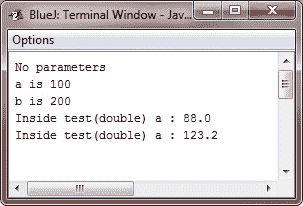
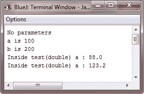

# Java 方法重载

> 原文：<https://codescracker.com/java/java-methods-overloading.htm>

在 Java 中，可以在同一个类中定义两个或更多共享相同名称的方法，只要它们的参数声明不同。在这种情况下，这些方法就被称为重载，这个过程称为方法重载。

方法重载是 Java 支持多态性的方式之一。如果你从未使用过允许方法重载的语言，那么这个概念对你来说可能会很陌生。但是你会看到，方法重载是 Java 最激动人心和最有用的特性之一。

## Java 方法重载规则

当一个重载的方法被调用时，Java 使用类型和/或参数的数量作为指导来决定实际调用哪个版本的重载方法。因此，重载方法必须在类型和/或参数数量上有所不同。虽然重载的方法可能有不同的返回类型，但返回类型本身不足以区分方法的两个版本。每当 Java 遇到对重载方法的调用时，它只是执行参数与调用中使用的参数相匹配的方法版本。

## Java 方法重载示例

下面是一个简单的示例程序，它说明了 Java 中的方法重载:

```
/* Java Program Example - Java Method Overloading
 * This program demonstrate the method overloading
 * concept of Java
 */

class OverloadDemo
{
    void test()
    {
        System.out.println("No parameters");
    }

    /* Overload the test for one integer parameter */
    void test(int a)
    {
        System.out.println("a : " + a);
    }

    /* Overload the test for two integer parameters */
    void test(int a, int b)
    {
        System.out.println("a is " + a + "\nb is " + b);
    }

    /* Overload the test for a double parameter */
    double test(double a)
    {
        System.out.println("double a : " + a);
        return a*a;
    }
}

class Overload
{
    public static void main(String args[])
    {

        OverloadDemo ob = new OverloadDemo();
        double result;

        /* all the version of method test() */
        ob.test();
        ob.test(100);
        ob.test(100, 200);

        result = ob.test(123.25);

        System.out.println("Result of ob.test(123.25) is " + result);

    }
}
```

当编译并执行上述 Java 程序时，它将产生以下输出:



可以看到， **test()** 方法重载了四次，如下所示:

1.  **test()** -不带参数
2.  **test(int a)** -接受一个整数参数
3.  **test(int a，int b)** -采用两个整数参数
4.  **测试(双 a)** -取一个*双*参数

test()的第四个版本也返回值，这一事实与重载无关，因为返回类型在重载决策中不起作用。

## Java 方法重载程序

当一个重载的方法被调用时，Java 寻找用于调用该方法的参数和方法的参数之间的匹配。然而，这种匹配不需要总是精确的。在某些情况下，Java 的自动类型转换可以在重载决策中发挥作用。例如，考虑以下程序:

```
/* Java Program Example - Java Method Overloading
 * Automatic type conversion apply to overloading
 */

class OverloadDemo
{
    void test()
    {
        System.out.println("No parameters");
    }

    /* overload test for the two integer parameters */
    void test(int a, int b)
    {
        System.out.println("a is " + a + "\nb is " + b);
    }

    /* overload test for a double parameter */
    void test(double a)
    {
        System.out.println("Inside test(double) a : " + a);
    }
}

class Overload
{
    public static void main(String args[])
    {

        OverloadDemo ob = new OverloadDemo();
        int i = 88;

        ob.test();
        ob.test(100, 200);

        ob.test(i);   // this will invoke test(double)
        ob.test(123.2);   // this will invoke test(double)

    }
}
```

当编译并执行上述 Java 程序时，它将产生以下输出:



可以看到，这个版本的 OverloadDemo 没有定义 test(int)。因此，当使用重载内的整数参数调用 test()时，找不到匹配的方法。但是 Java 可以自动将整数转换成 double，这种转换可以用来解析调用。因此，在定义了 test(int)之后，它应该被称为 rather。只有在找不到完全匹配的情况下，Java 才会使用它的自动类型转换。

[Java 在线测试](/exam/showtest.php?subid=1)

* * *

* * *