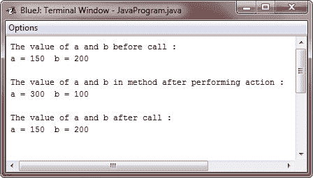
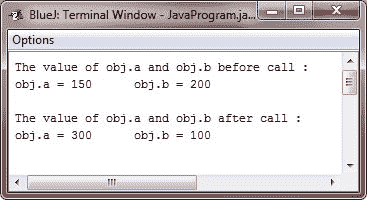

# Java 按值调用和按引用调用

> 原文：<https://codescracker.com/java/java-argument-passing.htm>

## Java 参数传递

一般来说，计算机语言可以通过以下两种方式将参数传递给子例程:

1.  **按值调用** -按值调用方法将参数的值复制到子例程的形参中。 因此，对函数或子例程参数的更改对参数没有影响。
2.  **引用调用** -在引用调用方法中，对参数的引用(不是参数的值)被 传递给参数。在子例程内部，该引用用于访问调用中确定的实际参数。这意味着 对参数的更改将影响用于调用子程序的参数。

## Java 按值调用

正如您将看到的，尽管 Java 使用按值调用来传递所有参数，但是传递基本类型还是引用类型的确切效果是不同的。

每当您将基本类型传递给方法时，它都是通过值传递的。因此，创建了参数的副本，接收参数的参数在方法之外没有任何影响。例如，考虑下面的示例程序:

## Java 按值调用示例

下面是一个示例程序，帮助您理解，如何使用通过值调用方法将参数传递给 Java 中的方法:

```
/* Java Program Example - Java Argument Passing
*  Primitive types are passed by value        */

class Test
{
    void meth(int i, int j)
    {
        i = i * 2;
        j = j / 2;

        System.out.println("\nThe value of a and b in method after performing action :");
        System.out.println("a = " + i + "\t b = " + j);
    }
}

public class JavaProgram
{   
    public static void main(String args[])
    {

        Test obj = new Test();

        int a = 150, b = 200;

        System.out.println("The value of a and b before call :");
        System.out.println("a = " + a + "\t b = " + b);

        obj.meth(a, b);

        System.out.println("\nThe value of a and b after call : ");
        System.out.println("a = " + a + "\t b = " + b);

    }
}
```

当编译并执行上述 Java 程序时，它将产生以下输出:



如您所见，名为 **meth()** 的方法中发生的操作对调用中使用的 **a** 和 **b** 的值没有影响，它们在这里的值没有更改为 300 和 100。

## Java 引用调用

当您将一个对象传递给一个方法时，情况会发生巨大的变化，因为对象是通过有效的引用调用来传递的。

永远记住，当你创建一个类类型的变量时，你只是创建了一个对象的引用。因此，当您 将这个引用传递给一个方法时，接收它的参数将引用与实参所引用的对象相同的对象。 这实际上意味着对象的行为就好像它们通过引用调用被传递给方法一样。在 方法*内对对象的改变会影响作为参数使用的对象。例如，考虑以下程序:*

## Java 引用调用示例

下面是一个示例程序，使用引用方法调用，将参数传递给 Java 中的方法:

```
/* Java Program Example - Java Argument Passing
*  Objects are passed through their reference   */

class Test
{
    int a, b;

    Test(int i, int j)
    {
        a = i;
        b = j;
    }

    /* pass an object */
    void meth(Test o)
    {
        o.a = o.a * 2;
        o.b = o.b / 2;
    }
}

public class JavaProgram
{   
    public static void main(String args[])
    {

        Test obj = new Test(150, 200);

        int a = 150, b = 200;

        System.out.println("The value of obj.a and obj.b before call :");
        System.out.println("obj.a = " + obj.a + "\t obj.b = " + obj.b);

        obj.meth(obj);

        System.out.println("\nThe value of obj.a and obj.b after call : ");
        System.out.println("obj.a = " + obj.a + "\t obj.b = " + obj.b);

    }
}
```

当编译并执行上述 Java 程序时，它将产生以下输出:



如您所见，在这种情况下， **meth()** 中的操作影响了用作参数的对象。

[Java 在线测试](/exam/showtest.php?subid=1)

* * *

* * *