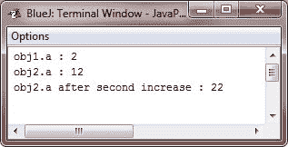

# Java 返回对象

> 原文：<https://codescracker.com/java/java-returning-objects.htm>

在 Java 中，方法可以返回任何类型的数据，包括您可以创建的类类型。例如，在下面的 Java 程序中，方法 **incrByTen()** 返回一个对象，其中 **a** 的值比调用对象中的值大 10。

## Java 返回对象示例

```
/* Java Program Example - Java Returning Objects
*  Returning an object */

class Test
{
    int a;

    Test(int i)
    {
        a = i;
    }

    Test incrByTen()
    {
        Test temp = new Test(a+10);
        return temp;
    }
}

public class JavaProgram
{   
    public static void main(String args[])
    {

        Test obj1 = new Test(2);
        Test obj2;

        obj2 = obj1.incrByTen();

        System.out.println("obj1.a : " + obj1.a);
        System.out.println("obj2.a : " + obj2.a);

        obj2 = obj2.incrByTen();

        System.out.println("obj2.a after second increase : " + obj2.a);

    }
}
```

当编译并执行上述 Java 程序时，它将产生以下输出:



如您所见，每次调用方法 **incrByTen()** 时，都会创建一个新的对象，并向调用例程返回对它的引用。

前面的程序提出了另一个要点，即由于所有的对象都是使用 **new** 操作符/关键字 动态分配的，所以你不需要担心对象超出范围，因为创建它的方法终止了。只要在你的程序中的某个地方有对它的引用，这个对象就将继续存在。当没有对它的引用时，该对象将在下一次 垃圾收集发生时被回收。

[Java 在线测试](/exam/showtest.php?subid=1)

* * *

* * *