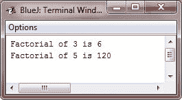

# Java 递归

> 原文：<https://codescracker.com/java/java-recursion.htm>

递归是根据事物本身来定义事物的过程。与 Java 编程相关， 递归是一种允许方法调用自身的属性。

一个可以调用自身的方法被称为*递归*方法。

## Java 递归示例

递归的经典例子是计算一个数的阶乘。一个数的阶乘比如说 *N* 是 1 和 *N* 之间所有整数的 乘积。例如，3 的阶乘是 1 * 2 * 3，即 6。下面是如何使用递归方法计算阶乘 :

```
/* Java Program Example - Java Recursion */
/* This is a simple program of recursion */

class Factorial
{
    /* this is a recursive method */
    int fact(int n)
    {
        int result;

        if(n == 1)
        {
            return 1;
        }
        result = fact(n-1) * n;
        return result;
    }
}

public class JavaProgram
{   
    public static void main(String args[])
    {

        Factorial f = new Factorial();

        System.out.println("Factorial of 3 is " + f.fact(3));
        System.out.println("Factorial of 5 is " + f.fact(5));

    }
}
```

当编译并执行上述 Java 程序时，它将产生以下输出:



## Java 递归工作说明

如果您不熟悉递归方法，那么 **fact()** 的操作可能会有点混乱。下面是它的工作原理:
当用参数 1 调用 **fact()** 时，函数返回 1；否则，它返回**事实(n-1)*n** 的乘积。 为了评估这个表达式，用 **n-1** 调用**事实()**。重复这个过程，直到 **n** 等于 1，并且对 方法的调用开始返回。

为了更好地理解 **fact()** 方法是如何工作的，让我们看一个简短的例子。当计算 3 的阶乘时， 对**事实()**的第一次调用将导致第二次调用，参数为 2。这个调用将导致**事实()**被第三次调用 ，参数为 1。这个调用将返回 1，然后乘以 2(第二次调用中 **n** 的值)。 这个结果(也就是 2)然后被返回到最初对 **fact()** 的调用，并乘以 3(n**的初始值**)。这产生了答案 6。

当一个方法调用它自己时，新的局部变量和参数被分配到堆栈上的存储空间，方法代码从一开始就用这些新的变量执行。当每个递归调用返回时，旧的局部变量和参数将从堆栈中删除，执行将在方法内部的调用点恢复。

许多例程的递归版本执行起来可能比迭代版本慢一些，因为额外的方法调用增加了额外的开销。对方法的多次递归调用可能会导致堆栈溢出。因为参数和局部变量的存储在堆栈上，并且每个新调用都会创建这些变量的新副本，所以堆栈可能会耗尽。如果发生这种情况，Java 运行时系统将导致异常。然而，除非递归例程失控，否则您可能不必担心这一点。

### 递归方法的优势

递归方法的主要优点是，与迭代方法相比，它们可以用来创建更清晰、更简单的几种算法。

**重要的** -当编写递归方法时，你必须在某处有一个 **if** 语句来强制方法返回，而不执行 递归调用。如果不这样做，一旦调用方法，它就永远不会返回。这是使用递归时非常常见的错误。

[Java 在线测试](/exam/showtest.php?subid=1)

* * *

* * *