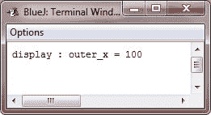

# Java 嵌套类和内部类

> 原文：<https://codescracker.com/java/java-nested-inner-classes.htm>

在 Java 中，可以在一个类中定义另一个类，这样的类称为嵌套类。

嵌套类的范围通过其封闭类的范围来限定。因此，如果一个类 B 被定义在一个类 A 中，那么 B 不会独立于类 A 而存在。

嵌套类可以访问嵌套类的成员，包括私有成员。另一方面，封闭类不能访问嵌套类的成员。直接在其封闭类范围内声明的嵌套类是其封闭类的成员。也可以声明一个嵌套类，它是块的局部类。

这里给出了两种类型的嵌套类:

*   静电
*   非静态

## Java 静态嵌套类

静态嵌套类是应用了 static 修饰符的类。因为它是静态的，所以它必须通过一个对象访问其封闭类的非静态成员，也就是说，它不能直接引用其封闭类的非静态成员。由于这个限制，静态嵌套类很少使用。

## Java 非静态嵌套类-内部类

嵌套类最重要的类型是内部类。内部类是非静态嵌套类。它可以访问其外部类的所有变量和方法，并可以像外部类的其他非静态成员那样直接引用它们。

这个示例程序演示了如何定义和使用一个内部类。Outer 类有一个名为 outer_x 的实例变量和一个名为 test()的实例方法，并定义了一个名为 inner 的内部类。

```
/* Java Program Example - Java Nested and Inner Classes
 * This program demonstrates an inner class in Java  */

 class Outer
 {
     int outer_x = 100;

     void test()
     {
         Inner inner = new Inner();
         inner.display();
     }

     /* this is an inner class */
     class Inner
     {
         void display()
         {
             System.out.println("display : outer_x = " + outer_x);
         }
     }
 }

 class JavaProgram
 {
     public static void main(String args[])
     {

         Outer outer = new Outer();
         outer.test();

     }
 }
```

当编译并执行上述 Java 程序时，它将产生以下输出:



在前面的程序中，名为 inner 的内部类是在 Outer 类的范围内定义的。因此，类 Inner 中的任何代码都可以直接访问变量 outer_x。这个 display()方法在标准输出流上显示 outer_x。JavaProgram 的 main()方法创建类 Outer 的一个实例，并调用其名为 test()的方法。该方法创建了类 Inner 的一个实例，并调用了 display()方法。

理解 Inner 的实例只能在 Outer 类的上下文中创建是很重要的。否则，Java 编译器会产生一条错误消息。通常，内部类实例通常由代码在其封闭范围内创建，如示例所示。

如前所述，内部类可以访问其封闭类的所有成员，但反之则不然。内部类的成员只在内部类的范围内是已知的，不能通过外部类使用。例如，考虑下面的示例程序:

## Java 嵌套类和内部类示例

下面是一个 Java 程序示例，使用了 Java 中的嵌套类和内部类:

```
/* Java Program Example - Java Nested and Inner Classes.
 * This program produce an error message.
 * For instance, in BlueJ, it will produce 
 * cannot find symbol - variable y
 * So this program will not compile. 
 */

 class Outer
 {
     int outer_x = 100;

     void test()
     {
         Inner inner = new Inner();
         inner.display();
     }

     /* this is an inner class */
     class Inner
     {
         int y = 10;     // y is local to Inner

         void display()
         {
             System.out.println("display : outer_x = " + outer_x);
         }
     }

     void showy()
     {
         System.out.println(y);      // error!, y not known here !!
     }
 }

 class JavaProgram
 {
     public static void main(String args[])
     {

         Outer outer = new Outer();
         outer.test();

     }
 }
```

这里，y 被声明为 Inner 的一个实例变量。因此，它在该类之外是未知的，也不能由 sturous()使用。

[Java 在线测试](/exam/showtest.php?subid=1)

* * *

* * *