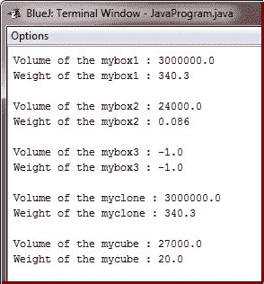
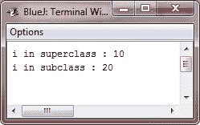

# Java 超级关键字和超类

> 原文：<https://codescracker.com/java/java-super-superclass.htm>

一个超类的引用变量可以被赋予一个从该超类派生的任何子类的引用。您会发现继承的这一方面在各种情况下非常有用。例如，考虑下面的示例程序:

```
/* Java Program Example - Java super Superclass */

class JavaProgram
{
    public static void main(String args[])
    {

        BoxWeight weightbox = new BoxWeight(5, 7, 9, 11.57);
        Box plainbox = new Box();

        double vol;

        vol = weightbox.volume();

        System.out.println("Volume of the weightbox is " + vol);
        System.out.println("Weight of the weightbox is " + weightbox.weight);
        System.out.println();

        /* assign BoxWeight reference to the Box reference */
        plainbox = weightbox;

        vol = plainbox.volume();    // OK, volume() defined in Box

        System.out.println("Volume of the plainbox is " + vol);

        /* the following statement is invalid because plainbox
         * doest not define a weight member          */

        // System.out.println("Weight of plainbox is " + plainbox.weight);

    }
}
```

这里， **weightbox** 是对 **BoxWeight** 对象的引用， **plainbox** 是对 **Box** 对象的引用。由于 **BoxWeight** 是 **Box** 的子类，因此允许将 **plainbox** 指定为 **weightbox** 对象的引用。

重要的是要明白，是引用变量的类型，而不是它所引用的对象的类型，决定了哪些成员可以被访问，也就是说，当一个子类对象的引用被分配给一个超类引用变量时，你将只能访问超类定义的对象的那些部分。这就是为什么 **plainbox** 不能访问**权重**的原因，即使它引用了一个 **BoxWeight** 对象。仔细想想，这是有意义的，因为超类 不知道子类给它添加了什么。这就是前面代码片段中最后一行代码被注释掉的原因。对于**框**引用来说 不可能访问**重量**字段，因为**框**没有定义重量字段。

## Java 超级关键字

在前面的例子中，从**框**中派生的类没有像它们本应该实现的那样高效或健壮地实现。例如， **BoxWeight** 的 构造器显式初始化 **Box** 的**宽度、高度**和**深度**字段。 不仅在超类中发现了重复的代码，这是低效的，而且这意味着子类必须被授权访问这些 成员。然而，有时你会想要创建一个超类来保存它自己的实现细节(例如， 保存它的私有数据成员)。在这种情况下，子类没有办法直接访问或初始化这些变量。既然封装是 OOP 的主要属性，那么 Java 为这个问题提供解决方案就不足为奇了。 每当子类需要引用它的直接超类时，它可以通过使用 **super** 关键字来实现。

**超级**一般有以下两种形式:

*   第一个调用超类构造函数。
*   第二个用于访问被子类成员隐藏的超类成员。

让我们逐一检查超级的两种一般形式。

子类可以通过使用以下形式的**超**来调用由其超类定义的构造函数:

```
super(*arg-list*);
```

这里， *arg-list* 指定了超类中构造函数所需的任何参数。 **super()** 必须总是子类构造函数中执行的第一个语句 。

要了解如何使用 **super()** ，请考虑下面这个 **BoxWeight** 类的改进版本:

```
/* BoxWeight now uses super to initialize its Box attributes */

class BoxWeight extends Box
{
   double weight;     // weight of the box

   /* initialize width, height, and depth using the super() */
   BoxWeight(double wei, double hei, double dep, double m)
   {
      super(wei, hei, dep);      // call the superclass constructor
      weight = m;
   }
}
```

这里， **BoxWeight** 用参数 **wei、**hei、 **dep** 调用 **super()** 。这导致 **Box** 构造函数被 调用，使用这些值初始化**宽度、高度**和**深度**。**盒重**不再自己初始化这些值 。它只需要初始化对它唯一的值: **weight** 。这使得**框**可以根据需要将这些值**设为私有** 。

## Java 超级关键字示例

在前面的示例中， **super()** 是用三个参数调用的。因为构造函数可以重载，所以可以使用超类定义的任何形式调用 **super()** 。执行的构造函数将是匹配参数的构造函数。例如，这里有一个 **BoxWeight** 的完整实现 ，它提供了构造一个盒子的各种方法。在每种情况下，使用 适当的参数调用 **super()** 。注意**宽度、高度**和**深度**已经在**框**中被私有。

```
/* Java Program Example - Java super Superclass
 * This is the complete implementation of the BoxWeight */

 class Box
 {
     private double width;
     private double height;
     private double depth;

     /* construct clone of an object */
     Box(Box obj)               // pass object to constructors
     {
         width = obj.width;
         height = obj.height;
         depth = obj.depth;
     }

     /* constructor used when all the dimensions specified */
     Box(double wei, double hei, double dep)
     {
         width = wei;
         height = hei;
         depth = dep;
     }

     /* constructor used when no dimensions specified */
     Box()
     {
         width = -1;         // use -1 to indicate
         height = -1;        // an uninitialized
         depth = -1;         // box
     }

     /* constructor used when the cube is created */
     Box(double len)
     {
         width = height = depth = len;
     }

     /* compute and return the volume */
     double volume()
     {
         return width * height * depth;
     }
 }

 /* BoxWeight is now fully implements all the constructors */
 class BoxWeight extends Box
 {
     double weight;      // weight of the box

     /* construct clone of an object */
     BoxWeight(BoxWeight obj)          // pass object to constructor
     {
         super(obj);
         weight = obj.weight;
     }

     /* constructor when all the parameters are specified */
     BoxWeight(double wei, double hei, double dep, double m)
     {
         super(wei, hei, dep);         // call the superclass constructor
         weight = m;
     }

     /* the default constructor */
     BoxWeight()
     {
         super();
         weight = -1;
     }

     /* constructor used when the cube is created */
     BoxWeight(double len, double m)
     {
         super(len);
         weight = m;
     }
 }

 class JavaProgram
 {
     public static void main(String args[])
     {

         BoxWeight mybox1 = new BoxWeight(100, 200, 150, 340.30);
         BoxWeight mybox2 = new BoxWeight(20, 30, 40, 0.086);
         BoxWeight mybox3 = new BoxWeight();          // default
         BoxWeight mycube = new BoxWeight(30, 20);
         BoxWeight myclone = new BoxWeight(mybox1);

         double vol;

         vol = mybox1.volume();
         System.out.println("Volume of the mybox1 : " + vol);
         System.out.println("Weight of the mybox1 : " + mybox1.weight);
         System.out.println();

         vol = mybox2.volume();
         System.out.println("Volume of the mybox2 : " + vol);
         System.out.println("Weight of the mybox2 : " + mybox2.weight);
         System.out.println();

         vol = mybox3.volume();
         System.out.println("Volume of the mybox3 : " + vol);
         System.out.println("Weight of the mybox3 : " + mybox3.weight);
         System.out.println();

         vol = myclone.volume();
         System.out.println("Volume of the myclone : " + vol);
         System.out.println("Weight of the myclone : " + myclone.weight);
         System.out.println();

         vol = mycube.volume();
         System.out.println("Volume of the mycube : " + vol);
         System.out.println("Weight of the mycube : " + mycube.weight);
         System.out.println();

     }
 }
```

当编译并执行上述 Java 程序时，它将产生以下输出:



特别注意 **BoxWeight** 中的这个构造器:

```
/* construct clone of an object */
BoxWeight(BoxWeight obj)          // pass object to constructor
{
    super(obj);
    weight = obj.weight;
}
```

注意， **super()** 被传递了一个类型为 **BoxWeight** 的对象，而不是类型为 **Box** 的对象。这仍然调用构造函数 **Box(Box obj)** 。如前所述，超类变量可以用来引用从该类派生的任何对象。因此，我们能够 将一个 **BoxWeight** 对象传递给 **Box** 构造函数。当然， **Box** 只知道自己的成员。

让我们回顾一下 **super()** 背后的关键概念。当一个子类调用 **super()** 时，它正在调用其直接 超类的构造函数。因此， **super()** 总是指向直接在调用类之上的超类。即使在多层次的层次结构中也是如此。另外， **super()** 必须总是子类构造函数中执行的第一条语句。

## 超级关键字(第二种形式)

第二种形式的 **super** 有点像 **this** ，除了它总是引用使用它的子类 的超类。这种用法具有以下一般形式:

```
super.*member*
```

这里，*成员*可以是方法，也可以是实例变量。

**超级**的第二种形式最适用于子类的成员名隐藏超类中同名成员的情况。 考虑以下简单的类层次结构:

```
/* Java Program Example - Java super Superclass 
 * This program use super to overcome name hiding */

 class A
 {
     int i;
 }

 /* create a subclass by extending the class A */
 class B extends A
 {
     int i;        // this i hides the i in A

     B(int a, int b)
     {
         super.i = a;        // i in A
         i = b;              // i in B
     }

     void show()
     {
         System.out.println("i in superclass : " + super.i);
         System.out.println("i in subclass : " + i);
     }
 }

 class JavaProgram
 {
     public static void main(String args[])
     {

         B subobj = new B(10, 20);

         subobj.show();

     }
 }
```

当编译并执行上述 Java 程序时，它将产生以下输出:



虽然 **B** 中的实例变量 **i** 隐藏了 **A 中的 **i** ，但是超**允许访问超类中定义的 **i** 。 正如您将看到的， **super** 也可以用来调用被子类隐藏的方法。

[Java 在线测试](/exam/showtest.php?subid=1)

* * *

* * *