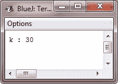
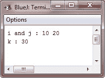
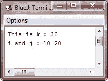

# Java 方法覆盖

> 原文：<https://codescracker.com/java/java-overriding.htm>

在类的层次结构中，当子类中的方法与其超类中的方法具有相同的名称和类型签名时，那么子类中的方法就被认为覆盖了超类中的方法。

当一个被覆盖的方法从它的子类内部被调用时，它将总是引用由子类定义的那个方法的版本。由超类定义的方法的版本将被隐藏。考虑下面的例子:

## Java 方法覆盖示例

下面的示例演示了 Java 中的方法覆盖:

```
/* Java Program Example - Java Method Overriding
 * This program demonstrates the Method Overriding */

 class A
 {
     int i, j;

     A(int x, int y)
     {
         i = x;
         j = y;
     }

     /* prints the value of i and j */
     void display()
     {
         System.out.println("i and j : " + i + "  " + j);
     }
 }

 class B extends A
 {
     int k;

     B(int x, int y, int z)
     {
         super(x, y);
         k = z;
     }

     /* print k's value, this overrides the display() in A */
     void display()
     {
         System.out.println("k : " + k);
     }
 }

 class JavaProgram
 {
     public static void main(String args[])
     {

         B subObj = new B(10, 20, 30);

         subObj.display();     // this calls the display() in B

     }
 }
```

当编译并执行上述 Java 程序时，它将产生以下输出:



当在 B 类型的对象上调用 display()时，使用 B 中定义的 display()版本，即 B 中 display()方法的版本覆盖 a 中声明的版本。

如果希望访问被重写方法的超类版本，可以通过使用。例如，在 B 的这个版本中，display()的超类版本在子类版本中被调用。这允许显示所有实例变量。

```
/* Java Program Example - Java Method Overriding
 * This program demonstrates Method Overriding */

 class A
 {
     int i, j;

     A(int x, int y)
     {
         i = x;
         j = y;
     }

     /* print i and j */
     void display()
     {
         System.out.println("i and j : " + i + "  " + j);
     }
 }

 class B extends A
 {
     int k;

     B(int x, int y, int z)
     {
         super(x, y);
         k = z;
     }

     /* print k, this overrides the display() in A */
     void display()
     {
         super.display();              // this calls A's display()
         System.out.println("k : " + k);
     }
 }

 class JavaProgram
 {
     public static void main(String args[])
     {

         B subObj = new B(10, 20, 30);

         subObj.display();     // this calls the display() in B

     }
 }
```

当编译并执行上述 Java 程序时，它将产生以下输出:



这里，super.display()调用 display()的超类版本。

只有当两个方法的名称和类型签名相同时，才会发生方法重写。如果不是，那么这两个方法就是重载了。例如，考虑下面的示例程序，它是前面示例的修改版本:

```
/* Java Program Example - Java Method Overriding
 * Methods with differing type signatures are 
 * overloaded, not overridden
 */

 class A
 {
     int i, j;

     A(int x, int y)
     {
         i = x;
         j = y;
     }

     /* print i and j */
     void display()
     {
         System.out.println("i and j : " + i + "  " + j);
     }
 }

 /* now create a subclass by extending class A */
 class B extends A
 {
     int k;

     B(int x, int y, int z)
     {
         super(x, y);
         k = z;
     }

     /* overload display() */
     void display(String msg)
     {
         System.out.println(msg + k);
     }
 }

 class JavaProgram
 {
     public static void main(String args[])
     {

         B subObj = new B(10, 20, 30);

         subObj.display("This is k : ");     // calls display() in B
         subObj.display();                   // calls display() in A

     }
 }
```

当编译并执行上述 Java 程序时，它将产生以下输出:



B 中的 display()版本接受一个字符串参数。这使得它的类型签名不同于不带参数的中的类型签名。因此，不会发生覆盖(或名称隐藏)。相反，B 中的 display()版本只是重载了 a 中的 display()版本。

[Java 在线测试](/exam/showtest.php?subid=1)

* * *

* * *