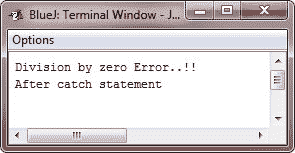
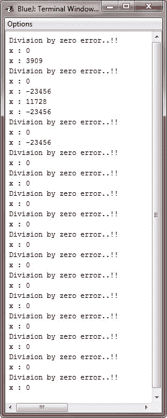

# Java 尝试捕捉

> 原文：<https://codescracker.com/java/java-try-catch.htm>

尽管 Java 运行时系统提供的默认异常处理程序对于调试很有用，但是您通常希望自己处理异常。这样做有以下两个好处:

1.  它允许您修复错误。
2.  它防止程序自动终止。

如果您的程序在出现错误时停止运行并打印堆栈跟踪，大多数用户会感到困惑。幸运的是，这是很容易防止的。

为了预防和处理运行时错误，只需将您想要监控的代码放在一个 **try** 块中。 紧跟在 **try** 块之后，包含一个 **catch** 子句，指定您希望捕获的异常类型。

## Java try catch 示例

为了说明这样做有多容易，下面的程序包括一个 **try** 块和一个 **catch** 子句，用于处理由被零除错误生成的 **算术异常**:

```
/* Java Program Example - Java try and catch
 * This program illustrates the uses of try 
 * and catch in Java */

 class JavaProgram
 {
     public static void main(String args[])
     {
         int denom = 0, num = 52, res;

         try {      // monitor a block of code

             res = num / denom;
             System.out.println("This will not be printed");

         } catch(ArithmeticException e) {       // catch divide-by-zero error

             System.out.println("Division by zero Error..!!");
         }

         System.out.println("After catch statement");
     }
 }
```

当编译并执行上述 Java 程序时，它将产生以下输出:



请注意，在 **try** 块中对 **println()** 的调用永远不会被执行。一旦抛出异常，程序控制将 从 **try** 块转移到 **catch** 块。换句话说， **catch** 没有被“调用”，所以执行永远不会从 **catch** 中“返回”到 **try** 块。因此，不会显示“这不会被打印”这一行。一旦执行了 **catch** 语句， 程序控制继续执行整个 **try / catch** 机制之后的程序中的下一行。

一个 **try** 和它的 **catch** 语句形成一个单元。 **catch** 子句的范围限于由紧接在 **try** 语句之前的 所指定的那些语句。一个 **catch** 语句不能捕获另一个 **try** 语句抛出的异常(嵌套 **try** 语句的 情况除外)。受 **try** 保护的语句必须用花括号括起来，即它们必须在 块内。不能在一条语句中使用 **try** 。

大多数构造良好的 **catch** 子句的目标应该是解决异常情况，然后继续运行，就好像错误 从未发生过一样。例如，在接下来的示例程序中，循环的**的每次迭代都会获得两个随机整数。那两个整数 互相除，结果用来除数值 23456。最终结果放入变量 **x** 。如果任何一个除法运算导致 出现被零除的错误，它将被捕获， **x** 的值将被设置为零，程序继续运行。**

```
/* Java Program Example - Java try and catch
 * This program handle an exception and 
 * move on */

 import java.util.Random;

 class JavaProgram
 {
     public static void main(String args[])
     {

         int x = 0, y = 0, z = 0;

         Random ran = new Random();

         for(int i=0; i<20; i++)
         {
             try {

                 y = ran.nextInt();
                 z = ran.nextInt();
                 x = 23456 / (y/z);

             } catch (ArithmeticException e) {

                 System.out.println("Division by zero error..!!");
                 x = 0;      // set x to zero and continue

             }

             System.out.println("x : " + x);

         }

     }
 }
```

当编译并执行上述 Java 程序时，它将产生以下输出:



[Java 在线测试](/exam/showtest.php?subid=1)

* * *

* * *