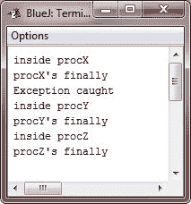

# Java finally 块

> 原文：<https://codescracker.com/java/java-finally-keyword.htm>

当抛出异常时，方法中的执行会采取相当突然的非线性路径，这改变了方法的正常流程。

根据编码的方法，异常甚至可能导致方法最终返回。这可能是几个方法的问题。例如，如果一个方法在进入时打开一个文件，在退出时关闭它，那么您不希望关闭文件的代码被异常处理机制绕过。关键字 finally 旨在解决这种偶然性。

最后，创建一个代码块，该代码块将在 try/catch 块完成之后、try/catch 块之后的代码之前执行。

无论是否抛出异常，finally 块都将始终执行。如果引发异常，即使没有任何 catch 语句与该异常匹配，finally 块也会执行。每当方法要通过未捕获的异常或显式 return 语句从 try/catch 块内部返回到调用方时，finally 子句也会在方法返回之前执行。这在关闭文件句柄和释放任何其他资源时很有用，这些资源可能是在方法开始时分配的，目的是在返回之前释放它们。

finally 子句是可选的。然而，每个 try 语句至少需要一个 catch 或 finally 子句。

## Java finally 块示例

下面是一个示例程序，显示了以不同方式退出的三种方法，没有一种方法不执行它们的 finally 子句:

```
/* Java Program Example - Java finally keyword
 * This program demonstrate the finally keyword 
 */

 class FinallyTest
 {
     /* Throw an exception out of method */
     static void procX() {
         try {

             System.out.println("inside procX");
             throw new RuntimeException("demo");

         } finally {

             System.out.println("procX's finally");

         }
     }

     /* return from within a try block */
     static void procY() {
         try {

             System.out.println("inside procY");
             return;

         } finally {

             System.out.println("procY's finally");

         }
     }

     /* execute a try block normally */
     static void procZ() {
         try {

             System.out.println("inside procZ");

         } finally {

             System.out.println("procZ's finally");

         }
     }

     public static void main(String args[])
     {
         try {

             procX();

         } catch(Exception e) {

             System.out.println("Exception caught");

         }

         procY();
         procZ();
     }
 }
```

在这个程序中，procX()方法通过抛出一个异常提前中断了 try。finally 子句在退出时执行。procY()方法的 try 语句是通过 return 语句存在的。finally 子句在 procY()返回之前执行。在 procZ()中，try 语句正常执行，没有错误。然而，finally 块被执行。

下面是上述 Java 程序生成的输出:



**注意** -如果一个**最终**程序块与一个 **try** 相链接，那么**最终**程序块将在 **try** 结束时执行。

[Java 在线测试](/exam/showtest.php?subid=1)

* * *

* * *