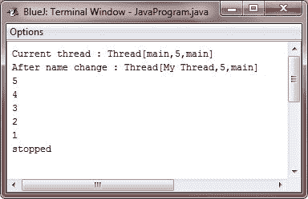

# Java 主线程

> 原文：<https://codescracker.com/java/java-main-thread.htm>

一旦 Java 程序启动，一个线程立即开始运行。这通常被称为程序的主线程，因为它是程序启动时执行的线程。主线程之所以重要，有以下两个原因:

*   它是其他(子)线程将从中产生的线程
*   通常，它必须是最后一个完成执行的线程，因为它执行各种关闭操作

虽然主线程是在程序启动时自动创建的，但它可以通过一个 thread 对象来控制。为此，您必须通过调用名为 currentThread()的方法来获取对它的引用，current Thread()是线程的公共静态成员。其一般形式为:

```
static Thread currentThread()
```

此方法返回对调用它的线程的引用。一旦有了对主线程的引用，就可以像控制其他线程一样控制它。

## Java 主线程示例

这里有一个例子演示了 Java 中主线程的概念:

```
/* Java Program Example - Java Main Thread
 * This program control the main Thread
 */

 class JavaProgram
 {
     public static void main(String args[])
     {

         Thread thr = Thread.currentThread();

         System.out.println("Current thread : " + thr);

         /* change the name of the thread */
         thr.setName("My Thread");
         System.out.println("After name change : " + thr);

         try {
             for(int i=5; i>0; i--)
             {
                 System.out.println(i);
                 Thread.sleep(1000);
             }
             System.out.println("stopped");

         } catch(InterruptedException e) {
             System.out.println("Main thread interrupted");
         }

     }
 }
```

当编译并执行上述 Java 程序时，它将产生以下输出:



在上面的程序中，通过调用 current thread()方法获得对当前线程(本例中为主线程)的引用，该引用存储在局部变量 thr 中。接下来，程序显示关于线程的信息。然后程序调用 setName()方法来改变线程的内部名称。然后重新显示关于该线程的数据。接下来，循环从五开始倒数，每行之间暂停一秒钟。暂停是由 sleep()方法执行的。sleep()的参数以毫秒为单位指定延迟时间。

注意这里的 try/catch 块围绕着这个循环。线程中的 sleep()方法可能会引发 interruptedException。只有当其他线程想要中断这个休眠线程时，才会发生这种情况。这个程序只是在被中断时打印一条信息(如上面的程序所示)。

请注意，thr 用作 println()的参数时产生的输出。这将按顺序显示线程的名称及其优先级，然后是其组的名称。

默认情况下，主线程的名称是 main。它的优先级是默认值 5，main 也是这个线程所属的线程组的名称。

线程组是一种数据结构，它从整体上控制线程集合的状态。在线程的名字被改变后，thr 再次被输出。这一次，将显示线程的新名称。

在上面的程序中，如您所见，sleep()使调用它的线程在给定的毫秒时间内暂停执行。它的一般形式是:

```
static void sleep(long *milliseconds*) throws InterruptedException
```

挂起的毫秒数以毫秒为单位。此方法可能会引发 InterruptedException。

sleep()有第二种形式，如下所示，允许您用毫秒和纳秒来指定时间段:

```
static void sleep(long *milliseconds*, int *nanoseconds*) throws InterruptedException
```

第二种形式的 sleep()方法仅在允许计时周期短至纳秒的环境中有用。

如前面的程序所示，您可以使用 setName()方法来设置线程的名称。

可以通过调用 getName()方法来获取线程的名称(上面的程序中没有显示这个方法，但是可以尝试一下)。这些方法是 Thread 类的成员，声明如下:

```
final void setName(String *threadName*)
final String getName()
```

这里， *threadName* 指定线程的名称。

[Java 在线测试](/exam/showtest.php?subid=1)

* * *

* * *