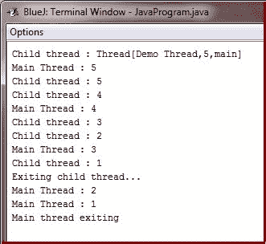
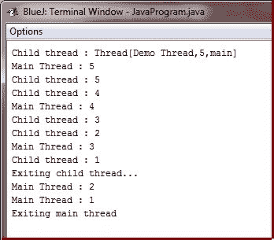

# Java 创建线程

> 原文：<https://codescracker.com/java/java-create-thread.htm>

在大多数情况下，通过实例化类型为 **Thread** 的对象来创建线程。

Java 定义了以下两种实现方式:

*   你可以实现**可运行的**接口
*   您可以扩展**线程**类本身

现在让我们逐一讨论每种方法。

## 用 Java 实现 Runnable

创建线程最简单的方法是创建一个实现 **Runnable** 接口的类。

**Runnable** 抽象出一个可执行代码单元。您可以在任何实现了 **Runnable** 的对象上构造一个线程。 要实现 **Runnable** ，一个类只需要实现一个名为 **run()** 的方法，声明如下:

```
public void run()
```

在 **run()** 方法中，您将定义构成新线程的代码。理解方法 **run()** 可以调用其他方法、使用其他类和声明变量是很重要的，就像主线程一样。唯一的区别是方法 **run()** 为程序中的另一个并发执行线程建立了入口点。这个线程将在方法 **run()** 返回时结束。

在您创建了实现了 **Runnable** 的类之后，您将从该类中实例化一个**线程**类型的对象。 **线程**定义了几个构造函数。我们将使用的方法如下所示:

```
Thread(Runnable *threadOb*, String *threadName*)
```

在这个构造函数中， *threadOb* 是实现 **Runnable** 接口的类的实例。这定义了线程的 执行将从哪里开始。新线程的名称由*线程名*指定。

新线程创建后，直到您调用其方法 **start()** 时才会开始运行，该方法在**线程**中声明。 本质上， **start()** 方法执行对 **run()** 方法的调用。 **start()** 方法如下所示:

```
void start()
```

## Java 创建线程示例

下面是一个创建新线程并启动它运行的示例:

```
/* Java Program Example - Java Creating a Thread
 * Implement Runnable interface 
 * Create a second thread 
 */

 class NewThread implements Runnable
 {
     Thread thr;

     NewThread()
     {
         /* create a new, second thread */
         thr = new Thread(this, "Demo Thread");
         System.out.println("Child thread : " + thr);
         thr.start();        // start the thread
     }

     /* this is the entry point for second thread */
     public void run()
     {
         try
         {
             for(int n=5; n>0; n--)
             {
                 System.out.println("Child thread : " + n);
                 Thread.sleep(500);
             }
         }
         catch(InterruptedException e)
         {
             System.out.println("Child interrupted");
         }

         System.out.println("Exiting child thread...");
     }
 }

 class JavaProgram
 {
     public static void main(String args[])
     {

         new NewThread();     // create a new thread

         try
         {
             for(int n=5; n>0; n--)
             {
                 System.out.println("Main Thread : " + n);
                 Thread.sleep(1000);
             }
         }
         catch(InterruptedException e)
         {
             System.out.println("Main thraed interrupted");
         }

         System.out.println("Main thread exiting");

     }
 }
```

在 **NewThread** 的构造函数中，这个语句创建了一个新的线程对象:

```
thr = new Thread(this, "Demo thread");
```

传递**这个**作为第一个参数，这表明你希望新线程在**这个**对象上调用方法 **run()** 。 接下来， **start()** 被调用，这启动了从方法 **run()** 开始执行的线程。这使得 循环的子线程**开始。调用 **start()** 方法后， **NewThread** 的构造函数返回到 **main()** 方法。当主 线程恢复时，它进入其**进行**循环。两个线程都继续运行，在单核系统中共享 CPU，直到它们的 循环结束。此程序产生的输出如下所示:**



如前所述，在多线程程序中，通常主线程必须是最后一个完成运行的线程。事实上，对于一些较老的 JVM，如果主线程在子线程完成之前完成，那么 Java 运行时系统可能会“挂起”。前面的程序确保主线程最后完成，因为主线程在两次迭代之间休眠 1000 毫秒，但子线程仅休眠 500 毫秒。这导致子线程比主线程提前终止。很快，您将看到等待线程结束的更好方法。

## 延伸螺纹

创建线程的第二种方式是创建一个扩展线程的新类，然后创建该类的一个实例。扩展类必须覆盖新线程的入口点 **run()** 。它还必须调用方法 **start()** 来启动新线程的执行。

### 例子

下面是为扩展**线程**而重写的前面的程序:

```
/* Java Program Example - Java Creating a Thread
 * Extending Thread
 * Create a second thread by extending Thread 
 */

 class NewThread extends Thread
 {
     NewThread()
     {
         /* create a new, second thread */
         super("Demo Thread");
         System.out.println("Child thread : " + this);
         start();        // start the thread
     }

     /* this is the entry point for second thread */
     public void run()
     {
         try
         {
             for(int n=5; n>0; n--)
             {
                 System.out.println("Child thread : " + n);
                 Thread.sleep(500);
             }
         }
         catch(InterruptedException e)
         {
             System.out.println("Child interrupted..!!");
         }

         System.out.println("Exiting child thread...");
     }
 }  

 class JavaProgram
 {
     public static void main(String args[])
     {

         new NewThread();     // create a new thread

         try
         {
             for(int n=5; n>0; n--)
             {
                 System.out.println("Main Thread : " + n);
                 Thread.sleep(1000);
             }
         }
         catch(InterruptedException e)
         {
             System.out.println("Main thraed interrupted..!!");
         }

         System.out.println("Exiting main thread");

     }
 }
```

上述 Java 程序产生与上述程序相同的输出，如下所示:



正如你所看到的，子线程是通过实例化 **NewThread** 的一个对象创建的，它是从**线程**派生而来的。

注意这里，对 **NewThread** 中的 **super()** 方法的调用。这将调用以下形式的**线程**构造函数:

```
public Thread(String *threadName*)
```

在这个语句中， *threadName* 指定线程的名称

[Java 在线测试](/exam/showtest.php?subid=1)

* * *

* * *