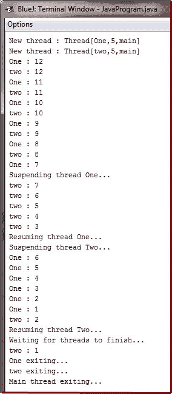

# Java 挂起恢复停止线程

> 原文：<https://codescracker.com/java/java-suspend-resume-stop-thread.htm>

有时，暂停线程的执行是有用的。例如，可以使用一个单独的线程来显示一天中的时间。如果用户不想要时钟，那么它的线程可以被挂起。无论是哪种情况，挂起线程都是一件简单的事情。一旦挂起，重启线程也是一件简单的事情。

挂起、恢复和停止线程的机制在 Java 的早期版本(如 Java 1.0)和从 Java 2 开始的现代版本之间有所不同。在 Java 2 之前，程序使用由**线程**定义的 **suspend()、resume()、**和 **stop()** 方法来 暂停、重启和停止线程的执行。尽管这些方法看起来是管理线程执行的非常合理和方便的方法，但是它们不能用于新的 Java 程序。

## Java 挂起线程

**线程**类的 **suspend()** 方法几年前就被 Java 2 弃用了。这样做是因为 **suspend()** 有时会导致严重的系统故障。

假设一个线程已经获得了关键数据结构的锁。如果该线程在该点被挂起，这些锁不会被释放。可能正在等待这些资源的其他线程可能会被死锁。

## Java 恢复线程

也不推荐使用 **resume()** 方法。这不会引起问题，但是如果没有 **suspend()** 方法，就不能像 方法一样使用。

## Java 停止线程

Java 2 也不赞成使用**线程**类的 **stop()** 方法。这样做是因为这种方法有时会 导致严重的系统故障。

假设一个线程正在写入一个非常重要的数据结构，并且只完成了它的一部分更改。如果线程在该点停止，数据结构可能会处于损坏状态。问题是， **stop()** 导致调用线程持有的任何锁 被释放。因此，损坏的数据可能被另一个正在等待同一锁的线程使用。

## Java 暂停恢复停止线程示例

因为您现在不能使用 **suspend()、resume()** 或 **stop()** 方法来控制线程，所以您可能会认为不存在暂停、 重启或终止线程的方法。但是，幸运的是，这不是真的。相反，线程必须被设计成使得 **run()** 方法周期性地 检查以确定该线程是否应该挂起、恢复或停止它自己的执行。通常，这是通过建立一个指示线程执行状态的 标志变量来实现的。只要这个标志被设置为“running”，那么 **run()** 方法就必须继续 让线程执行。如果此变量设置为“暂停”，线程必须暂停。如果设置为“停止”，线程必须终止。当然，存在多种方式来编写这样的代码，但是所有程序的中心主题都是一样的。

下面的例子说明了如何使用从**对象**继承的 **wait()** 和 **notify()** 方法来控制 线程的执行。我们来考虑一下它的操作。 **NewThread** 类包含一个名为 **suspendFlag** 的**布尔**实例变量，用于控制线程的执行。它被构造函数初始化为**假**。 **run()** 方法包含一个检查 **suspendFlag** 的 **synchronized** 语句块。如果该变量为**真**，则调用 **wait()** 方法来暂停线程的执行 。 **mysuspend()** 方法将 **suspendFlag** 设置为 **true** 。 **myresume()** 方法将 **suspendFlag** 设置为 **false** 并且 调用 **notify()** 来唤醒线程。最后， **main()** 方法被修改为调用 **mysuspend()** 和 **myresume()** 方法。

```
/* Java Program Example - Java Suspend Resume Stop Thread
 * Suspending and resuming a thread the modern way */

 class NewThread implements Runnable
 {
     String name;      //name of thread
     Thread thr;
     boolean suspendFlag;

     NewThread(String threadname)
     {
         name = threadname;
         thr = new Thread(this, name);
         System.out.println("New thread : " + thr);
         suspendFlag = false;
         thr.start();     // start the thread
     }

     /* this is the entry point for thread */
     public void run()
     {
         try
         {
             for(int i=12; i>0; i--)
             {
                 System.out.println(name + " : " + i);
                 Thread.sleep(200);
                 synchronized(this)
                 {
                     while(suspendFlag)
                     {
                         wait();
                     }
                 }
             }
         }
         catch(InterruptedException e)
         {
             System.out.println(name + " interrupted");
         }

         System.out.println(name + " exiting...");
     }

     synchronized void mysuspend()
     {
         suspendFlag = true;
     }

     synchronized void myresume()
     {
         suspendFlag = false;
         notify();
     }
 }

 class SuspendResumeThread
 {
     public static void main(String args[])
     {

         NewThread obj1 = new NewThread("One");
         NewThread obj2 = new NewThread("two");

         try
         {
             Thread.sleep(1000);
             obj1.mysuspend();
             System.out.println("Suspending thread One...");
             Thread.sleep(1000);
             obj1.myresume();
             System.out.println("Resuming thread One...");

             obj2.mysuspend();
             System.out.println("Suspending thread Two...");
             Thread.sleep(1000);
             obj2.myresume();
             System.out.println("Resuming thread Two...");
         }
         catch(InterruptedException e)
         {
             System.out.println("Main thread Interrupted..!!");
         }

         /* wait for threads to finish */
         try
         {
             System.out.println("Waiting for threads to finish...");
             obj1.thr.join();
             obj2.thr.join();
         }
         catch(InterruptedException e)
         {
             System.out.println("Main thread Interrupted..!!");
         }

         System.out.println("Main thread exiting...");

     }
 }
```

当您编译并运行上面的 Java 程序时，您将看到线程暂停和恢复，如下所示:



[Java 在线测试](/exam/showtest.php?subid=1)

* * *

* * *