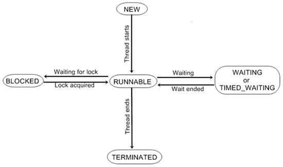

# Java 获取线程状态

> 原文：<https://codescracker.com/java/java-get-thread-state.htm>

一个线程可以有多种不同的状态。可以通过调用 thread 定义的 getState()方法来获取线程的当前状态。下面是获取线程状态的方法:

```
Thread.State getState()
```

它返回一个 Thread 类型的值。State，指示进行调用时线程的状态。状态是由线程定义的枚举。(一个[枚举](/java/java-enumerations.htm)什么都不是，它是一个命名常量的列表。 你将在下一章学习枚举。

下表列出了 getState()方法可以返回的值:

| 价值 | 状态 |
| 堵塞的 | 由于等待获得锁而挂起执行的线程 |
| 新的 | 尚未开始执行的线程 |
| 可追捕的 | 当前正在执行或将在获得对 CPU 的访问权时执行的线程 |
| 终止的 | 已经完成执行的线程 |
| 定时等待 | 已暂停执行指定时间的线程。比如当它已经调用 **sleep()** 的时候。当调用 **wait()** 或 **join()** 的超时版本时，该状态也进入 |
| 等待 | 由于等待某个操作发生而暂停执行的线程。例如，它正在等待，因为调用了非超时版本的 **wait()** 或 **join()** |

## Java 线程状态

下图显示了各种线程状态之间的关系:



给定一个线程实例，您可以使用 getState()方法来获取线程的状态。例如，下面的序列确定在调用 getState()时，名为 thrd 的线程是否处于可运行状态:

```
Thread.State ts = thrd.getState();
if(ts == Thread.State.RUNNABLE)  // ...
```

在调用 getState()之后，线程的状态可能会改变，理解这一点很重要。因此，根据具体情况，通过调用 getState()方法获得的状态可能并不反映稍后线程的实际状态。出于这个原因和其他原因，getState()方法并不打算提供同步线程的方法。它主要用于调试/分析线程的运行时特性。

[Java 在线测试](/exam/showtest.php?subid=1)

* * *

* * *