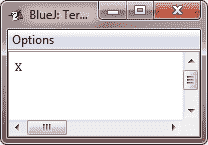

# Java 写入控制台输出

> 原文：<https://codescracker.com/java/java-write-console-output.htm>

如前所述，控制台输出最容易通过 **print()** 和 **println()** 方法完成。这些方法由 类 **PrintStream** 定义，它是 **System.in** 引用的对象类型。尽管 **System.out** 是一个字节流，使用 进行简单的程序输出仍然是可以接受的。

因为 **PrintStream** 是从 **OutputStream** 派生的输出流，所以它也实现了底层方法 **write()** 。 因此， **write()** 可以用来写入控制台。由 **PrintStream** 定义的 **write()** 的最简单形式如下所示:

```
void write(int *byteval*)
```

该方法写入由 *byteval* 指定的字节。虽然 *byteval* 被声明为整数，但是只有低阶八位 被写入。下面是一个简短的例子，它使用 **write()** 将字符‘X’后跟一个换行符输出到屏幕上:

```
/* Java Program Example - Java Write Console Output
 * This program writes the character X followed by newline 
 * This program demonstrates System.out.write()  */

 class WriteConsoleOutput
 {
     public static void main(String args[])
     {

         int y;

         y = 'X';

         System.out.write(y);
         System.out.write('\n');

     }
 }
```

这个 Java 程序将产生以下输出:



您不会经常使用 **write()** 来执行控制台输出(尽管这样做在某些情况下可能有用)，因为 **print()** 和 **println()** 实际上更容易使用。

## Java 中的文件示例

这里有一些关于 Java 文件的例子，你可以去看看。

*   [用 Java 读取文件](/java/program/java-program-read-file.htm)
*   [写入文件 Java](/java/program/java-program-write-to-file.htm)
*   [用 Java 读取&显示文件](/java/program/java-program-read-and-display-file.htm)
*   [用 Java 复制文件](/java/program/java-program-copy-file.htm)
*   [在 Java 中合并两个文件](/java/program/java-program-merge-two-files.htm)
*   [列出 Java 目录下的文件](/java/program/java-program-list-files-in-directory.htm)
*   [删除 Java 中的文件](/java/program/java-program-delete-file.htm)

[Java 在线测试](/exam/showtest.php?subid=1)

* * *

* * *