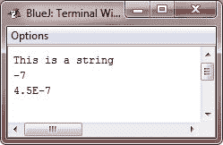

# Java PrintWriter 类

> 原文：<https://codescracker.com/java/java-printwriter-class.htm>

虽然使用 **System.out** 写入控制台是可以接受的，但它的使用可能最适合于调试目的或示例程序。

对于真实世界的程序，使用 Java 时，推荐的写入控制台的方法是通过 **PrintWriter** 流。

**PrintWriter** 是基于字符的类之一。为控制台输出使用基于字符的类使得国际化你的 程序更加容易。

**PrintWriter** 定义了几个构造函数。我们将使用的方法如下所示:

```
PrintWriter(OutputStream *outputStream*, boolean *flushingOn*)
```

这里， *outputStream* 是一个类型为 **OutputStream** 的对象， *flushingOn* 控制每次 调用 **println()** 方法(以及其他方法)时 Java 是否刷新输出流。如果 *flushingOn* 为**真**，冲洗自动进行。如果**为假**，冲洗 不自动。

**PrintWriter** 支持 **print()** 和 **println()** 方法。因此，您可以像使用 和 **System.out** 一样使用这些方法。如果参数不是简单类型， **PrintWriter** 方法调用对象的 **toString()** 方法，然后 显示结果。

要使用 **PrintWriter** 写入控制台，请为输出流和自动刷新指定 **System.out** 。例如， 下面一行代码创建了一个连接到控制台输出的 **PrintWriter** :

```
PrintWriter pw = new PrintWriter(System.out, true);
```

## Java PrintWriter 示例

下面的应用程序说明了如何使用一个 **PrintWriter** 来处理控制台输出:

```
/* Java Program Example - Java PrintWriter Class
 * This program demonstrate the PrintWriter */

 import java.io.*;

 class PrintWriterDemo
 {
     public static void main(String args[])
     {

         PrintWriter prnwrt = new PrintWriter(System.out, true);

         prnwrt.println("This is a string");

         int i = -7;
         prnwrt.println(i);
         double d = 4.5e-7;
         prnwrt.println(d);

     }
 }
```

这个 Java 程序的输出如下所示:



记住，当你在学习 Java 或者调试你的 程序的时候，使用 **System.out** 简单的文本输出到控制台是没有错的。然而，使用 **PrintWriter** 可以让你现实世界的应用程序更容易国际化。因为在简单程序中使用 **PrintWriter** 对 没有好处，我们将继续使用 **System.out** 向控制台写入。

## Java 中的文件示例

这里有一些关于 Java 文件的例子，你可以去看看。

*   [用 Java 读取文件](/java/program/java-program-read-file.htm)
*   [写入文件 Java](/java/program/java-program-write-to-file.htm)
*   [用 Java 读取&显示文件](/java/program/java-program-read-and-display-file.htm)
*   [用 Java 复制文件](/java/program/java-program-copy-file.htm)
*   [在 Java 中合并两个文件](/java/program/java-program-merge-two-files.htm)
*   [列出 Java 目录下的文件](/java/program/java-program-list-files-in-directory.htm)
*   [删除 Java 中的文件](/java/program/java-program-delete-file.htm)

[Java 在线测试](/exam/showtest.php?subid=1)

* * *

* * *