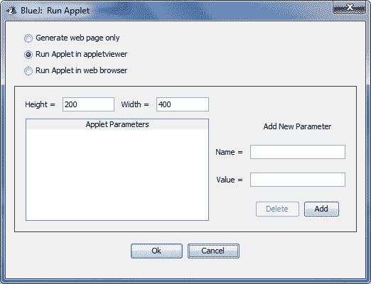
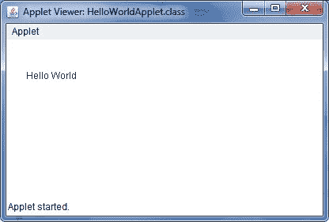

# Java Applet 基础教程

> 原文：<https://codescracker.com/java/java-applet-basics.htm>

Java 小程序是用 Java 语言开发的。

在 Java 中，applet 是在 Web 浏览器中运行的程序。applet 可以是全功能的 Java 应用程序，因为它拥有完整的 Java API。

Java applet 是一个运行在另一个程序(如 web 浏览器)中的小 Java 程序。Internet Explorer 和 Netscape navigator 都可以运行 Java applet。Java 小程序被嵌入到网页中，以旋转动画图像和访问互联网上的数据库。

## Java 小程序示例

下面是一个名为**HelloWorldApplet.java**的简单小程序:

```
/* Java Program Example - Java Applet Basics */

import java.applet.*;
import java.awt.*;

public class HelloWorldApplet extends Applet
{
   public void paint (Graphics g)
   {

      g.drawString ("Hello World", 25, 50);

   }
}
```

## 编译并执行 Java Applet 程序

这是给 **BlueJ** 用户的。要编译和执行 applet 程序/应用程序，请遵循以下步骤:

*   首先将上面的代码复制并粘贴到你的 **BlueJ** 编译器中，其类名为 **HelloWorldApplet**
*   现在编译程序
*   编译成功后，只需关闭源代码窗口
*   现在右击**hello world plet**
*   然后点击**运行小程序**
*   一个新的窗口将出现，要求像窗口宽度，高度等配置。这是图表。



现在提供 200 英寸的高度框和 400 英寸的宽度框，然后点击 **OK** 按钮，观察如下所示的输出。

这里是上面 400 宽 200 高的小程序的输出窗口。



下面是 Java 中的两个导入语句，它们将这些类纳入了 Java 中 applet 类的范围:

*   java.awt.Graphics。
*   java.applet.Applet

[Java 在线测试](/exam/showtest.php?subid=1)

* * *

* * *