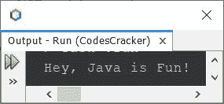
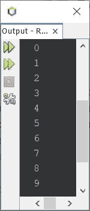
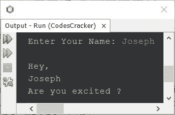
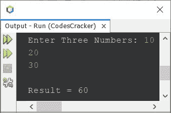
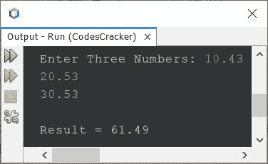
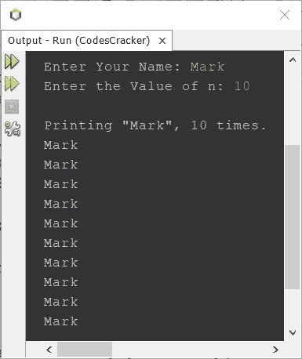

# Java 编程示例

> 原文：<https://codescracker.com/java/program/java-programming-examples.htm>

Java 编程是一种仍然统治着 android 世界的语言。几乎有成吨的著名 android 应用程序 是用 Java 写的。一些世界著名的应用程序使用 Java，如谷歌、亚马逊、LinkedIn、优步、Spotify 等。

作为一名程序员，我知道如何高效地学习一门语言。我们需要尽可能多的实践。因此，我在这里用 Java 写了大约 1000 个代码，分散在 100 多篇 Java 程序文章中。

由于程序很多，我就用 Java 写了。当然，所有这些程序不可能包含在一篇文章中。因此，我将这些程序分成单独的文章。

这基本上是 Java 编程实例的主页。这里编写的所有程序都经过了良好的测试，并在最著名的 Java IDE**Apache NetBeans IDE**下执行 。这一系列的 Java 编程例子，都是 设计的，同时也照顾到了初学者。因此，在本文的大部分内容中，我首先包含了代码的基本版本 ，然后编写了相同程序的完整版本。

我向你保证，在你自己练习了这里写的所有程序之后。你会比 T1 之前的 T2 感觉好得多。因此，试验这里编写的所有 Java 程序变得很重要。你练习得越多，你对 Java 的技能就会越强。

## 面向初学者的简单 Java 程序

这里列出了一些为初学者编写的简单 Java 程序。因此，如果你是一个初学 Java 的程序员，那么在访问其他 Java 程序之前，必须先练习这些 Java 程序。这些 Java 程序可能会增加你在 Java 领域的知识，这样你就可以很容易地入门。

*   [Java 程序打印“Hello World”](/java/program/java-program-print-hello-world.htm)
*   [Java 程序将两个数相加](/java/program/java-program-add-two-numbers.htm)
*   [Java 程序检查偶数或奇数](/java/program/java-program-check-even-odd.htm)
*   [Java 程序检查是否质数](/java/program/java-program-check-prime.htm)
*   [Java 程序检查是否为字母](/java/program/java-program-check-alphabet.htm)
*   [Java 程序检查元音与否](/java/program/java-program-check-vowel.htm)
*   [Java 程序检查闰年与否](/java/program/java-program-check-leap-year.htm)
*   [Java 程序求 N 个数之和](/java/program/java-program-add-n-numbers.htm)
*   [Java 程序反转一个数字](/java/program/java-program-reverse-numbers.htm)
*   [Java 程序交换两个数](/java/program/java-program-swap-two-numbers.htm)
*   [Java 程序求一个数的阶乘](/java/program/java-program-find-factorial.htm)
*   [Java 程序打印给定数量的表格](/java/program/java-program-print-table-of-number.htm)
*   [Java 中的简单计算器程序](/java/program/java-program-make-calculator.htm)
*   [Java 程序计算算术平均值](/java/program/java-program-calculate-arithmetic-mean.htm)
*   [Java 程序求面积&正方形的周长](/java/program/java-program-calculate-area-perimeter.htm)
*   [Java 程序求面积&矩形的周长](/java/program/java-program-area-perimeter-rectangle.htm)
*   [Java 程序求面积&圆周](/java/program/java-program-calculate-area-circumference.htm)

## 前 100 名 Java 程序列表

以下是排名前 100 的 Java 程序列表。这里提供的一系列 Java 程序并不局限于这些 Java 程序列表。你会得到比这多得多的。但是，这些是常见程序的列表，几乎在大多数项目和作业中都有。

1.  [获取用户输入的 Java 程序](/java/program/java-program-take-input-from-user.htm)
2.  [Java 程序求一个数的位数之和](/java/program/java-program-add-digits-of-number.htm)
3.  [计算学生成绩的 Java 程序](/java/program/java-program-calculate-student-grade.htm)
4.  [交换数字的 Java 程序](/java/program/java-program-interchange-numbers.htm)
5.  [Java 程序寻找两个数中最大的一个](/java/program/java-program-find-largest-of-two-numbers.htm)
6.  [Java 程序寻找三个数中最大的一个](/java/program/java-program-find-largest-of-three-numbers.htm)
7.  [Java 程序求 HCF & LCM 的两个数](/java/program/java-program-find-hcf-lcm.htm)
8.  [将华氏温度转换为摄氏温度的 Java 程序](/java/program/java-program-convert-fahrenheit-to-centigrade.htm)
9.  [将摄氏温度转换为华氏温度的 Java 程序](/java/program/java-program-convert-centigrade-to-fahrenheit.htm)
10.  [Java 程序求商和余数](/java/program/java-find-quotient-remainder.htm)
11.  [将日转换成秒的 Java 程序](/java/program/java-convert-days-to-seconds.htm)
12.  [计算一个数的位数的 Java 程序](/java/program/java-count-digits-in-number.htm)
13.  [Java 程序将两个二进制数相加](/java/program/java-add-two-binary-numbers.htm)
14.  [Java 程序计算折扣和待付价格](/java/program/java-calculate-discount-purchase.htm)
15.  [Java 程序计算快递寄送包裹的费用](/java/program/java-compute-courier-charge.htm)
16.  [Java 程序查找电话账单](/java/program/java-calculate-telephone-bill.htm)
17.  [Java 程序寻找简单兴趣](/java/program/java-calculate-simple-interest.htm)
18.  [Java 程序求复利](/java/program/java-calculate-compound-interest.htm)
19.  [Java 程序打印 ASCII 值](/java/program/java-program-print-ascii-values.htm)
20.  [Java 程序打印斐波那契数列](/java/program/java-program-print-fibonacci-series.htm)
21.  [Java 程序检查回文与否](/java/program/java-program-check-palindrome.htm)
22.  [Java 程序检查阿姆斯特朗与否](/java/program/java-program-find-armstrong-number.htm)
23.  [生成阿姆斯特朗数字的 Java 程序](/java/program/java-program-generate-armstrong-number.htm)
24.  [Java 程序查找 nCr 和 nPr](/java/program/java-program-find-ncr-npr.htm)
25.  [Java 程序将十进制转换为二进制](/java/program/java-program-convert-decimal-to-binary.htm)
26.  [Java 程序将十进制转换为八进制](/java/program/java-program-convert-decimal-to-octal.htm)
27.  [Java 程序将十进制转换为十六进制](/java/program/java-program-convert-decimal-to-hexadecimal.htm)
28.  [Java 程序将二进制转换成十进制](/java/program/java-program-convert-binary-to-decimal.htm)
29.  [Java 程序将二进制转换为八进制](/java/program/java-program-convert-binary-to-octal.htm)
30.  [Java 程序将二进制转换成十六进制](/java/program/java-program-convert-binary-to-hexadecimal.htm)
31.  [Java 程序将八进制转换成十进制](/java/program/java-program-convert-octal-to-decimal.htm)
32.  [将八进制转换为二进制的 Java 程序](/java/program/java-program-convert-octal-to-binary.htm)
33.  [Java 程序将八进制转换为十六进制](/java/program/java-program-convert-octal-to-hexadecimal.htm)
34.  [Java 程序将十六进制转换为十进制](/java/program/java-program-convert-hexadecimal-to-decimal.htm)
35.  [Java 程序将十六进制转换为二进制](/java/program/java-program-convert-hexadecimal-to-binary.htm)
36.  [Java 程序将十六进制转换为八进制](/java/program/java-program-convert-hexadecimal-to-octal.htm)
37.  [Java 程序对星星图案](/java/program/java-print-star-pattern.htm)
38.  [Java 程序对字母的模式](/java/program/java-print-alphabet-pattern.htm)
39.  [Java 程序对数字图案](/java/program/java-print-number-pattern.htm)
40.  [Java 程序打印星星金字塔](/java/program/java-program-print-star-pyramid-patterns.htm)
41.  [打印字母金字塔的 Java 程序](/java/program/java-print-alphabet-pyramid-pattern.htm)
42.  [Java 程序打印数字金字塔](/java/program/java-print-number-pyramid-pattern.htm)
43.  [Java 程序打印菱形图案](/java/program/java-program-print-diamond-pattern.htm)
44.  [Java 程序打印弗洛伊德三角形](/java/program/java-program-print-floyd-triangle.htm)
45.  [Java 程序打印帕斯卡三角形](/java/program/java-program-print-pascal-triangle.htm)
46.  [Java 中的线性搜索程序](/java/program/java-program-linear-search.htm)
47.  [Java 中的二分搜索程序](/java/program/java-program-binary-search.htm)
48.  [Java 程序使用指针将两个数相加](/java/program/java-program-add-two-numbers-using-pointers.htm)
49.  [Java 程序寻找数组中最大的元素](/java/program/java-program-find-largest-element-in-array.htm)
50.  [Java 程序寻找数组中的最小元素](/java/program/java-program-find-smallest-element-in-array.htm)
51.  [Java 程序求一个数组的逆矩阵](/java/program/java-program-reverse-array.htm)
52.  [Java 程序在数组中插入一个元素](/java/program/java-program-insert-element-in-array.htm)
53.  [Java 程序从数组中删除一个元素](/java/program/java-program-delete-element-from-array.htm)
54.  [Java 程序合并两个数组](/java/program/java-program-merge-two-arrays.htm)
55.  [Java 中的冒泡排序程序](/java/program/java-program-bubble-sort.htm)
56.  [选择 Java 中的排序程序](/java/program/java-program-selection-sort.htm)
57.  [Java 中的插入排序程序](/java/program/java-program-Insertion-sort.htm)
58.  [Java 程序寻找两个数组之间的公共元素](/java/program/java-find-common-elements-from-two-arrays.htm)
59.  [计算数组中偶数和奇数的 Java 程序](/java/program/java-count-even-odd-numbers-in-array.htm)
60.  [Java 程序相加两个矩阵](/java/program/java-program-add-two-matrices.htm)
61.  [Java 程序相减两个矩阵](/java/program/java-program-subtract-matrices.htm)
62.  [Java 程序转置矩阵](/java/program/java-program-transpose-matrix.htm)
63.  [Java 程序将两个矩阵相乘](/java/program/java-program-multiply-two-matrices.htm)
64.  [Java 程序求字符串长度](/java/program/java-program-find-length-of-string.htm)
65.  [Java 程序比较两个字符串](/java/program/java-program-compare-two-string.htm)
66.  [Java 程序复制字符串](/java/program/java-program-copy-string.htm)
67.  [Java 程序连接字符串](/java/program/java-program-concatenate-string.htm)
68.  [Java 程序反转一个字符串](/java/program/java-program-reverse-string.htm)
69.  [Java 程序从字符串中删除元音](/java/program/java-program-delete-vowels-from-string.htm)
70.  从字符串中删除单词的 Java 程序
71.  [Java 程序查找字符串中某个字符的出现](/java/program/java-program-find-frequency-of-character.htm)
72.  [Java 程序在字符串](/java/program/java-find-occurrence-of-word-in-string.htm)中查找单词的出现
73.  [Java 程序查找每个字符的出现](/java/program/java-count-occurrence-of-each-character-in-string.htm)
74.  [Java 程序查找每个单词的出现](/java/program/java-count-occurrence-of-each-word-in-string.htm)
75.  [Java 程序计算重复字符的数量](/java/program/java-count-repeated-characters-in-string.htm)
76.  [Java 程序计算重复单词的数量](/java/program/java-count-repeated-words-in-string.htm)
77.  [Java 程序将字符串中的每个单词大写](/java/program/java-capitalize-each-word-in-string.htm)
78.  [计算元音和辅音的 Java 程序](/java/program/java-count-vowels-consonants-in-string.htm)
79.  [Java 程序从字符串中提取数字](/java/program/java-extract-numbers-from-string.htm)
80.  [Java 程序计算一个字符串的字数](/java/program/java-program-count-words-in-sentence.htm)
81.  从字符串中删除空格的 Java 程序
82.  [Java 程序对字符串进行排序](/java/program/java-program-sort-string.htm)
83.  [Java 程序将大写字母转换成小写字母](/java/program/java-program-convert-uppercase-to-lowercase.htm)
84.  [Java 程序将小写转换成大写](/java/program/java-program-convert-lowercase-to-uppercase.htm)
85.  [Java 程序交换两个字符串](/java/program/java-program-swap-two-strings.htm)
86.  [Java 程序检查是否为字谜](/java/program/java-program-check-anagram.htm)
87.  [Java 程序检查平衡括号](/java/program/java-check-balanced-parentheses.htm)
88.  [Java 程序检查密码强度](/java/program/java-check-password-strength.htm)
89.  [Java 程序生成随机数](/java/program/java-program-generate-random-numbers.htm)
90.  [Java 程序读取一个文件](/java/program/java-program-read-file.htm)
91.  [Java 程序写入文件](/java/program/java-program-write-to-file.htm)
92.  [Java 程序读取&显示文件的内容](/java/program/java-program-read-and-display-file.htm)
93.  [Java 程序复制一个文件的内容](/java/program/java-program-copy-file.htm)
94.  [Java 程序将文本追加到文件中](/java/program/java-append-text-to-file.htm)
95.  [Java 程序合并两个文件](/java/program/java-program-merge-two-files.htm)
96.  [Java 程序列出目录中的文件和文件夹](/java/program/java-program-list-files-in-directory.htm)
97.  [Java 程序删除一个文件](/java/program/java-program-delete-file.htm)
98.  [Java 程序打印时间&日期](/java/program/java-program-print-time-date.htm)
99.  [Java 程序获取本地和公共 IP 地址](/java/program/java-program-get-ip-address.htm)
100.  [关闭电脑的 Java 程序](/java/program/java-program-shutdown-computer.htm)

现在，在开始 Java 编程示例系列之前，让我们先来看看一些基本的 Java 程序及其解释。

## Java 程序：示例 1

下面写的 Java 程序，是一个可以用 Java 编写的非常基本和最简单的程序。让我们看看代码及其输出。然后是它的解释，让我们对用 Java 写的代码有所了解。

```
public class CodesCracker
{
   public static void main(String[] args)
   {
      System.out.println("Hey, Java is Fun!");
   }
}
```

该程序产生如下图所示的输出:



在上面的程序中，下面的代码:

```
public class CodesCracker
```

说明使用 [关键字](/java/java-keywords.htm) **类**定义了一个名为 **CodesCracker** 的[类](/java/java-classes.htm)。这个类使用 **public** 关键字被声明为 public， 。这里 **public** 是一个访问[修饰符](/java/java-modifier-types.htm)。将类声明为 **public** ，意味着 类 **CodesCracker** 对所有人都是可访问的。和下面的代码:

```
public static void main(String[] args)
```

指 **main()** 的定义[方法](/java/java-methods.htm)。每个 Java 程序都必须有这个方法。程序的执行， 从 **main()** 方法内部开始。

在方法之前， **main()** ，关键字 **void** 是指方法的返回类型。将方法 **void** 声明为其返回类型，意味着方法不返回任何值。当然，我们不希望从 **main()** 方法返回任何值:)。

使用方法作为**静态**类型，意味着我们不需要创建一个对象来调用方法。当然， **main()**方法是不带任何对象调用的，因此使用**静态**来定义。关键字 **public** 也是一个访问修饰符。

并且 **String[] args** 指示传递给方法 **main()** 的一系列 [字符串](/java/java-strings.htm)的一个[数组](/java/java-arrays.htm)。当程序执行时，会发生这种情况。例如，如果您使用/通过命令行执行 Java 程序:

```
java CodesCracker Hey, Java is Fun!
```

然后，数组会存储:【【嘿】【Java】【是】【好玩！”】。

最后，在 **main()** 函数中，代码 **System.out.println()** 用于打印输出 屏幕上的内容。例如，在上面的程序中，我传递了一个字符串**“嘿，Java 很有趣！”**。因此，该字符串会打印在输出屏幕上 。

上面的程序，也可以写成:

```
public class CodesCracker
{
   public static void main(String[] args)
   {
      String str = "Hey, Java is Fun!";
      System.out.println(str);
   }
}
```

您将得到与前一个程序相同的输出。

现在简而言之如果我说，那么<u>每个 Java 程序都包含一个 **main()** 方法</u>，在类内部，用与 相同的名字，作为 Java 应用程序或程序的源代码名，即:

```
public class CodesCracker
{
   public static void main(String[] args)
   {
      // your Java codes goes here
   }
}
```

其中 **CodesCracker** 是类的名称。在你的情况下，唯一可能发生的变化，就是这个名字。其他事情 也会一样。在 **//这里是你的 Java 代码部分**，你可以写你的 Java 代码来完成你想要的工作。 现在让我们看看更多的 Java 程序示例，如下所示。

## Java 程序：示例 2

这是用 Java 编写的第二个版本的程序。这个程序使用[循环](/java/java-loop.htm)多次执行一个语句。

```
public class CodesCracker
{
   public static void main(String[] args)
   {
      for(int i=0; i<10; i++)
         System.out.println(i);
   }
}
```

这个 Java 程序产生的输出将是:



前面已经讲过，Java 程序的执行，是从 **main()** 方法开始的。因此，在 **main()** 方法中， 有一个[为循环](/java/java-for-loop.htm)定义。循环的**开始执行，第一条语句开始执行 ，并且只执行一次。因此，用第一种说法，那就是:**

```
int i=0;
```

定义了一个[变量](/java/java-variables.htm) **i** ，其类型为**int** 。并用值 **0** 初始化。现在当进入 循环**的主体**时，每次编译器检查循环的条件。也就是说，第二个语句(条件检查) 被执行。

```
i<10;
```

现在变量 **i** 被它的值代替了。由于其值现在为 0，因此 **0 < 10** 评估为 为**真**。由于条件评估为真，因此程序流进入循环内部。现在在循环内部， 语句:

```
System.out.println(i);
```

会被处决。这将在输出屏幕上打印出 **i** 的值。因此 **0** 被打印在输出上。当循环的 语句被执行时，编译器转到循环的第三条语句，即:

```
i++
```

**i** 的值增加 1。所以现在 **i=1** 。如前所述，在进入循环之前，条件检查 语句(第二条语句)被求值。由于 **i < 10** 或 **1 < 10** 再次评估为真，因此 程序流程再次进入循环，并打印出 **i** 的新值。也就是这次 1。该过程继续，直到 条件评估为假。

## Java 程序：示例 3

现在让我们用 Java 创建另一个程序，它接收用户名，并在输出中打印一些字符串，以及输入的名称:

```
import java.util.Scanner;

public class CodesCracker
{
   public static void main(String[] args)
   {
      String name;
      Scanner scan = new Scanner(System.in);

      System.out.print("Enter Your Name: ");
      name = scan.nextLine();

      System.out.println("\nHey,");
      System.out.println(name);
      System.out.println("Are you excited ?");
   }
}
```

下面给出的快照显示了上述 Java 程序的示例运行，用户输入 **James** 作为名称:



因为在 Java 中，为了扫描来自用户的输入，我们需要使用 **Scanner** 类。并且**扫描器**类定义在 **java.util** [包](/java/java-packages.htm)内 。因此，在使用 **Scanner** 类扫描输入之前，我已经导入了包 ，然后定义了 **Scanner** 类的对象 **scan** 来扫描来自用户的 [输入。不要担心，在这一系列 Java 程序示例中，您将一步一步地学习所有的东西。](/java/program/java-program-take-input-from-user.htm)

在上面的程序中，第二个 **System.out.println()** 语句中使用的 **\n** 是一个转义序列。这将在输出屏幕中插入一个新行，这样下一个输出内容将从下一行开始打印。因此，字符串 **Hey** 在用户输入后的一行被打印出来。同样在上面的程序中，最后三个 **System.out.println()** 语句可以写成 这样:

```
System.out.println("\nHey,\n" +name+ "\nAre you excited ?");
```

也就是说，在上述语句中:

```
"\nHey,\n" +name+ "\nAre you excited ?"
```

由三个字符串组成，第一个字符串是:

```
"\nHey,\n"
```

也就是字符串本身。第二个是:

```
name
```

根据上面给出的示例运行，间接等于用户输入的**“Joseph”**。因为输入的 字符串存储在**名**变量中。因此，无论你在 **main()** 方法中的什么地方写**名字**，它都会将 赋值为 **"Joseph"** 。第三个是:

```
"\nAre you excited ?"
```

它本身是一个字符串。使用 **+** 操作符，我添加了所有这三个字符串。因此，输出将与前面程序的示例运行相同 。

## Java 程序：示例 4

这个程序不接收用户的任何输入。这个程序只声明了四个 **int** 类型的变量。 并将一些值初始化为三个变量，所有三个变量的值的总和被初始化为第四个变量 。再次使用 **System.out.println()** 语句将第四个变量的值打印在输出屏幕上。

```
public class CodesCracker
{
   public static void main(String[] args)
   {
      int a, b, c, res;
      a = 10;
      b = 20;
      c = 30;
      res = a+b+c;
      System.out.println(res);
   }
}
```

上述 Java 程序产生的输出将是:

```
60
```

## Java 程序：示例 5

这和以前的节目一样。唯一的区别是，用户在程序运行时接收三个变量的值:

```
import java.util.Scanner;

public class CodesCracker
{
   public static void main(String[] args)
   {
      Scanner s = new Scanner(System.in);
      System.out.print("Enter Three Numbers: ");
      int a = s.nextInt();
      int b = s.nextInt();
      int c = s.nextInt();
      int res = a+b+c;
      System.out.println("\nResult = " +res);
   }
}
```

上述 Java 程序产生的输出，带有用户输入的 **10** 、 **20** 和 **30** 三个数字，在下面给出的快照中显示为 :



## Java 程序：示例 6

此处的程序与之前的程序相同，除了此程序对 **int** 和 **float** 类型值都有效。 也就是说，如果用户输入一个整数或一个实数，这个程序对两者都有效。

```
import java.util.Scanner;

public class CodesCracker
{
   public static void main(String[] args)
   {
      Scanner s = new Scanner(System.in);
      System.out.print("Enter Three Numbers: ");
      float a = s.nextFloat();
      float b = s.nextFloat();
      float c = s.nextFloat();
      float res = a+b+c;
      System.out.println("\nResult = " +res);
   }
}
```

以下是用户输入 **10.43** 、 **20.53** 和 **30.53** 的示例运行:



## Java 程序：示例 7

这是另一个用 Java 编写的程序，它接收两个不同类型的值。

```
import java.util.Scanner;

public class CodesCracker
{
   public static void main(String[] args)
   {
      String name;
      int n;
      Scanner scan = new Scanner(System.in);

      System.out.print("Enter Your Name: ");
      name = scan.nextLine();
      System.out.print("Enter the Value of n: ");
      n = scan.nextInt();

      System.out.println("\nPrinting \"" +name+ "\", " +n+ " times.");
      for(int i=0; i<n; i++)
         System.out.println(name);
   }
}
```

用户输入**标记**为名称或字符串，并且 **10** 为 **n** 的值，上面的 Java 程序产生的示例输出是下面给出的快照中显示的 :



以上七个 Java 程序的例子是用来演示如何用 Java 编写程序的。接下来，一个接一个，你会得到更多用 Java 写的程序，用不同的方式。

#### 其他语言示例

*   [C 编程实例](/c/program/c-programming-examples.htm)
*   [C++ 编程实例](/cpp/program/cpp-programming-examples.htm)
*   [Python 编程实例](/python/program/index.htm)

[Java 在线测试](/exam/showtest.php?subid=1)

* * *

* * *