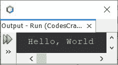
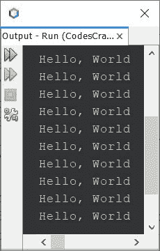
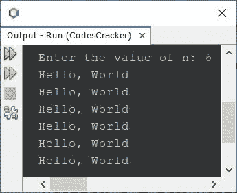

# Java 程序：打印 Hello World 

> 原文：<https://codescracker.com/java/program/java-program-print-hello-world.htm>

本文介绍了一个用 Java 编写的程序，该程序打印出 **Hello，World** 。要用 Java 编程在输出屏幕上打印 **Hello，World** ，只需将字符串 **Hello，World** 放入 **System.out.println()中**即可，如下图所示。

## 用 Java 打印 Hello World

问题是，*写一个 Java 程序打印**你好，世界**T3。下面给出的程序是它的答案:*

```
public class CodesCracker
{
   public static void main(String[] args)
   {
      System.out.println("Hello, World");
   }
}
```

当编译并执行上述 Java 程序时，它将产生以下输出:



## 使用 for 循环在 Java 中打印 Hello World 10 次

这个程序打印 **Hello，World** 10 次，使用**进行**循环。

```
public class CodesCracker
{
   public static void main(String[] args)
   {
      for(int i=0; i<10; i++)
         System.out.println("Hello, World");
   }
}
```

下面给出的快照显示了上面的 Java 程序在打印 **Hello World** 10 次时产生的示例输出:



## 使用 while 循环在 Java 中打印 Hello World 10 次

这是与之前相同的程序，但是使用 **while** 循环创建，而不是用**代替**。

```
public class CodesCracker
{
   public static void main(String[] args)
   {
      int i=0;
      while(i<10)
      {
         System.out.println("Hello, World");
         i++;
      }
   }
}
```

这个程序产生与前一个程序完全相同的输出。上面的程序也可以这样创建:

```
public class CodesCracker
{
   public static void main(String[] args)
   {
      int i=0;
      while(i++<10)
         System.out.println("Hello, World");
   }
}
```

即，在代码中:

```
i++<10
```

使用 **i** 的当前值，然后递增，如在 **i++** 中， **++** 是后递增运算符。

## 打印 Hello World n 次

现在这个程序打印 **n** 次，字符串 **Hello，World** 。例如，如果 **n** 的值是 100，那么这个程序打印 100 **Hello，World** 。用户在程序运行时使用**扫描器**类 接收 **n** 的值。

```
import java.util.Scanner;

public class CodesCracker
{
   public static void main(String[] args)
   {
      int n;
      Scanner s = new Scanner(System.in);

      System.out.print("Enter the value of n: ");
      n = s.nextInt();

      for(int i=0; i<n; i++)
         System.out.println("Hello, World");
   }
}
```

下面给出的快照显示了上述程序的示例运行，用户输入 **6** 作为 **n** 的值，以打印 6 **Hello，World**



## 使用函数在 Java 中打印 Hello World

要使用用户自定义函数在 Java 中打印 **Hello，World** ，请使用以下程序:

```
public class CodesCracker
{
   public static void main(String[] args)
   {
      HelloWorld();
   }
   public static void HelloWorld()
   {
      System.out.println("Hello, World");
   }
}
```

这个程序的输出是:

```
Hello, World
```

## 使用类在 Java 中打印 Hello World

要使用类和对象在 Java 中打印 **Hello，World** ，请使用以下程序:

```
public class CodesCracker
{
   public static void main(String[] args)
   {
      CodesCracker cc = new CodesCracker();
      cc.HelloWorld();
   }
   public static void HelloWorld()
   {
      System.out.println("Hello, World");
   }
}
```

这个程序产生与前一个程序完全相同的输出。

## 使用构造函数在 Java 中打印 Hello World

这是本文的最后一个程序，使用构造函数创建。构造函数在类的对象创建后被自动调用，其中定义了构造函数。

```
public class CodesCracker
{
   CodesCracker()
   {
      System.out.println("Hello, World");
   }
   public static void main(String[] args)
   {
      CodesCracker cc = new CodesCracker();
   }
}
```

#### 其他语言的相同程序

*   [C 打印你好世界](/c/program/c-program-print-hello-world.htm)
*   [C++ 打印 Hello World](/cpp/program/cpp-program-print-hello-world.htm)
*   [Python 打印 Hello World](/python/program/python-program-print-hello-world.htm)

[Java 在线测试](/exam/showtest.php?subid=1)

* * *

* * *