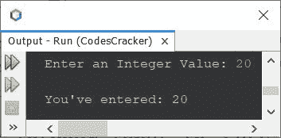
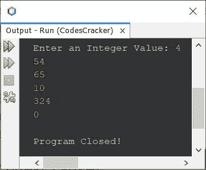
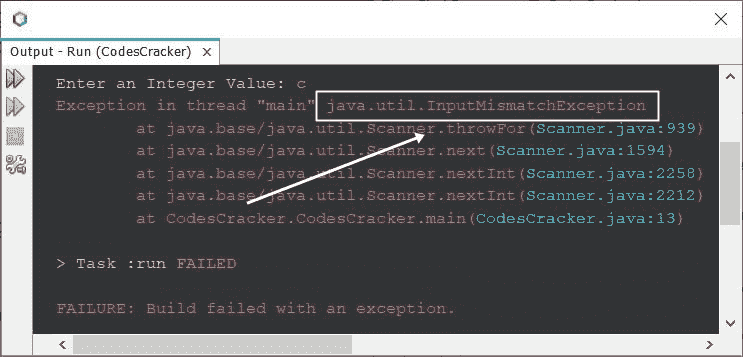
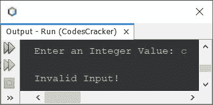
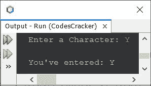
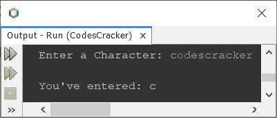
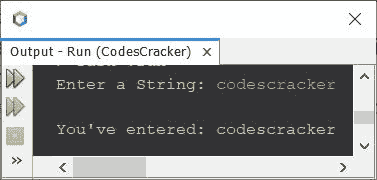
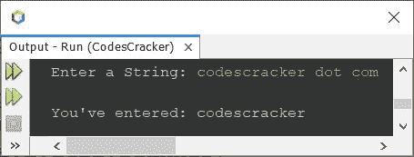
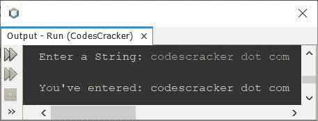
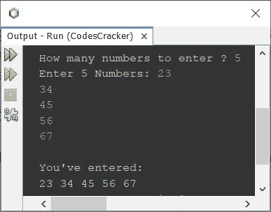

# Java 程序：获取用户输入

> 原文：<https://codescracker.com/java/program/java-program-take-input-from-user.htm>

本文涵盖了 Java 中基于接收用户输入的多个程序。以下是本文中包含的程序列表:

*   在 Java 中获取整数输入
*   继续接收输入，直到用户输入 0
*   如何处理 Java 中的无效输入？
*   获取 Java 中的字符输入
*   获取 Java 中的字符串输入

## 在 Java 中获取整数输入

问题是，*编写一个 Java 程序，要求用户输入一个整数值，并在输出屏幕上将输入的值打印回来 。*下面给出的程序就是它的答案。这个程序基本上展示了，如何使用**扫描器**和 **nextInt()** 在 Java 中读取一个整数值

```
import java.util.Scanner;

public class CodesCracker
{
   public static void main(String[] args)
   {
      int num;
      Scanner scan = new Scanner(System.in);

      System.out.print("Enter an Integer Value: ");
      num = scan.nextInt();

      System.out.println("\nYou've entered: " +num);
   }
}
```

下面给出的快照显示了上述程序的示例运行，用户输入 **20** :



您可以使用以下方法来扫描其他类型的值:

*   **nextDouble()** -读取 **double** 数据类型的值
*   **nextFloat()** -读取 **float** 类型的值
*   **nextLong()** -读取 **long** 类型的值
*   **nextShort()** -读取 **short** 类型的值
*   **nextByte()** -读取**字节**类型的值

### 继续接收整数输入，直到用户在 Java 中输入 0

这个程序是以一种方式创建的，持续接收用户的输入，直到输入 0。你可以修改这个程序，以某种方式使用，像继续接收用户的输入，直到用户输入一个字符' x '或任何你想要的。

```
import java.util.Scanner;

public class CodesCracker
{
   public static void main(String[] args)
   {
      Scanner scan = new Scanner(System.in);

      System.out.print("Enter an Integer Value: ");
      int num = scan.nextInt();
      while(num!=0)
         num = scan.nextInt();
      System.out.println("\nProgram Closed!");
   }
}
```

下面是一些用户输入的运行示例:



## 如何处理 Java 中的无效输入？

现在的问题是，如果用户输入一个无效的输入怎么办？
就像当我们需要获取整数输入时，但是用户输入一些其他类型的值，比如浮点输入、 字符输入或字符串输入。让我们用本文的第一个程序来检查一下，使用另一个样本运行，但是使用非整数值的 比如说 **c** ，一个字符输入，这次:



现在我们需要将 scanner 语句放在 **try** 块中，这样，我们就可以使用 catch 块来捕获该异常。下面是代码的完整版本，是在修改了本文的第一个程序后创建的。 该程序处理无效输入:

```
import java.util.Scanner;
import java.util.InputMismatchException;

public class CodesCracker
{
   public static void main(String[] args)
   {
      int num;
      Scanner scan = new Scanner(System.in);

      System.out.print("Enter an Integer Value: ");
      try
      {
         num = scan.nextInt();
         System.out.println("\nYou've entered: " +num);
      }
      catch(InputMismatchException ime)
      {
         System.out.println("\nInvalid Input!");
      }
   }
}
```

这是它的示例运行，用户输入与之前的示例运行相同，即 **c** :



在上面的程序中，下面两条语句:

```
import java.util.Scanner;
import java.util.InputMismatchException;
```

也可以替换为下面给出的一条语句:

```
import java.util.*;
```

## 以 Java 中的字符输入为例

创建这个程序是为了向你展示，在程序运行时，如何从用户那里接收字符输入。

```
import java.util.Scanner;

public class CodesCracker
{
   public static void main(String[] args)
   {
      Scanner scan = new Scanner(System.in);

      System.out.print("Enter a Character: ");
      char ch = scan.next().charAt(0);

      System.out.println("\nYou've entered: " +ch);
   }
}
```

用户输入 **Y** 的示例运行显示在下面给出的快照中:



在上面的程序中， **next()** 方法用于接收字符串输入，而 **charAt()** 方法用于 获取在使用其参数指定的任何特定索引处可用的字符。因此， **charAt(0)** 扫描 字符串的第一个字符或第 0 个<sup>索引处的可用字符。因此，如果您在上述程序的示例运行中输入任何类似于 **codescracker** 的 字符串，那么第一个字符，即 **c** 将被初始化为 **ch** 。以下是用户输入 **codescracker** 的运行示例:</sup>



## 在 Java 中从用户获取字符串输入

要在 Java 中从用户处获得字符串输入，我们有以下两种方法:

*   下一个()
*   nextLine()

**next()** 方法用于扫描单个单词、名称或任何不带空格的字符串。而使用 **nextLine()** 方法，当我们需要扫描和接收整个字符串时，不管有没有空格，都要在按下 `ENTER`键之前输入。让我们为这两种方法创建程序。

### 用 Java 获取字符串输入——不带空格

这个程序使用 **next()** 方法扫描一个没有空格的单词或字符串。

```
import java.util.Scanner;

public class CodesCracker
{
   public static void main(String[] args)
   {
      Scanner scan = new Scanner(System.in);

      System.out.print("Enter a String: ");
      String str = scan.next();

      System.out.println("\nYou've entered: " +str);
   }
}
```

下面是用户输入的示例运行 **codescracker** :



这是另一个使用用户输入运行的示例**codescracker . com**:



### 用 Java 获取字符串输入——带空格

要接收一行中输入的包含空格的完整字符串，请使用 **nextLine()** 而不是 **next()** 。 所有代码的其余部分与之前的程序相同。

下面是它的运行示例，当您使用 **nextLine()** ，同时接收来自用户的字符串输入时:



## 在 Java 中从用户获得多个输入

这是本文的最后一个程序，创建它是为了向您展示如何在 Java 语言中获得多个输入。

```
import java.util.Scanner;

public class CodesCracker
{
   public static void main(String[] args)
   {
      Scanner scan = new Scanner(System.in);

      System.out.print("How many numbers to enter ? ");
      int n = scan.nextInt();
      int[] arr = new int[n];

      System.out.print("Enter " +n+ " Numbers: ");
      for(int i=0; i<n; i++)
         arr[i] = scan.nextInt();

      System.out.println("\nYou've entered: ");
      for(int i=0; i<n; i++)
         System.out.print(arr[i]+ " ");
   }
}
```

下面是它的示例运行，用户输入的 **5** 为大小， **23，34，45，56，67** 为五个数字:



#### 其他语言的相同程序

*   [C 获取用户的输入](/c/program/c-program-receive-input.htm)
*   [C++ 从用户那里获得输入](/cpp/program/cpp-program-receive-input.htm)
*   [Python 从用户处获取输入](/python/program/python-program-get-input-from-user.htm)

[Java 在线测试](/exam/showtest.php?subid=1)

* * *

* * *