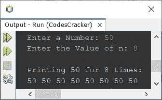

# Java 程序：打印整数

> 原文：<https://codescracker.com/java/program/java-program-print-integer.htm>

本文介绍了一个用 Java 编写的程序，它在输出中打印一个整数或一个数字。

## 用 Java 打印一个数字

问题是，*写一个 Java 程序在输出屏幕上打印一个数字。*下面给出的节目是它的 回答:

```
import java.util.Scanner;

public class CodesCracker
{
   public static void main(String[] args)
   {
      int num=10;
      System.out.println("\nThe Value of 'num' is " +num);
   }
}
```

下面给出的快照显示了这个 Java 程序在打印一个数字时产生的输出:


## 使用`for`循环在 Java 中打印一个数字

创建该程序是为了打印用户在程序运行时输入的数字，对于 **n** 次 ，使用**进行**循环。用户在运行时也会收到 **n** 的值。

```
import java.util.Scanner;

public class CodesCracker
{
   public static void main(String[] args)
   {
      Scanner scan = new Scanner(System.in);

      System.out.print("Enter a Number: ");
      int num = scan.nextInt();
      System.out.print("Enter the Value of n: ");
      int n = scan.nextInt();

      System.out.println("\nPrinting " +num+ " for " +n+ " times:");
      for(int i=0; i<n; i++)
         System.out.print(num+ " ");
   }
}
```

下面是它的示例运行，将用户输入的 **50** 作为要打印的数字，将 **8** 作为 **n** 的值，打印 **50**8 次:



[Java 在线测试](/exam/showtest.php?subid=1)

* * *

* * *