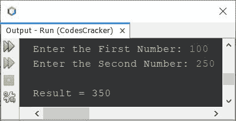
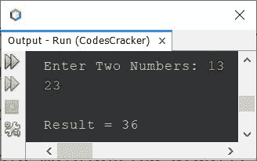
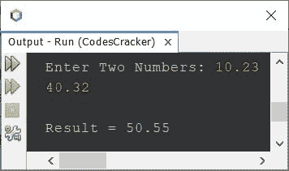
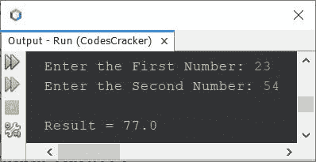

# Java 程序将两个数相加

> 原文：<https://codescracker.com/java/program/java-program-add-two-numbers.htm>

本文旨在介绍 Java 中最流行的程序之一。那个程序是把两个数相加。我在 Java 中用多种方法创建了同一个程序。以下是本文中涉及的方法列表:

*   Java 中两个数相加的最简单程序
*   使用**扫描仪**将两个数字相加(或通过用户输入)
*   使用用户定义的函数将两个数相加
*   使用**类**将两个数相加
*   使用构造函数将两个数相加

## 用 Java 将两个数相加-最简单的版本

问题是，*写一个 Java 程序把两个数*相加。下面给出的程序是这个问题的答案:

```
import java.util.Scanner;

public class CodesCracker
{
   public static void main(String[] args)
   {
      int numberOne = 5, numberTwo = 10, add;

      add = numberOne + numberTwo;
      System.out.println("Result = " +add);
   }
}
```

上面的 Java 程序产生的输出是:

```
Result = 15
```

现在让我们继续，用 Java 创建一个程序，它接受用户的输入，然后把给定的两个数相加。

## 使用扫描仪在 Java 中添加两个数

问题是，*写一个 Java 程序把任意两个数相加。这两个号码都必须由用户在 程序运行时接收。*下面给出的程序是它的答案:

```
import java.util.Scanner;

public class CodesCracker
{
   public static void main(String[] args)
   {
      int numberOne, numberTwo, add;
      Scanner s = new Scanner(System.in);

      System.out.print("Enter the First Number: ");
      numberOne = s.nextInt();
      System.out.print("Enter the Second Number: ");
      numberTwo = s.nextInt();

      add = numberOne + numberTwo;
      System.out.println("\nResult = " +add);
   }
}
```

下面给出的快照显示了上述程序的示例运行，用户输入 100 和 250 作为两个数字:



上面的程序也可以这样创建:

```
import java.util.Scanner;

public class CodesCracker
{
   public static void main(String[] args)
   {
      Scanner s = new Scanner(System.in);

      System.out.print("Enter Two Numbers: ");
      int a = s.nextInt();
      int b = s.nextInt();

      System.out.println("\nResult = " +(a+b));
   }
}
```

下面给出的快照显示了上述 Java 程序的示例运行，其中用户输入 **13** 和 **23** 为两个数字:



上述程序有一个限制。限制是，程序只能处理整数。因此，让我创建另一个既适用于整数又适用于实数的程序:

```
import java.util.Scanner;

public class CodesCracker
{
   public static void main(String[] args)
   {
      Scanner s = new Scanner(System.in);

      System.out.print("Enter Two Numbers: ");
      float a = s.nextFloat();
      float b = s.nextFloat();

      System.out.println("\nResult = " +(a+b));
   }
}
```

下面是用户输入 10.23 和 40.32 作为两个数字的示例运行:



## 在 Java 中使用函数将两个数相加

创建这个程序是为了展示在 Java 中如何使用一个用户定义的函数来执行两个数的相加。也就是说，创建了一个名为 **add()** 的函数，它接受两个参数并返回其参数的相加结果。

```
import java.util.Scanner;

public class CodesCracker
{
   public static void main(String[] args)
   {
      Scanner s = new Scanner(System.in);

      System.out.print("Enter the First Number: ");
      float a = s.nextFloat();
      System.out.print("Enter the Second Number: ");
      float b = s.nextFloat();

      System.out.println("\nResult = " +add(a, b));
   }

   public static float add(float x, float y)
   {
      return (x+y);
   }
}
```

上述程序的示例运行如下:



## 使用类在 Java 中添加两个数

这是另一个使用类创建的程序。也就是说，创建了类 **CodesCracker** 的对象 **obj** 。使用对象 **obj** ，我们可以调用该类的方法 **add()** 。其余的事情类似于前面的程序，使用函数创建的 。

```
import java.util.Scanner;

public class CodesCracker
{
   static int add(int x, int y)
   {
      return (x+y);
   }
   public static void main(String[] args)
   {
      Scanner s = new Scanner(System.in);

      System.out.print("Enter the First Number: ");
      int a = s.nextInt();
      System.out.print("Enter the Second Number: ");
      int b = s.nextInt();

      CodesCracker obj = new CodesCracker();
      int res = obj.add(a, b);

      System.out.println("\nResult = " +res);
   }
}
```

## 在 Java 中使用构造函数将两个数相加

这是本文的最后一个程序，使用构造函数创建。构造函数基本上是一个有名字的方法，和类名一样。当类的对象被创建时，构造函数被自动执行。

```
import java.util.Scanner;

public class CodesCracker
{
   int add;
   CodesCracker(int x, int y)
   {
      add = x + y;
      System.out.println("\nResult = " +add);
   }
   public static void main(String[] args)
   {
      Scanner s = new Scanner(System.in);

      System.out.print("Enter the First Number: ");
      int a = s.nextInt();
      System.out.print("Enter the Second Number: ");
      int b = s.nextInt();

      CodesCracker obj = new CodesCracker(a, b);
   }
}
```

上面的程序产生了与前面的程序类似的结果/输出。在上面的程序中，执行语句后:

```
CodesCracker obj = new CodesCracker(a, b);
```

名为 **CodesCracker()** 的构造函数(类中的一个方法，其名称与类名相同)自动执行 。这是传递给构造函数的两个参数 **x** 和 **y** 的 **a** 和 **b** 的值。 这两个数的相加结果被初始化为 **add** 变量。最后，使用语句将 **add** 的值 打印在输出上:

```
System.out.println("\nResult = " +add);
```

在构造函数内部作为第二条语句可用。

#### 其他语言的相同程序

*   [C 加两个数](/c/program/c-program-add-two-numbers.htm)
*   [C++ 加两个数](/cpp/program/cpp-program-add-two-numbers.htm)
*   [Python 加两个数](/python/program/python-program-add-two-numbers.htm)

[Java 在线测试](/exam/showtest.php?subid=1)

* * *

* * *