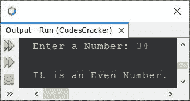
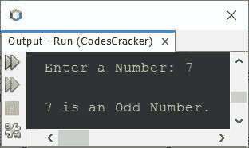

# Java 程序：检查奇数或偶数

> 原文：<https://codescracker.com/java/program/java-program-check-even-odd.htm>

本文介绍了一个 Java 程序，它检查用户在程序运行时输入的数字是奇数还是偶数。

**注-** 能被分成两个相等的组或部分的数，称为偶数。而 不能分成两等份的数，可以称为奇数。

## 在 Java 中使用 if-else 检查奇数或偶数

问题是，*写一个 Java 程序检查奇数还是偶数。用户必须在运行时收到该号码。* 下面给出的程序是它的答案:

```
import java.util.Scanner;

public class CodesCracker
{
   public static void main(String[] args)
   {
      int num;
      Scanner scan = new Scanner(System.in);

      System.out.print("Enter a Number: ");
      num = scan.nextInt();

      if(num%2==0)
      {
         System.out.println("\nIt is an Even Number.");
      }
      else
      {
         System.out.println("\nIt is an Odd Number.");
      }
   }
}
```

下面给出的快照显示了上面的 Java 程序在检查一个给定的数字是奇数还是偶数时的示例运行，用户输入 **34**



上面的程序也可以写成:

```
import java.util.Scanner;

public class CodesCracker
{
   public static void main(String[] args)
   {
      Scanner scan = new Scanner(System.in);

      System.out.print("Enter a Number: ");
      int num = scan.nextInt();

      if(num%2==0)
         System.out.println("\n" +num+ " is an Even Number.");
      else
         System.out.println("\n" +num+ " is an Odd Number.");
   }
}
```

下面是用户输入 **7** 的运行示例:



## 在 Java 中使用三元运算符检查奇数或偶数

这个程序使用三元运算符(？:)来完成与上一个程序相同的工作。

```
import java.util.Scanner;

public class CodesCracker
{
   public static void main(String[] args)
   {
      Scanner scan = new Scanner(System.in);

      System.out.print("Enter a Number: ");
      int num = scan.nextInt();

      int res = (num%2==0) ? 0 : 1;

      if(res==0)
         System.out.println("\n" +num+ " is an Even Number.");
      else
         System.out.println("\n" +num+ " is an Odd Number.");
   }
}
```

上面的程序也可以这样创建:

```
import java.util.Scanner;

public class CodesCracker
{
   public static void main(String[] args)
   {
      Scanner scan = new Scanner(System.in);

      System.out.print("Enter a Number: ");
      int num = scan.nextInt();

      String res = (num%2==0) ? "even" : "odd";

      if(res.equals("even"))
         System.out.println("\n" +num+ " is an Even Number.");
      else
         System.out.println("\n" +num+ " is an Odd Number.");
   }
}
```

## 在 Java 中不使用模数运算符检查奇数或偶数

这是本文的最后一个程序，检查偶数或奇数。这个程序不以任何方式使用模数(%)运算符。

```
import java.util.Scanner;

public class CodesCracker
{
   public static void main(String[] args)
   {
      Scanner scan = new Scanner(System.in);

      System.out.print("Enter a Number: ");
      int num = scan.nextInt();

      float resReal = (float)num/2;
      int resRound = num/2;

      if((resReal*2)==(resRound*2))
         System.out.println("\n" +num+ " is an Even Number.");
      else
         System.out.println("\n" +num+ " is an Odd Number.");
   }
}
```

#### 其他语言的相同程序

*   [C 检查偶数或奇数](/c/program/c-program-check-even-odd.htm)
*   [C++ 奇偶校验](/cpp/program/cpp-program-check-even-odd.htm)
*   [Python 检查奇偶](/python/program/python-program-check-even-odd.htm)

[Java 在线测试](/exam/showtest.php?subid=1)

* * *

* * *