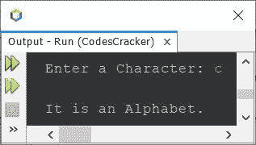
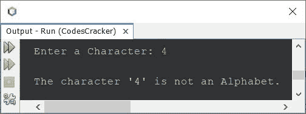
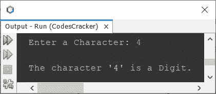

# Java 程序：检查字母表

> 原文：<https://codescracker.com/java/program/java-program-check-alphabet.htm>

这篇文章讲述了一个 Java 程序，它检查用户在程序运行时输入的字符是否是字母。

**注意-** 来自 **A-Z** 或 **a-z** 的所有字符都是字母。

## 在 Java 中使用 if-else 检查字母表

问题是，*写一个 Java 程序，用 if-else 检查一个字符是不是字母表。*下面给出的程序 是它的答案:

```
import java.util.Scanner;

public class CodesCracker
{
   public static void main(String[] args)
   {
      char ch;
      Scanner s = new Scanner(System.in);

      System.out.print("Enter a Character: ");
      ch = s.next().charAt(0);

      if((ch>='A' && ch<='z') || (ch>='a' && ch<='z'))
      {
         System.out.println("\nIt is an Alphabet.");
      }
      else
      {
         System.out.println("\nIt is not an Alphabet.");
      }
   }
}
```

下面是它的示例运行，使用用户输入的 **c** 作为字符来检查它是否是一个字母表:



上面的程序也可以写成:

```
import java.util.Scanner;

public class CodesCracker
{
   public static void main(String[] args)
   {
      Scanner s = new Scanner(System.in);

      System.out.print("Enter a Character: ");
      char ch = s.next().charAt(0);

      if((ch>='A' && ch<='z') || (ch>='a' && ch<='z'))
         System.out.println("\nThe character \'" +ch+ "\' is an Alphabet.");
      else
         System.out.println("\nThe character \'" +ch+ "\' is not an Alphabet.");
   }
}
```

用户输入 **4** 的示例运行显示在下面给出的快照中:



## 检查 Java 中的字母或数字

这个程序检查一个给定的字符是一个字母，一个数字，还是任何其他字符。

```
import java.util.Scanner;

public class CodesCracker
{
   public static void main(String[] args)
   {
      Scanner s = new Scanner(System.in);

      System.out.print("Enter a Character: ");
      char ch = s.next().charAt(0);

      if((ch>='A' && ch<='z') || (ch>='a' && ch<='z'))
         System.out.println("\nThe character \'" +ch+ "\' is an Alphabet.");
      else if(ch>='0' && ch<='9')
         System.out.println("\nThe character \'" +ch+ "\' is a Digit.");
      else
         System.out.println("\nThe character \'" +ch+ "\' is neither an Alphabet nor a Digit.");
   }
}
```

与前一个程序的示例运行具有相同用户输入的示例运行为:



#### 其他语言的相同程序

*   [C 检查字母是否正确](/c/program/c-program-check-alphabet.htm)
*   [C++是否检查字母表](/cpp/program/cpp-program-check-alphabet.htm)
*   [Python 是否检查字母表](/python/program/python-program-check-alphabet.htm)

[Java 在线测试](/exam/showtest.php?subid=1)

* * *

* * *