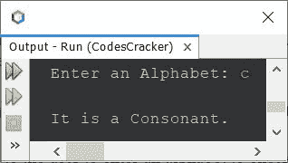
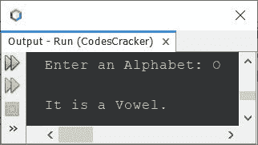
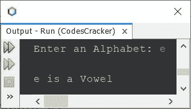
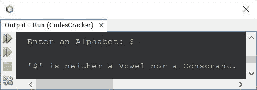

# Java 程序：检查元音或辅音

> 原文：<https://codescracker.com/java/program/java-program-check-vowel.htm>

这篇文章讲述了一个 Java 程序，它检查用户在程序运行时输入的字母是元音还是辅音。

**注** - **a，E，I，O，U，A，E，I，O，U** 为元音。

## 用 Java 第一方式检查元音或辅音

问题是，*写一个 Java 程序，检查一个输入的字符(字母表)是元音还是辅音。*下面给出的节目 就是它的回答:

```
import java.util.Scanner;

public class CodesCracker
{
   public static void main(String[] args)
   {
      char ch;
      Scanner scan = new Scanner(System.in);

      System.out.print("Enter an Alphabet: ");
      ch = scan.next().charAt(0);

      if(ch=='a' || ch=='e' || ch=='i' || ch=='o' || ch=='u' ||
         ch=='A' || ch=='E' || ch=='I' || ch=='O' || ch=='U')
         System.out.println("\nIt is a Vowel.");
      else
         System.out.println("\nIt is a Consonant.");
   }
}
```

下面给出的快照显示了上述 Java 程序的示例运行，用户输入 **c** 作为字母表，以检查 是否为元音:



这是另一个使用用户输入 **O** 运行的示例，这一次:



## 用 Java 第二种方法检查元音或辅音

这个程序做的工作与前一个程序相同，但使用不同的方式创建。这个程序使用字符数组来存储所有的 10 个元音。并进一步使用该数组来比较和检查用户输入的字符是否是元音(辅音)。

```
import java.util.Scanner;

public class CodesCracker
{
   public static void main(String[] args)
   {
      char ch;
      int count=0;
      char[] vowels = {'a','e','i','o','u','A','E','I','O','U'};
      Scanner scan = new Scanner(System.in);

      System.out.print("Enter an Alphabet: ");
      ch = scan.next().charAt(0);

      for(int i=0; i<10; i++)
      {
         if(ch==vowels[i])
         {
            count++;
            break;
         }
      }

      if(count==0)
         System.out.println("\n" +ch+ " is a Consonant");
      else
         System.out.println("\n" +ch+ " is a Vowel");
   }
}
```

下面是用户输入 **e** 的运行示例:



## 在 Java 中检查元音或辅音-完整版

这是本文的最后一个程序。我把这个程序称为检查元音或辅音的完整版本，因为这个程序也处理无效字符输入。也就是说，在以前的程序中，如果用户输入诸如 **2、$、}** 等字符。，那么程序打印的字符是辅音。但是这个程序没有。它只打印元音 或辅音，如果字符是。否则它打印出的*字符既不是元音也不是辅音*。

```
package CodesCracker;

import java.util.Scanner;

public class CodesCracker
{
   public static void main(String[] args)
   {
      Scanner scan = new Scanner(System.in);

      System.out.print("Enter an Alphabet: ");
      char ch = scan.next().charAt(0);

      int ascii = ch;
      if(ch==65 || ch==69 || ch==73 || ch==79 || ch==85)
         System.out.println("\n\'" +ch+ "\' is an Uppercase Vowel.");
      else if(ch==97 || ch==101 || ch==105 || ch==111 || ch==117)
         System.out.println("\n\'" +ch+ "\' is a Lowercase Vowel.");
      else
      {
         if((ascii>=65 && ascii<=90) || (ch>=97 && ch<=122))
            System.out.println("\n\'" +ch+ "\' is a Consonant.");
         else
            System.out.println("\n\'" +ch+ "\' is neither a Vowel nor a Consonant.");
      }
   }
}
```

下面是用户输入 **$** 的运行示例



**注-****A-Z**的 ASCII 值为 **65-90** 。而 **a-z** 的 ASCII 值为 **97-122** 。

#### 其他语言的相同程序

*   [C 检查元音与否](/c/program/c-program-check-vowel.htm)
*   [C++ 是否检查元音](/cpp/program/cpp-program-check-vowel.htm)
*   [Python 检查元音与否](/python/program/python-program-check-vowel.htm)

[Java 在线测试](/exam/showtest.php?subid=1)

* * *

* * *