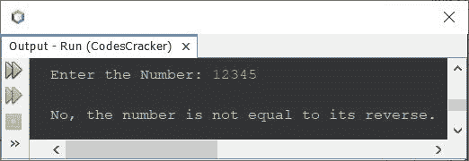

# Java 程序检查原件是否等于其反面

> 原文：<https://codescracker.com/java/program/java-program-check-reverse-equal-original.htm>

本文介绍一个 Java 程序，它检查一个数的倒数是否等于它的原始数。

基于此，推荐的其他计划有:

*   [在 Java 中查找并打印一个数字的倒数](/java/program/java-program-reverse-numbers.htm)
*   [在 Java 中检查回文与否](/java/program/java-program-check-palindrome.htm)

问题是，*写一个 Java 程序，检查一个数是否等于它的倒数。*以下是其 的回答:

```
import java.util.Scanner;

public class CodesCracker
{
   public static void main(String[] args)
   {
      int num, orig, rem, rev=0;
      Scanner scan = new Scanner(System.in);

      System.out.print("Enter the Number: ");
      num = scan.nextInt();

      orig = num;
      while(num>0)
      {
         rem = num%10;
         rev = (rev*10) + rem;
         num = num/10;
      }

      if(orig==rev)
         System.out.println("\nYes, the number is equal to its reverse.");
      else
         System.out.println("\nNo, the number is not equal to its reverse.");
   }
}
```

下面给出的快照显示了上述程序的示例运行，用户输入 **12321** :


下面是另一个使用用户输入 **12345** 运行的示例:



[Java 在线测试](/exam/showtest.php?subid=1)

* * *

* * *