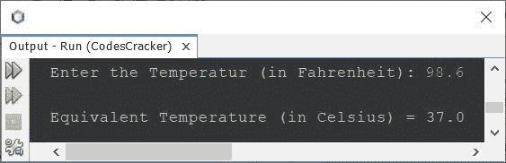

# Java 程序：将华氏温度转换为摄氏温度

> 原文：<https://codescracker.com/java/program/java-program-convert-fahrenheit-to-centigrade.htm>

这篇文章讲述了一个 Java 程序，它将用户输入的华氏温度转换成摄氏温度。

将华氏温度转换为摄氏温度的公式为:

```
C = (F-32)/1.8
```

其中 **C** 为摄氏度值， **F** 为华氏度值。尽管如此，如果你想探索公式，那么参考 到[摄氏度到华氏温度公式解释](/nonprog/celsius-to-fahrenheit-formula.htm)。

## Java 中华氏温度到摄氏温度的转换

问题是，*写一个 Java 程序，把华氏温度换算成摄氏温度。华氏温度值必须是用户在程序运行时收到的 。*下面给出的程序是它的答案:

```
import java.util.Scanner;

public class CodesCracker
{
   public static void main(String[] args)
   { 
      float fahrenheit, celsius;

      Scanner scan = new Scanner(System.in);

      System.out.print("Enter the Temperatur (in Fahrenheit): ");
      fahrenheit = scan.nextFloat();

      celsius = (float) ((fahrenheit-32)/1.8);

      System.out.println("\nEquivalent Temperature (in Celsius) = " +celsius);
   }
}
```

上面程序的示例运行，用户输入 **98.6** 作为华氏温度，显示在下面给出的快照 中:



#### 其他语言的相同程序

*   [华氏温度到摄氏温度](/c/program/c-program-convert-fahrenheit-to-centigrade.htm)
*   [C++华氏温度到摄氏温度](/cpp/program/cpp-program-convert-fahrenheit-to-centigrade.htm)
*   [Python 华氏温度到摄氏温度](/python/program/python-program-convert-fahrenheit-to-celsius.htm)

[Java 在线测试](/exam/showtest.php?subid=1)

* * *

* * *