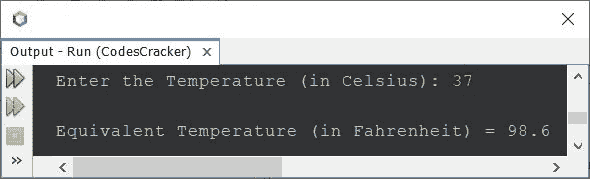

# Java 程序：将摄氏温度转换为华氏温度

> 原文：<https://codescracker.com/java/program/java-program-convert-centigrade-to-fahrenheit.htm>

这篇文章讲述了一个 Java 程序，它将摄氏温度转换为华氏温度。

摄氏温度到华氏温度的换算公式如下:

```
F = (C * 1.8) + 32
```

其中 **F** 是华氏温度，而 **C** 是摄氏温度。

**注-** 如果你想知道，为什么要用这个公式，那就参考 [摄氏到华氏的公式解释](/nonprog/celsius-to-fahrenheit-formula.htm)。

## Java 中摄氏到华氏的转换

问题是，*写一个 Java 程序把摄氏换算成华氏。用户必须在程序运行时的 收到摄氏温度值。*下面给出的程序是它的答案:

```
import java.util.Scanner;

public class CodesCracker
{
   public static void main(String[] args)
   {
      float celsius, fahrenheit;

      Scanner scan = new Scanner(System.in);

      System.out.print("Enter the Temperature (in Celsius): ");
      celsius = scan.nextFloat();

      fahrenheit = (float) ((celsius*1.8)+32);

      System.out.println("\nEquivalent Temperature (in Fahrenheit) = " +fahrenheit);
   }
}
```

下面给出的快照显示了上述程序的示例运行，用户输入 **37** 作为摄氏温度，以转换 并打印其等效华氏温度值:



#### 其他语言的相同程序

*   [摄氏到华氏的转换](/c/program/c-program-convert-centigrade-to-fahrenheit.htm)
*   [C++摄氏到华氏转换](/cpp/program/cpp-program-convert-centigrade-to-fahrenheit.htm)
*   [Python 摄氏到华氏的换算](/python/program/python-program-convert-celsius-to-fahrenheit.htm)

[Java 在线测试](/exam/showtest.php?subid=1)

* * *

* * *