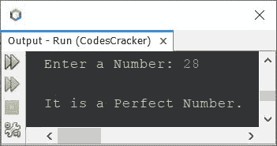
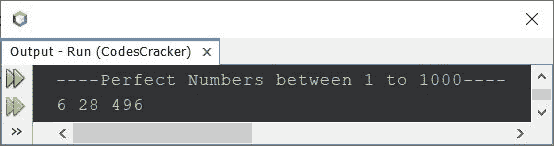
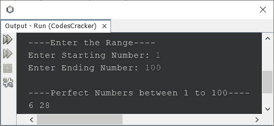

# Java 程序：完全数

> 原文：<https://codescracker.com/java/program/java-perfect-number.htm>

本文旨在介绍 Java 中的完全数程序。即文章包含了一些关于完全数的程序。但是在创建完全数程序之前，我们先来了解一下，完全数是什么意思。

一个完全数是等于它的正约数之和的数(不包括数本身)。例如 6、28、496 等。是完美的数字。因为:

```
6 = 1+2+3
  = 6
```

其中 1、2、3 是 **6** 的正约数。类似地:

```
28 = 1+2+4+7+14
   = 28
```

## 使用`for`循环检查完全数

问题是，*编写一个 Java 程序来检查用户在运行时输入的数字是否是一个完全数 使用**进行**循环*。这个问题的答案，是下面给出的程序:

```
import java.util.Scanner;

public class CodesCracker
{
   public static void main(String[] args)
   {
      int num, i, sum=0;
      Scanner s = new Scanner(System.in);

      System.out.print("Enter a Number: ");
      num = s.nextInt();

      for(i=1; i<num; i++)
      {
         if(num%i==0)
            sum = sum+i;
      }

      if(sum==num)
         System.out.println("\nIt is a Perfect Number.");
      else
         System.out.println("\nIt is not a Perfect Number.");
   }
}
```

下面给出的快照显示了上述 Java 程序的示例运行，用户输入 **28** 来检查它是否是一个 完全数:



## 使用`while`循环检查完全数

让我们使用 **while** 循环创建相同的程序。

```
import java.util.Scanner;

public class CodesCracker
{
   public static void main(String[] args)
   {
      int num, i=1, sum=0;
      Scanner s = new Scanner(System.in);

      System.out.print("Enter a Number: ");
      num = s.nextInt();

      while(i<num)
      {
         if(num%i==0)
            sum = sum+i;
         i++;
      }

      if(sum==num)
         System.out.println("\nIt is a Perfect Number.");
      else
         System.out.println("\nIt is not a Perfect Number.");
   }
}
```

这个程序产生的输出与前一个程序完全相同。

因为在 **while** 循环的情况下，我们需要在循环之前做初始化部分，并在循环内部更新部分。因此， 在声明变量 **i** 时，我将它的值初始化为 1，并且在 **while** 循环中，我增加了一个额外的 语句，即**i++；**在每次执行循环时，将 **i** 的值增加 1。

## 查找并打印 1 到 1000 之间的完全数

这是另一个用来查找和打印 1 到 1000 之间所有完全数的程序。该程序不接收用户的输入。

```
public class CodesCracker
{
   public static void main(String[] args)
   {
      int num, start=1, end=1000, i, sum;

      System.out.println("----Perfect Numbers between 1 to 1000----");
      for(num=start; num<=end; num++)
      {
         sum = 0;
         for(i=1; i<num; i++)
         {
            if(num%i==0)
               sum = sum+i;
         }
         if(sum==num)
            System.out.print(num+ " ");
      }
   }
}
```

下面是它的示例输出:



## 在给定范围内寻找完全数

现在，这是本文的最后一个程序，使用 **for** 循环创建，以查找并打印用户在程序运行时提供的 范围内的所有完全数。这个程序类似于以前的程序。唯一不同的是，**开始**和**结束**变量的 值由用户接收。

```
import java.util.Scanner;

public class CodesCracker
{
   public static void main(String[] args)
   {
      long num, start, end, i, sum;
      Scanner s = new Scanner(System.in);

      System.out.print("----Enter the Range----");
      System.out.print("\nEnter Starting Number: ");
      start = s.nextLong();
      System.out.print("Enter Ending Number: ");
      end = s.nextLong();

      if(start<end)
      {
         System.out.println("\n----Perfect Numbers between "+start+" to "+end+"----");
         for(num=start; num<=end; num++)
         {
            sum = 0;
            for(i=1; i<num; i++)
            {
               if(num%i==0)
                  sum = sum+i;
            }
            if(sum==num)
               System.out.print(num+ " ");
         } 
      }
      else
         System.out.println("\nInvalid Input!");
   }
}
```

下面是它的示例运行，以用户输入的 **1** 为开始，以 **100** 为结束，打印 1 到 100 之间的所有完全数 :



[Java 在线测试](/exam/showtest.php?subid=1)

* * *

* * *