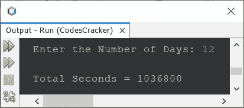

# 将天转换成秒的 Java 程序

> 原文：<https://codescracker.com/java/program/java-convert-days-to-seconds.htm>

这篇文章包含了一个 Java 程序，可以将给定的天数转换成秒。一天有 86400 秒。

问题是，*写一个 Java 程序，把天换算成秒。用户必须在运行时收到日期。* 下面给出的程序就是这个问题的答案。

```
import java.util.Scanner;

public class CodesCracker
{
   public static void main(String[] args)
   {
      int noOfDays, noOfSeconds;
      Scanner s = new Scanner(System.in);

      System.out.print("Enter the Number of Days: ");
      noOfDays = s.nextInt();

      noOfSeconds = noOfDays*86400;
      System.out.println("\nTotal Seconds = " +noOfSeconds);
   }
}
```

下面是它的示例运行，用户输入 **12** 作为天数进行转换，或者查找并打印给定 12 天内经过的总秒数 :



这种类型的 Java 程序属于最简单的程序，在这里，我们只需要接收用户的输入，然后乘以 **86400** 。结果将是给定天数中的总秒数。所以我们只需要 在输出上打印结果值。就是这样。

为了使上面的程序更短，用 下面的语句替换 **main()** 方法中的所有语句:

```
Scanner s = new Scanner(System.in);
System.out.print("Enter the Number of Days: ");
int noOfDays = s.nextInt();
System.out.println("\nTotal Seconds = " +noOfDays*86400);
```

输出将与之前的程序完全相同。

[Java 在线测试](/exam/showtest.php?subid=1)

* * *

* * *