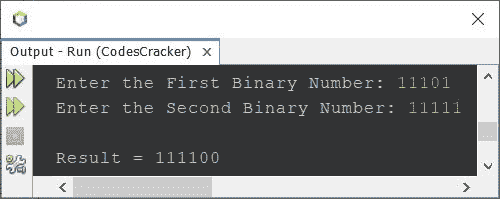
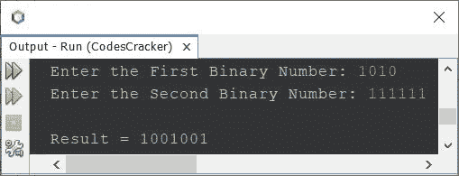
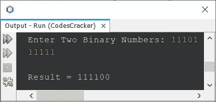
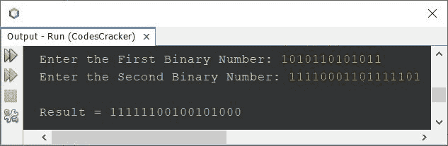

# Java 程序：将两个二进制数相加

> 原文：<https://codescracker.com/java/program/java-add-two-binary-numbers.htm>

本文涵盖了一些 Java 中两个二进制数相加的程序。在这里，我用 Java 创建了多个二进制数加法程序。

但在开始程序之前，让我们先提醒一下，两个二进制数的加法是如何执行的:

```
1 + 0 = 1
0 + 1 = 1
0 + 0 = 0
1 + 1 = 10 (0 and carry 1)
1 + 1 + 1 = 10 + 1 = 11 (1 and carry 1)
```

例如

```
  1 1 1 0 1
+ 1 1 1 1 1
-----------
1 1 1 1 0 0
```

## Java 中使用整数的二进制数加法

问题是，*写一个 Java 程序把两个二进制数相加。两个二进制数都必须由用户在运行时输入。* 下面给出这个问题的答案。

本文最后创建了一个完整的 Java 二进制数加法程序。但是在创建对用户输入的两个二进制数执行加法的程序的完整版本之前。让我们首先创建一个非常基本的程序，提供易于理解的代码。这个程序是使用 **int** (整数)数据 类型创建的。

```
import java.util.Scanner;

public class CodesCracker
{
   public static void main(String[] args)
   {
      int binaryOne, binaryTwo, remOne, remTwo, i=0, carry=0;
      int[] res = new int[10];
      Scanner scan = new Scanner(System.in);

      System.out.print("Enter the First Binary Number: ");
      binaryOne = scan.nextInt();
      System.out.print("Enter the Second Binary Number: ");
      binaryTwo = scan.nextInt();

      while(binaryOne!=0)
      {
         remOne = binaryOne%10;
         remTwo = binaryTwo%10;
         if(remOne==0 && remTwo==0)
         {
            if(carry==0)
            {
               res[i] = (res[i]*10) + 0;
            }
            else
            {
               res[i] = (res[i]*10) + 1;
               carry = 0;
            }
         }
         else if(remOne==0 && remTwo==1)
         {
            if(carry==0)
            {
               res[i] = (res[i]*10) + 1;
            }
            else
            {
               res[i] = (res[i]*10) + 0;
               carry = 1;
            }
         }
         else if(remOne==1 && remTwo==0)
         {
            if(carry==0)
            {
               res[i] = (res[i]*10) + 1;
            }
            else
            {
               res[i] = (res[i]*10) + 0;
               carry = 1;
            }
         }
         else if(remOne==1 && remTwo==1)
         {
            if(carry==0)
            {
               res[i] = (res[i]*10) + 0;
               carry = 1;
            }
            else
            {
               res[i] = (res[i]*10) + 1;
               carry = 1;
            }
         }
         else
         {
            System.out.println("\nInvalid Input!");
            return;
         }
         binaryOne = binaryOne/10;
         binaryTwo = binaryTwo/10;
         i++;
      }
      if(carry==1)
         res[i] = (res[i]*10) + 1;
      System.out.print("\nResult = ");
      while(i>=0)
      {
         System.out.print(res[i]);
         i--;
      }
   }
}
```

下面是它的示例运行，用户输入 **11101** 作为第一个二进制数， **11111** 作为第二个二进制数:



上面的程序有限制，比如如果用户输入两个二进制数，其中一个二进制数的位数比另一个多或少 ，或者如果用户输入的二进制数的位数大于 **int** 该怎么办。因此，让我们修改 上面的程序，并使用 **long** 数据类型重新创建相同的程序。此外，这个程序基本上是以前的简短版本 。

```
import java.util.Scanner;

public class CodesCracker
{
   public static void main(String[] args)
   {
      long binaryOne, binaryTwo;
      int remOne, remTwo, sumDigit, i=0, carry=0;
      int[] sum = new int[10];
      Scanner scan = new Scanner(System.in);

      System.out.print("Enter the First Binary Number: ");
      binaryOne = scan.nextLong();
      System.out.print("Enter the Second Binary Number: ");
      binaryTwo = scan.nextLong();

      while(binaryOne!=0 || binaryTwo!=0)
      {
         remOne = (int)(binaryOne%10);
         remTwo = (int)(binaryTwo%10);
         sumDigit = remOne + remTwo + carry;
         sum[i] = (int)(sumDigit%2);
         carry = (int)(sumDigit/2);
         binaryOne = binaryOne/10;
         binaryTwo = binaryTwo/10;
         i++;
      }
      if(carry==1)
         sum[i] = carry;
      System.out.print("\nResult = ");
      while(i>=0)
      {
         System.out.print(sum[i]);
         i--;
      }
   }
}
```

下面是它的示例运行，用户输入 **1010** 作为第一个二进制数， **111111** 作为第二个二进制数:



让我们再次缩短上面的程序。下面是上述程序的简短版本。 **i++** 是 I 的后增量 ，这意味着使用了 **i** 的当前值，然后将其值增加 1:

```
import java.util.Scanner;

public class CodesCracker
{
   public static void main(String[] args)
   {
      long binaryOne, binaryTwo;
      int remOne, remTwo, sumDigit, i=0, carry=0;
      int[] sum = new int[10];
      Scanner scan = new Scanner(System.in);

      System.out.print("Enter Two Binary Numbers: ");
      binaryOne = scan.nextLong();
      binaryTwo = scan.nextLong();

      while(binaryOne!=0 || binaryTwo!=0)
      {
         sum[i++] = (int)((binaryOne%10 + binaryTwo%10 + carry)%2);
         carry = (int)((binaryOne%10 + binaryTwo%10 + carry)/2);
         binaryOne /= 10;
         binaryTwo /= 10;
      }
      if(carry==1)
         sum[i] = carry;
      System.out.print("\nResult = ");
      while(i>=0)
         System.out.print(sum[i--]);
   }
}
```

<u>程序还是不完美</u>，因为我用了**数组**，它的极限是 **10** 。我知道你可以把极限 提高 100 或者更多。但是数据类型 **long** 呢，它的限制是**9223372036854775807**。

因此，我必须推荐你用字符串型去加任何两个二进制数，而不取决于它的大小或位数，给定二进制数有多少。

## Java 中使用字符串的二进制数加法

在创建完整的版本之前，让我们先用 string 创建一个简单的基本版本。该程序假设用户在运行时输入的两个二进制数具有相同的位数:

```
import java.util.Scanner;

public class CodesCracker
{
   public static void main(String[] args)
   {
      String binaryOne, binaryTwo, resRev="", resOrig="";
      char charOne, charTwo, carry='0';
      int i;

      Scanner scan = new Scanner(System.in);

      System.out.print("Enter Two Binary Numbers: ");
      binaryOne = scan.next();
      binaryTwo = scan.next();

      for(i=(binaryOne.length()-1); i>=0; i--)
      {
          charOne = binaryOne.charAt(i);
          charTwo = binaryTwo.charAt(i);
          if(charOne=='0' && charTwo=='0')
          {
             if(carry=='0')
                resRev = resRev + "0";
             else
             {
                resRev = resRev + "1";
                carry = '0';
             }
          }
          else if(charOne=='0' && charTwo=='1')
          {
             if(carry=='0')
                resRev = resRev + "1";
             else
             {
                resRev = resRev + "0";
                carry = '1';
             }
          }
          else if(charOne=='1' && charTwo=='0')
          {
             if(carry=='0')
                resRev = resRev + "1";
             else
             {
                resRev = resRev + "0";
                carry = '1';
             }
          }
          else if(charOne=='1' && charTwo=='1')
          {
             if(carry=='0')
             {
                resRev = resRev + "0";
                carry = '1';
             }
             else
             {
                resRev = resRev + "1";
                carry = '1';
             }
          }
          else
          {
             System.out.println("\nInvalid Input!");
             return;
          }
      }
      if(carry=='1')
         resRev = resRev + "1";
      for(i=(resRev.length()-1); i>=0; i--)
         resOrig = resOrig + resRev.charAt(i);
      System.out.println("\nResult = " + resOrig);
   }
}
```

下面是它的示例运行，用户输入 **11101** 和 **11111** 作为两个二进制数:



## Java 中的二进制数加法-完整版

现在让我们用 Java 创建二进制数加法程序的完整版本。我说这个程序是完整版本，因为这个程序可以处理所有类型的错误，也可以处理任意位数的二进制数。

```
import java.util.Scanner;

public class CodesCracker
{
   public static void main(String[] args)
   {
      String binaryOne, binaryTwo, resRev="", resOrig="";
      char charOne, charTwo, carry='0';
      int binaryOneLen, binaryTwoLen, i, j, len;

      Scanner scan = new Scanner(System.in);

      System.out.print("Enter the First Binary Number: ");
      binaryOne = scan.next();
      System.out.print("Enter the Second Binary Number: ");
      binaryTwo = scan.next();

      binaryOneLen = binaryOne.length();
      binaryTwoLen = binaryTwo.length();

      if(binaryOneLen > binaryTwoLen)
      {
         for(i=(binaryOneLen-1), j=(binaryTwoLen-1); j>=0; i--, j--)
         {
            charOne = binaryOne.charAt(i);
            charTwo = binaryTwo.charAt(j);
            if(charOne=='0' && charTwo=='0')
            {
               if(carry=='0')
                  resRev = resRev + "0";
               else
               {
                  resRev = resRev + "1";
                  carry = '0';
               }
            }
            else if(charOne=='0' && charTwo=='1')
            {
               if(carry=='0')
                  resRev = resRev + "1";
               else
               {
                  resRev = resRev + "0";
                  carry = '1';
               }
            }
            else if(charOne=='1' && charTwo=='0')
            {
               if(carry=='0')
                  resRev = resRev + "1";
               else
               {
                  resRev = resRev + "0";
                  carry = '1';
               }
            }
            else if(charOne=='1' && charTwo=='1')
            {
               if(carry=='0')
               {
                  resRev = resRev + "0";
                  carry = '1';
               }
               else
               {
                  resRev = resRev + "1";
                  carry = '1';
               }
            }
            else
            {
               System.out.println("\nInvalid Input!");
               return;
            }
         }
         for(i=i; i>=0; i--)
         {
            charOne = binaryOne.charAt(i);
            if(carry=='1')
            {
               if(charOne=='1')
               {
                  resRev = resRev + "0";
                  carry = '1';
               }
               else if(charOne=='0')
               {
                  resRev = resRev + "1";
                  carry = '0';
               }
               else
               {
                  System.out.println("\nInvalid Input!");
                  return;
               }
            }
            else
            {
               resRev = resRev + charOne;
            }
         }
      }
      else if(binaryOneLen < binaryTwoLen)
      {
         for(i=(binaryOneLen-1), j=(binaryTwoLen-1); i>=0; i--, j--)
         {
            charOne = binaryOne.charAt(i);
            charTwo = binaryTwo.charAt(j);
            if(charOne=='0' && charTwo=='0')
            {
               if(carry=='0')
                  resRev = resRev + "0";
               else
               {
                  resRev = resRev + "1";
                  carry = '0';
               }
            }
            else if(charOne=='0' && charTwo=='1')
            {
               if(carry=='0')
                  resRev = resRev + "1";
               else
               {
                  resRev = resRev + "0";
                  carry = '1';
               }
            }
            else if(charOne=='1' && charTwo=='0')
            {
               if(carry=='0')
                  resRev = resRev + "1";
               else
               {
                  resRev = resRev + "0";
                  carry = '1';
               }
            }
            else if(charOne=='1' && charTwo=='1')
            {
               if(carry=='0')
               {
                  resRev = resRev + "0";
                  carry = '1';
               }
               else
               {
                  resRev = resRev + "1";
                  carry = '1';
               }
            }
            else
            {
               System.out.println("\nInvalid Input!");
               return;
            }
         }
         for(i=j; i>=0; i--)
         {
            charTwo = binaryTwo.charAt(i);
            if(carry=='1')
            {
               if(charTwo=='1')
               {
                  resRev = resRev + "0";
                  carry = '1';
               }
               else if(charTwo=='0')
               {
                  resRev = resRev + "1";
                  carry = '0';
               }
               else
               {
                  System.out.println("\nInvalid Input!");
                  return;
               }
            }
            else
            {
               resRev = resRev + charTwo;
            }
         }
      }
      else
      {
         for(i=(binaryOneLen-1); i>=0; i--)
         {
            charOne = binaryOne.charAt(i);
            charTwo = binaryTwo.charAt(i);
            if(charOne=='0' && charTwo=='0')
            {
               if(carry=='0')
                  resRev = resRev + "0";
               else
                  resRev = resRev + "1";
            }
            else if(charOne=='0' && charTwo=='1')
            {
               if(carry=='0')
                  resRev = resRev + "1";
               else
               {
                  resRev = resRev + "0";
                  carry = '1';
               }
            }
            else if(charOne=='1' && charTwo=='0')
            {
               if(carry=='0')
                  resRev = resRev + "1";
               else
               {
                  resRev = resRev + "0";
                  carry = '1';
               }
            }
            else if(charOne=='1' && charTwo=='1')
            {
               if(carry=='0')
               {
                  resRev = resRev + "0";
                  carry = '1';
               }
               else
               {
                  resRev = resRev + "1";
                  carry = '1';
               }
            }
            else
            {
               System.out.println("\nInvalid Input!");
               return;
            }
         }
      }
      if(carry=='1')
         resRev = resRev + "1";
      len = resRev.length();
      for(i=len-1; i>=0; i--)
         resOrig = resOrig + resRev.charAt(i);
      System.out.println("\nResult = " + resOrig);
   }
}
```

下面是它的示例运行，用户输入的第一个数字为 **1010110101011** ，第二个数字为**1111000110111101**:



我知道这个程序有点长，但是我建议你对这个程序进行深入的研究，理解程序中使用的逻辑。创建相同的程序还有许多其他方法。因为这篇文章比平常要长，所以我让你修改程序，用你自己创造另一种方式。

[Java 在线测试](/exam/showtest.php?subid=1)

* * *

* * *