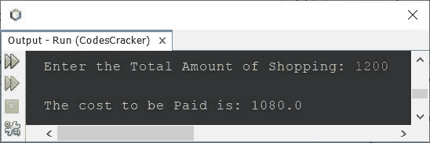
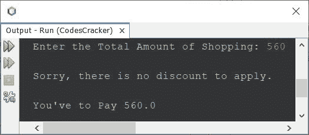
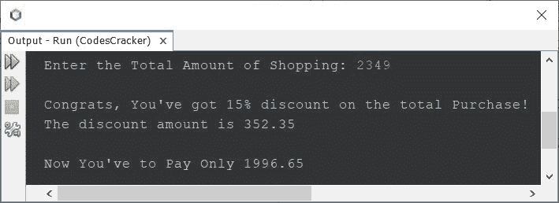

# Java 程序：计算折扣和价格支付

> 原文：<https://codescracker.com/java/program/java-calculate-discount-purchase.htm>

创建本文是为了介绍一些 Java 程序，这些程序可以计算折扣，以及在提供购物总额后必须支付的价格。折扣必须基于下表中给出的数据:

| 购物金额 | 折扣 |
| <=800 | 没有折扣 |
| > 800 且< =1500 | 10% |
| > 1500 且< =2500 | 15% |
| > 2500 且< =5000 | 20% |
| >5000 | thirty percent |

也就是说，当购物总额小于 800 时，就没有折扣可申请。当购物总额大于 800 且小于等于 1500 时，则有 9 折优惠可以申请，以此类推。

## Java 中的折扣程序

问题是，*写一个 Java 程序，求应用折扣(如果有的话)后要支付的价格。*下面给出的 节目就是这个问题的答案:

```
import java.util.Scanner;

public class CodesCracker
{
   public static void main(String[] args)
   {
      float totalCost, costToPaid, discount;
      Scanner scan = new Scanner(System.in);

      System.out.print("Enter the Total Amount of Shopping: ");
      totalCost = scan.nextFloat();

      if(totalCost<=800)
      {
         costToPaid = totalCost;
      }
      else if(totalCost>800 && totalCost<=1500)
      {
         discount = (totalCost*10)/100;
         costToPaid = totalCost - discount;
      }
      else if(totalCost>1500 && totalCost<=2500)
      {
         discount = (totalCost*15)/100;
         costToPaid = totalCost - discount;
      }
      else if(totalCost>2500 && totalCost<=5000)
      {
         discount = (totalCost*20)/100;
         costToPaid = totalCost - discount;
      }
      else
      {
         discount = (totalCost*30)/100;
         costToPaid = totalCost - discount;
      }
      System.out.println("\nThe cost to be Paid is: " + costToPaid);
   }
}
```

下面是它的示例运行，用户输入 **1200** 作为购物总额:



由于购物总额为 **1200** ，因此在打九折后，顾客只需支付 1080。但是这个程序看起来很奇怪，意味着这个程序没有提供好的用户体验。因此，让我们 修改上述程序并重新创建，以提供良好的用户体验:

```
import java.util.Scanner;

public class CodesCracker
{
   public static void main(String[] args)
   {
      float totalCost, costToPaid, discount;
      Scanner scan = new Scanner(System.in);

      System.out.print("Enter the Total Amount of Shopping: ");
      totalCost = scan.nextFloat();

      if(totalCost<=800)
      {
         costToPaid = totalCost;
         System.out.println("\nSorry, there is no discount to apply.");
      }
      else if(totalCost>800 && totalCost<=1500)
      {
         discount = (totalCost*10)/100;
         costToPaid = totalCost - discount;
         System.out.println("\nCongrats, You've got 10% discount on the total Purchase!");
         System.out.println("The discount amount is " +discount);
      }
      else if(totalCost>1500 && totalCost<=2500)
      {
         discount = (totalCost*15)/100;
         costToPaid = totalCost - discount;
         System.out.println("\nCongrats, You've got 15% discount on the total Purchase!");
         System.out.println("The discount amount is " +discount);
      }
      else if(totalCost>2500 && totalCost<=5000)
      {
         discount = (totalCost*20)/100;
         costToPaid = totalCost - discount;
         System.out.println("\nCongrats, You've got 20% discount on the total Purchase!");
         System.out.println("The discount amount is " +discount);
      }
      else
      {
         discount = (totalCost*30)/100;
         costToPaid = totalCost - discount;
         System.out.println("\nCongrats, You've got 30% discount on the total Purchase!");
         System.out.println("The discount amount is " +discount);
      }
      if(totalCost<=800)
         System.out.println("\nYou've to Pay " + costToPaid);
      else
         System.out.println("\nNow You've to Pay Only " + costToPaid);
   }
}
```

下面是它的示例运行，用户输入 **560** 作为总购买金额:



下面是另一个使用用户输入 **2349** 运行的示例:



程序使用 **if** - **else** 语句来完成这项工作。你可以根据购物范围重新定义折扣， 根据你的要求，因为这只是一个演示程序，显示了如何使用 if-else 的折扣程序可以在 Java 中创建 。

[Java 在线测试](/exam/showtest.php?subid=1)

* * *

* * *