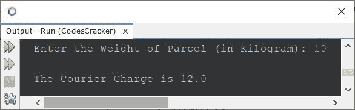
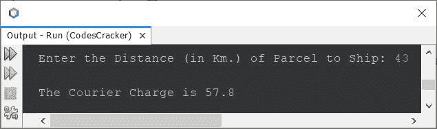
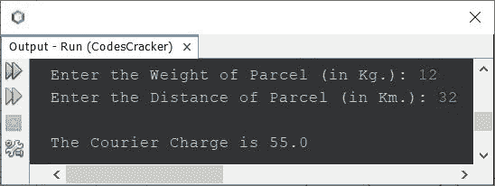

# 计算运送包裹的快递费用的 Java 程序

> 原文：<https://codescracker.com/java/program/java-compute-courier-charge.htm>

本文涵盖了一些 Java 程序，这些程序可以计算运送包裹的快递费用。该计划分为三类。

*   首先，当我们需要根据要运送的包裹的重量来确定快递费用时。
*   第二，当我们需要根据地址的距离来计算运送包裹的快递费用时
*   第三个也是最后一个，当我们需要根据距离和地址计算快递费用时，两者都需要

## 根据包裹重量收取快递费

问题是，*写一个 Java 程序，根据包裹重量来计算快递费用。基于重量的费用 必须按照以下标准计算:*

*   当包裹重量小于或等于 5 公斤时，快递费为 6 美元
*   当包裹的重量超过 5 公斤时，每超过一公斤要加收 1.2 美元的费用

下面给出的程序是这个问题的答案:

```
import java.util.Scanner;

public class CodesCracker
{
   public static void main(String[] args)
   {
      float weight, courierCharge;
      Scanner scan = new Scanner(System.in);

      System.out.print("Enter the Weight of Parcel (in Kilogram): ");
      weight = scan.nextFloat();

      if(weight<=5)
      {
         courierCharge = 6;
      }
      else
      {
         weight = weight - 5;
         courierCharge = (float)(6 + (weight*1.2));
      }
      System.out.println("\nThe Courier Charge is " + courierCharge);
   }
}
```

下面是它的示例运行，用户输入 **10** 作为包裹的重量(以千克为单位。)发货:



由于输入的重量为 **10** ，因此为前 5 Kg。，有 **6** 充电，然后为剩余 5 Kg。，每公斤有额外的 T4 1.2 费用，即 **1.2*5** 或 **6** 。因此快递总费用为 **6+6** ，即 等于 12。

## 根据地址到发货的距离收取快递费用

这个程序与上一个相似。唯一的区别是，这个程序根据包裹运送的距离来计算快递费用。这里的距离是指包裹要运送到的地址(客户地址)的距离。快递费必须按照以下费率计算:

*   当距离小于或等于 6 公里时，快递费用为 4.2 美元
*   如果距离超过 6 公里，那么每超过一公里就要加收 1.4 美元的费用

以下是基于上述要求的程序:

```
import java.util.Scanner;

public class CodesCracker
{
   public static void main(String[] args)
   {
      float distance, courierCharge;
      Scanner scan = new Scanner(System.in);

      System.out.print("Enter the Distance (in Km.) of Parcel to Ship: ");
      distance = scan.nextFloat();

      if(distance<=6)
      {
         courierCharge = (float)4.2;
      }
      else
      {
         distance = distance - 6;
         courierCharge = (float)(6 + (distance*1.4));
      }
      System.out.println("\nThe Courier Charge is " + courierCharge);
   }
}
```

下面给出的快照显示了上述程序的示例运行，用户输入 **43** 作为包裹的距离:



## 基于重量和距离的快递费用

现在让我们把这两个程序结合起来。因为有时我们需要根据包裹的重量和包裹的距离来计算运送包裹的快递费。因此，这里是解决方案。在这个程序中，我对两者都使用了上面提供的相同标准。

```
import java.util.Scanner;

public class CodesCracker
{
   public static void main(String[] args)
   {
      float weight, distance, courierCharge;
      Scanner scan = new Scanner(System.in);

      System.out.print("Enter the Weight of Parcel (in Kg.): ");
      weight = scan.nextFloat();
      System.out.print("Enter the Distance of Parcel (in Km.): ");
      distance = scan.nextFloat();

      if(weight<=5)
         courierCharge = 6;
      else
      {
         weight = weight - 5;
         courierCharge = (float)(6 + (weight*1.2));
      }
      if(distance<=6)
         courierCharge = courierCharge + (float)4.2;
      else
      {
         distance = distance - 6;
         courierCharge = courierCharge + ((float)(4.2 + (distance*1.4)));
      }
      System.out.println("\nThe Courier Charge is " + courierCharge);
   }
}
```

下面是它的示例运行，用户输入 **12** 作为重量，输入 **32** 作为包裹运送的距离:



[Java 在线测试](/exam/showtest.php?subid=1)

* * *

* * *