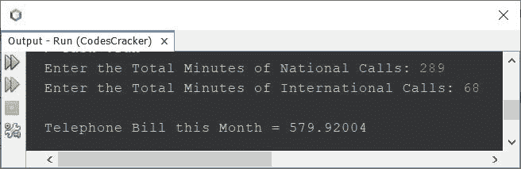
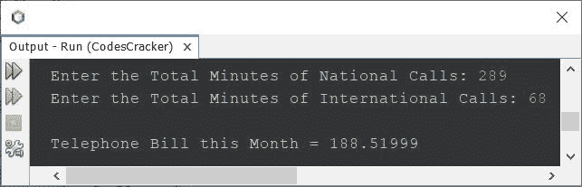

# 计算每月电话费的 Java 程序

> 原文：<https://codescracker.com/java/program/java-calculate-telephone-bill.htm>

这篇文章包含了一个 Java 程序，可以计算和打印每月的电话账单。必须根据以下标准生成账单:

*   前 60 分钟的费用是 14 美元
*   在前 60 分钟的通话后，客户将被收取 0.12 美元的额外费用

如果客户打了不到 60 分钟的电话，那么他/她也必须支付 14 美元，即使他/她当月没有打电话。

## Java 中的电话账单程序

问题是，*写一个 Java 程序，根据 打电话的总分钟数，查找并打印上个月必须支付的电话账单。*下面是它的回答。该程序遵循上面给出的速率。

```
import java.util.Scanner;

public class CodesCracker
{
   public static void main(String[] args)
   {
      int numberOfCalls;
      float phoneBill;
      Scanner scan = new Scanner(System.in);

      System.out.print("Enter the Total Minutes of Calls Made this Month: ");
      numberOfCalls = scan.nextInt();

      if(numberOfCalls<=60)
         phoneBill = 14;
      else
      {
         numberOfCalls = numberOfCalls - 60;
         phoneBill = 14 + (float)(numberOfCalls * 0.12);
      }

      System.out.println("\nTelephone Bill this Month = " +phoneBill);
   }
}
```

下面是它的示例运行，用户输入 **432** 作为总通话分钟数:



上面的程序没有什么基础，因为有时我们需要为不同的通话计算不同的费率。例如，客户打国内电话比打国际电话便宜。因此，让我们修改上面的程序，并使用以下标准创建另一个程序:

*   前 60 个国内电话收费 14 美元
*   国际电话每多打几分钟要加收 0.12 美元的费用
*   前 12 个国际电话收费 16 美元
*   国际电话每多打一分钟要加收 2.34 美元的费用

下面是根据用户输入的国内和国际电话计算电话费的程序:

```
import java.util.Scanner;

public class CodesCracker
{
   public static void main(String[] args)
   {
      int nationalCalls, internationalCalls;
      float phoneBill;
      Scanner scan = new Scanner(System.in);

      System.out.print("Enter the Total Minutes of National Calls: ");
      nationalCalls = scan.nextInt();
      System.out.print("Enter the Total Minutes of International Calls: ");
      internationalCalls = scan.nextInt();

      if(nationalCalls==0)
         phoneBill = 0;
      else if(nationalCalls<=60)
         phoneBill = 14;
      else
      {
         nationalCalls = nationalCalls - 60;
         phoneBill = 14 + (float)(nationalCalls * 0.12);
      }

      if(internationalCalls==0)
         phoneBill = phoneBill;
      else if(internationalCalls<=12)
         phoneBill = phoneBill + 16;
      else
      {
         internationalCalls = internationalCalls - 12;
         phoneBill = phoneBill + 16 + (float)(internationalCalls * 2.34);
      }

      System.out.println("\nTelephone Bill this Month = " +phoneBill);
   }
}
```

以下是用户输入 289 分钟的国内通话和 68 分钟的国际通话的运行示例:



您可以修改上面的程序，并根据您的标准创建您需要的版本，因为这只是一个演示程序，显示了如何使用 Java 程序计算每月的电话账单。

[Java 在线测试](/exam/showtest.php?subid=1)

* * *

* * *