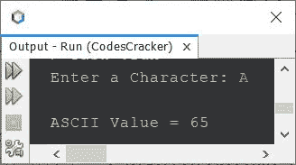
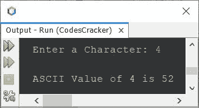
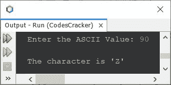
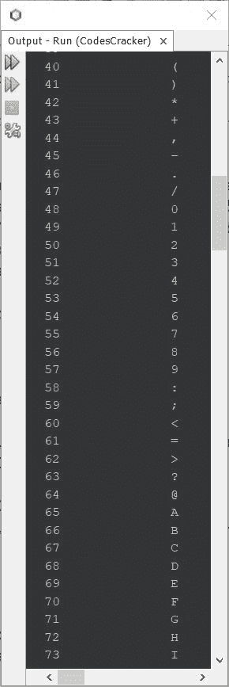

# Java 程序：打印字符的 ASCII 值

> 原文：<https://codescracker.com/java/program/java-program-print-ascii-values.htm>

本文介绍了 Java 中查找和打印字符的 ASCII 值的多个程序。以下是本文涵盖的程序列表:

*   查找并打印给定字符的 ASCII 值
*   查找并打印给定 ASCII 值的字符
*   打印所有 ASCII 字符及其值

**注-****A-Z**的 ASCII 值为 **65-90** 。

**注-****a-z**的 ASCII 值为 **97-122** 。

**注-****0-9**的 ASCII 值为 **48-57** 。

## 在 Java 中打印给定字符的 ASCII 值

问题是，*写一个 Java 程序，查找并打印一个字符的 ASCII 值。该字符必须在程序运行时由用户接收 。*下面给出的程序是它的答案:

```
import java.util.Scanner;

public class CodesCracker
{
   public static void main(String[] args)
   {
      char ch;
      int ascii;
      Scanner scan = new Scanner(System.in);

      System.out.print("Enter a Character: ");
      ch = scan.next().charAt(0);

      ascii = ch;
      System.out.println("\nASCII Value = " +ascii);
   }
}
```

下面给出的快照显示了上述程序的示例运行，其中用户输入 **A** 作为字符来查找并打印其 ASCII 值:



上面的程序也可以写成:

```
import java.util.Scanner;

public class CodesCracker
{
   public static void main(String[] args)
   {
      Scanner scan = new Scanner(System.in);

      System.out.print("Enter a Character: ");
      char ch = scan.next().charAt(0);

      System.out.println("\nASCII Value of " +ch+ " is " +(int)(ch));
   }
}
```

下面是用户输入 **4** 的运行示例:



## 在 Java 中查找并打印给定 ASCII 值的字符

这个程序基本上是前一个程序的反向版本。因为这个程序不查找并打印字符的 ASCII 值，而是查找并打印用户在运行时输入的字符的 ASCII 值。

```
import java.util.Scanner;

public class CodesCracker
{
   public static void main(String[] args)
   {
      Scanner scan = new Scanner(System.in);

      System.out.print("Enter the ASCII Value: ");
      int ascii = scan.nextInt();

      char ch = (char)ascii;
      System.out.println("\nThe character is \'" +ch+ "\'");
   }
}
```

使用用户输入的 **90** 作为 ASCII 值来查找并打印 ASCII 值 为 90 的字符，上面程序的示例运行如下面给出的快照所示:



## 在 Java 中打印所有 ASCII 字符及其值

使用 ASCII 码存储的字符为 256。计算机系统中存储的每个 ASCII 字符，使用 8 位信息，即给出**2<sup>8</sup>T3】或 **256** 个字符。**

下面给出的 Java 程序打印所有的 ASCII 字符及其值。

```
public class CodesCracker
{
   public static void main(String[] args)
   {
      int ASCII;
      char ch;
      Scanner scan = new Scanner(System.in);

      System.out.println("ASCII\t\tCharacter");
      for(ASCII=0; ASCII<=255; ASCII++)
      {
         ch = (char)ASCII;
         System.out.println(ASCII + "\t\t" +ch);
      }
   }
}
```

下面给出的快照显示了上述程序产生的示例输出的一部分。此快照显示了示例输出的一部分，因为不可能在单个快照中显示完整的输出。但问题是，当你在你的系统中尝试这个程序时，你会得到类似的输出。



#### 其他语言的相同程序

*   [C 打印 ASCII 值](/c/program/c-program-print-ascii-values.htm)
*   [C++ 打印 ASCII 值](/cpp/program/cpp-program-print-ascii-values.htm)
*   [Python 打印 ASCII 值](/python/program/python-program-print-ascii-values.htm)

[Java 在线测试](/exam/showtest.php?subid=1)

* * *

* * *