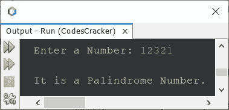
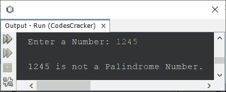
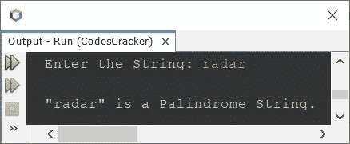

# Java 程序检查回文与否

> 原文：<https://codescracker.com/java/program/java-program-check-palindrome.htm>

本文涵盖了 Java 中的多个程序，这些程序检查一个数字或字符串是否是回文数字/字符串。本文涉及的两个程序是:

*   Java 程序检查回文号与否
*   Java 程序检查回文字符串与否

**注-** 一个数的倒数等于该数本身，称为回文数。例如，12321、 121、1001 等。是回文数字。

**注-** 一个串的倒数等于原串，称为回文串。例如， 雷达，夫人，参考，水平，reviver 等。都是回文串。

## 在 Java 中检查回文数

问题是，*写一个 Java 程序，检查给定的数是否是回文数。该号码必须在程序运行时由用户接收 。*下面给出的程序是它的答案:

```
import java.util.Scanner;

public class CodesCracker
{
   public static void main(String[] args)
   {
      int num, rev=0, rem, temp;
      Scanner scan = new Scanner(System.in);

      System.out.print("Enter a Number: ");
      num = scan.nextInt();

      temp = num;
      while(temp!=0)
      {
         rem = temp%10;
         rev = (rev*10) + rem;
         temp = temp/10;
      }

      if(num==rev)
         System.out.println("\nIt is a Palindrome Number.");
      else
         System.out.println("\nIt is not a Palindrome Number.");
   }
}
```

下面给出的快照显示了上面的 Java 程序在检查给定数字是否为回文数字时的示例运行，用户输入 **12321** :



上面的程序也可以这样创建:

```
import java.util.Scanner;

public class CodesCracker
{
   public static void main(String[] args)
   {
      int rev=0;
      Scanner scan = new Scanner(System.in);

      System.out.print("Enter a Number: ");
      int num = scan.nextInt();

      int temp = num;
      while(temp!=0)
      {
         rev = (rev*10) + (temp%10);
         temp /= 10;
      }

      if(num==rev)
         System.out.println("\n" +num+ " is a Palindrome Number.");
      else
         System.out.println("\n" +num+ " is not a Palindrome Number.");
   }
}
```

下面是用户输入 **1245** 的运行示例



## 在 Java 中检查回文字符串

问题是，*写一个 Java 程序来检查用户在运行时输入的字符串是否是回文字符串或者 不是。*下面给出的程序是它的答案:

```
import java.util.Scanner;

public class CodesCracker
{
   public static void main(String[] args)
   {
      String str, strReverse="";
      char ch;
      int i, strLen;
      Scanner scan = new Scanner(System.in);

      System.out.print("Enter the String: ");
      str = scan.nextLine();

      strLen = str.length();
      i = (strLen-1);
      while(i>=0)
      {
         ch = str.charAt(i);
         strReverse = strReverse + ch;
         i--;
      }

      if(str.equals(strReverse))
         System.out.println("\n\"" +str+ "\" is a Palindrome String.");
      else
         System.out.println("\n\"" +str+ "\" is not a Palindrome String.");
   }
}
```

带有用户输入 **radar** 的上述程序的示例运行显示在下面给出的快照中:



#### 其他语言的相同程序

*   [C 检查回文号](/c/program/c-program-palindrome-number.htm)
*   [C++ 检查回文号](/cpp/program/cpp-program-palindrome-number.htm)
*   [Python 检查回文号](/python/program/python-program-check-palindrome.htm)

[Java 在线测试](/exam/showtest.php?subid=1)

* * *

* * *